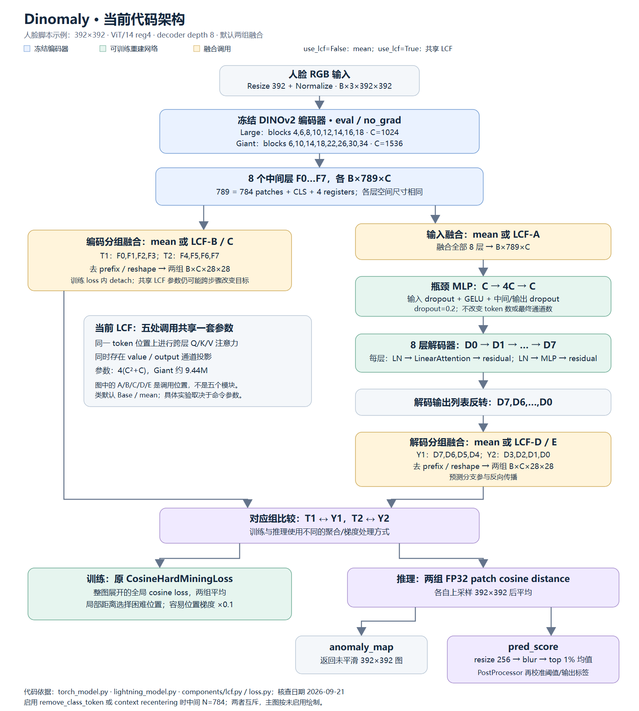
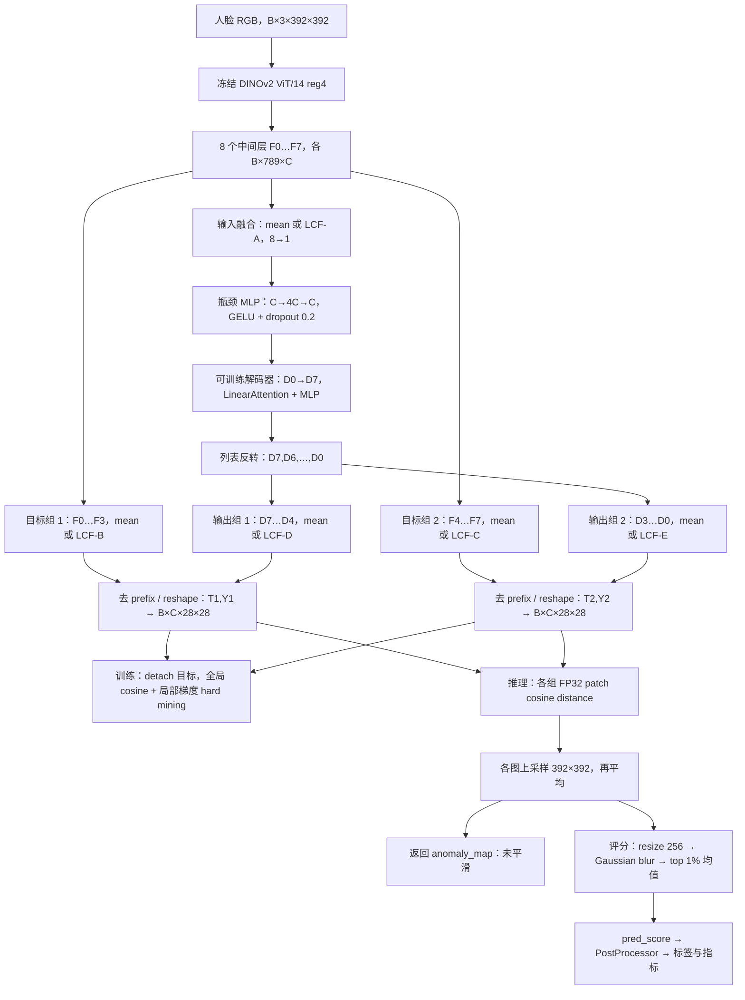
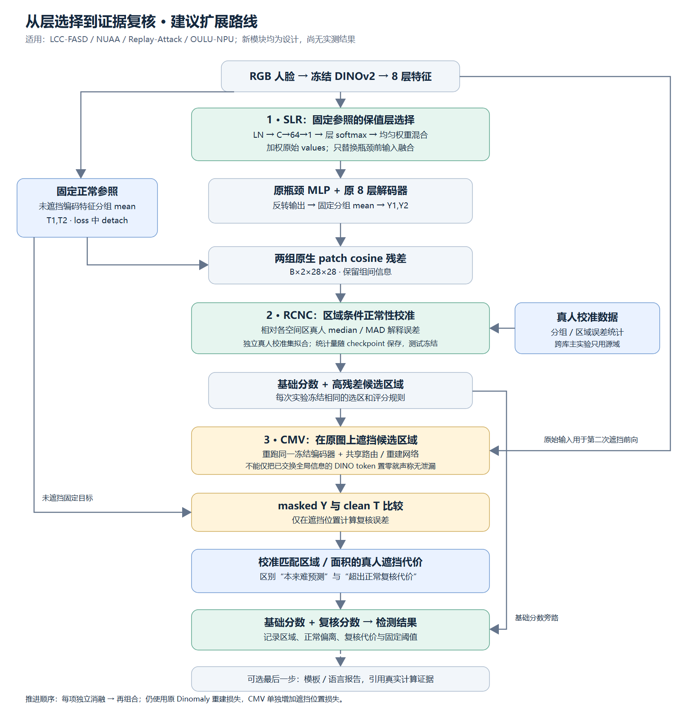
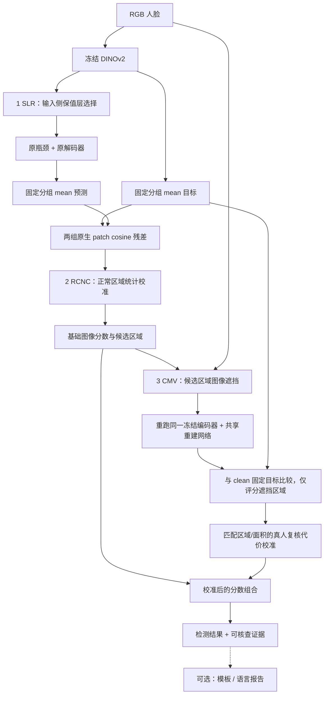

# Dinomaly 人脸防伪：当前架构、模块接入与逐步实验技术文档

日期：2026-09-21。针对数据集：**LCC-FASD、NUAA、Replay-Attack、OULU-NPU**。

本文依据本仓库当前实现设计，面向只用真实人脸优化模型的单类人脸呈现攻击检测（one-class FAS/PAD）。用户已经确认数据集；单类训练设置依据现有脚本推定。如果后续使用攻击样本训练分类头，应另设监督实验。

交付性质：**架构核对与待实施方案**。下述新模块没有接入生产模型，也没有获得四个数据集上的实验结果；参数起点都是待验证建议。已有 `dinomaly_lcf_face_roadmap.md` 保留原样；本文补齐四库协议、可直接实现的首模块和完整消融路线。

阅读建议：先看“推荐顺序”和当前架构；准备编码时直接看“下一步重点模块”；准备论文时看机制证据、实验协议和相关工作。

|图|直接查看/插入文档|矢量版本|可编辑 Mermaid 源码|
|---|---|---|---|
|当前代码架构|[PNG](assets/dinomaly_fas_current.png)|[SVG](assets/dinomaly_fas_current.svg)|[MMD](assets/dinomaly_fas_current.mmd)|
|分阶段扩展方案|[PNG](assets/dinomaly_fas_proposed.png)|[SVG](assets/dinomaly_fas_proposed.svg)|[MMD](assets/dinomaly_fas_proposed.mmd)|

## 1. 推荐顺序与论文主线

建议研究问题是：**只见过真实人脸时，如何让重建误差成为跨设备可靠的攻击证据？**

这个问题可以拆成三个可检验环节：使用哪些层的表示；如何区分正常难点和异常；初次发现的异常能否通过第二次验证。这三步能够连成一篇论文，而每一步都可以独立实验。

|顺序|模块或实验|接入位置|额外监督|训练/计算成本|要回答的问题|
|---|---|---|---|---|---|
|0|固定数据协议，复现 mean / 当前 LCF|数据清单、训练与评估脚本|保持现有设置|基线成本|当前提升可否复现，是否依赖划分？|
|0.5|LCF 只用于输入，目标和输出固定 mean|三类融合调用处分开|无|与现有训练相近|共享融合器和变化目标是否影响稳定性？|
|**1，下一步重点**|**固定参照的保值层选择 SLR**|**8 个编码层 → 瓶颈 MLP 之间**|**仅真人**|**约 0.07M/0.10M 参数，Large/Giant**|**能否学习位置相关的层权重，同时保留稳定参照？**|
|2|区域条件正常性校准 RCNC|两组 patch 残差 → 图像评分之间|独立真人校准集|无须重训主干，少量统计量|眼口等正常难点是否被误报？|
|3|区域匹配遮挡复核 CMV|初次残差选区 → 遮挡 → 第二次编码/解码|仅真人，自监督遮挡|第二次前向，成本需实测|初次高残差是否具有超出正常遮挡代价的异常性？|
|备选 A|固定频率目标重建 FNR|RGB 旁路产生目标，解码特征接小预测头|仅真人|轻量头，增加训练目标|语义重建是否忽略再成像细节？|
|备选 B|区域关系预测 RRP|区域池化 token → 预测被隐藏区域|仅真人|中等|局部看似正常，但区域之间是否不协调？|
|最后|时序证据 / 语言报告|帧级证据之后|真实视频元数据 / 可选文本标注|取决于分支|证据是否跨时间稳定，解释是否忠实？|

**如果只做一次最小实验，先做 SLR；如果只想利用已有 checkpoint 快速验证新方向，先做 RCNC。** SLR 是已有 LCF 的受控改造；RCNC 才是与现有网络串接的独立新模块。两条路径最后可以组合，但先分别验证。

不要同时加入频域、GNN、Mamba、LoRA、文本大模型。Dinomaly 的重建能力增强不一定提升检测：模型也可能更好地重建攻击。原论文强调有意限制重建方式，新增容量需要通过正常/攻击分数间隔来验证。[Dinomaly，CVPR 2025](https://openaccess.thecvf.com/content/CVPR2025/html/Guo_Dinomaly_The_Less_Is_More_Philosophy_in_Multi-Class_Unsupervised_Anomaly_CVPR_2025_paper.html)

## 2. 四个数据集如何支撑故事

四个数据集用于呈现攻击检测。它们不能自动支持“检测所有 Deepfake、三维面具或身份异常”的结论。

|数据集|适合承担的实验角色|协议重点|对模块设计的影响|
|---|---|---|---|
|LCC-FASD|多设备屏幕重放与较复杂采集变化|恢复原始 training/development/evaluation 对应清单；检查重组目录是否混合原 split|频率模块必须跨设备验证；不能主要依靠屏幕外框|
|NUAA|打印照片攻击的快速机制检查|确认原始标签、训练测试清单及身份/采集信息；勿把自定义切分称为官方协议|适合排错和小规模消融；单库提升不支持广泛泛化|
|Replay-Attack|打印、手机/平板显示等攻击，视频级测试|使用 train/dev/test；固定采帧与视频聚合；在 dev 定阈值|适合复核不同攻击媒介，以及视频证据扩展|
|OULU-NPU|环境、打印机/显示器、相机变化及组合变化|分别报告 Protocol I–IV；涉及多折时按官方折运行|适合验证“降低设备依赖”的核心贡献|

LCC 原论文聚焦屏幕重放和多种采集/显示设备，特别强调避免依赖可见边框；这使“只检测屏幕边缘”的故事不适合覆盖四库。[LCC-FASD 原论文](https://pureportal.spbu.ru/files/51584200/CSIT2019_Grishkin_Timoshenko.pdf)

OULU 官方定义：P1 测环境变化，P2 测新的打印机/显示器，P3 留一相机，P4 组合变化。把四者统一称为“随机分四份测试”是错误的。[OULU-NPU 官方说明](https://sites.google.com/site/oulunpudatabase/)

Replay 官方推荐用开发集 EER 对应阈值计算测试集 HTER；当前 NUAA/LCC 风格脚本中的“开发集最小 HTER 阈值”不是同一个阈值策略，报告时要分开。[Replay-Attack 官方协议](https://www.idiap.ch/fr/recherche/donnees/replayattack/index_html?set_language=fr)

### 2.1 当前脚本与正式协议存在的差异

以下是代码事实，不是推测数据已经泄漏：

- `train_dinomaly_lcf_lcc_dim1024.py`：默认 Large，C=1024；从 `normal` 划正常测试集，`normal_test_dir=None`，不使用原有平铺 `test`；验证集从测试来源再次划出。
- `train_dinomaly_lcf_nuaa_giant_dim1536.py`：默认 Giant，C=1536；`normal` 训练，`test` 为正常测试来源，`abnormal` 为攻击来源；`val_split_mode="from_test"`。
- `train_dinomaly_lcf_replay_attack_giant_dim1536.py`：默认 Giant，正常测试也由正常目录划分，验证来自测试来源。
- `train_dinomaly_lcf_face.py`：OULU 路线默认 Giant；通过 `Folder` 和可配置目录/划分运行，不能仅凭脚本名称认定使用了官方 P1–P4。

因此，要先建立从处理后图片返回原始样本的映射。至少保存 `sample_id, path, dataset, original_split, label, subject_id, video_id, session_id, device_id, attack_type, frame_index`；缺失元数据明确写 `unknown`，不要自行编造。

## 3. 当前真实架构

### 3.1 默认类配置与人脸脚本配置

`Dinomaly()` 类默认是 Base、`use_lcf=False`；文件名含 `lcf` 的训练脚本也需要显式传入 `--use-lcf` 才启用 LCF。不能把仓库“支持 LCF”画成所有实验都启用了它。

|配置|特征维度 C|编码器抽取 block 索引（零基）|解码器头数|
|---|---:|---|---:|
|Base 类默认|768|2,3,4,5,6,7,8,9|12|
|Large，LCC 脚本默认|1024|4,6,8,10,12,14,16,18|16|
|Giant，NUAA / Replay / OULU 上述脚本默认|1536|6,10,14,18,22,26,30,34|24|

这些层是不同深度的特征，**空间尺寸相同**，不是 FPN 那样的不同分辨率尺度。`E6` 表示 `blocks.6`，不是自然语言的“第六层”。

类默认预处理为 Resize 448 后 CenterCrop 392；上述人脸脚本默认直接 Resize 392，并可配置裁剪。以下主图按人脸脚本的 392×392、8 层解码器、两组融合、保留 prefix token 绘制。



### 3.2 可编辑 Mermaid 图



图中 LCF-A/B/C/D/E 是五个调用位置，**共享同一个实例、同一套参数**。`use_lcf=False` 时五处均是 mean；最后的异常图平均和 top-1% 均值不由 LCF 替换。

### 3.3 张量流与梯度

令 H=W=392，patch_size=14，则 h=w=28，patch 数为 784。带 CLS 与 4 个 register 时 N=789。开启 `remove_class_token` 或 `use_context_recentering` 后中间 N=784，两选项互斥。后者在每层以 patch−CLS 重定心，已经实现，不是待增加的新贡献。

|阶段|张量|是否更新参数|
|---|---|---|
|DINO 特征|8 × `[B,N,C]`|编码器冻结，特征提取器以 eval/no_grad 运行|
|输入融合|`[B,N,C]`|mean 无参数；LCF 可训练|
|瓶颈|`[B,N,C]`|可训练；不是空间降采样，也不减最终通道数|
|解码逐层输出|8 × `[B,N,C]`|可训练|
|分组目标 / 预测|各 2 × `[B,C,28,28]`|目标在 loss 中 detach；预测参与反向|
|原生残差|`[B,2,28,28]`|推理统计，不是学习到的攻击概率|
|输出|分数 `[B]`，图 `[B,1,392,392]`|PostProcessor 再处理|

### 3.4 当前 LCF 实际做什么

在位置 p，对 L 个特征向量：

```text
mean_f[p] = mean_l F[l,p]
q[p] = Wq mean_f[p] + bq
k[l,p] = Wk F[l,p] + bk
v[l,p] = Wv F[l,p] + bv
a[l,p] = softmax_l(q[p]·k[l,p] / sqrt(C))
z[p] = Wo Σ_l a[l,p] v[l,p] + bo
```

这属于**同一位置的跨层注意力**，空间上下文主要由 DINO 和解码器提供。Q/K/V/O 都是 C→C 全连接；参数量为 `4(C²+C)`，Large 为 4,198,400，Giant 为 9,443,328。五次调用共享参数，但计算和激活不是一份。

需要区分两个概念：冻结编码器保证原始 DINO 特征固定；损失中的 `detach` 只切断当前反向传播。若编码目标也经过持续更新的 LCF，那么目标仍可能跨优化步骤改变。这是需要检测的机制，不能直接宣称它已经导致性能下降或坍缩。

不要照抄 `lcf.py` 注释里“blocks 2–3 一定对应纸纹、8–9 一定对应某种攻击”的对应关系。这不是由代码或本次实验建立的证据，在 Giant 上索引也完全不同。

### 3.5 当前损失和评分的准确解释

训练损失对每组特征整张展开后计算全局 cosine distance，再对组平均；局部 patch distance 用于选择困难位置，并把容易位置的梯度乘 0.1。困难选择比例调度在 1000 步内达到 p=0.9。它并非逐 patch cosine loss 的普通平均。

推理使用各组逐 patch cosine distance，FP32 计算；分别插值至输入大小后平均。用于评分的副本再 resize 到 256×256、Gaussian blur（kernel=5，sigma=4），取最高约 1% 像素均值；当前返回的 `anomaly_map` 是之前保存的未平滑图。做解释或定位评价要注明具体使用哪张图。

当前 `precision="float16"` 实际调用 `.to(torch.bfloat16)`，不等于标准 FP16 AMP。损失和余弦已转 FP32，但 blur 仍先匹配 kernel dtype。不要一边改变精度/评分，一边把结果差异归因给新模块。

## 4. 下一步重点模块：固定参照的保值层选择 SLR

工作名称：**Stable Layer Routing（SLR）**。这是本文用于实现讨论的名称，不代表已经确认首创。这里“保值”仅表示加权原始 value、不加 Wv/Wo；加权本身仍会改变特征，**不能声称严格保持距离、角度或流形几何**。

### 4.1 论文故事：在固定参照下选择输入层

真实人脸与呈现攻击保有相似的人脸结构；不同位置的重建难度和有效特征深度可能不同。固定平均没有选择性，完整投影式融合又同时改变表示空间。我们提出的可检验假设是：

> 在冻结、固定的 DINO 分组目标下，只学习输入侧的局部层权重，可以用较少参数改善正常建模，同时避免共享目标融合器带来的额外变化。

这是“稳定正常建模”的故事。只用真人训练时，路由器没有看到真实攻击标签，不能声称它直接学会选择最能识别攻击的层。攻击分离度的改善必须在冻结方案后测得。

这里的“固定参照”指冻结编码器与固定分组运算，不是所有图片共用一个真人模板：每张输入 x 都产生自己的 T(x)，测试攻击也如此。正常性来自只在真人上训练的重建网络；SLR 选择的是重建输入层，首版不改变 T(x) 的分组定义。

机制证据包括：正常探针目标的变化、层权重熵、重建误差分布、正常/攻击间隔、跨 seed 波动、跨数据集效果。只有 AUROC 提升一项不足以证明完整故事。

### 4.2 放在什么位置

首版只替换 `get_encoder_decoder_outputs()` 中瓶颈前的一次融合：

```text
冻结 DINO 8 层
    ├─ SLR ─ 瓶颈 MLP ─ 8 层解码器 ─ 固定分组 mean ─ Y1,Y2
    └─ 固定分组 mean ─ detach ──────────────────── T1,T2
                                                    ↓
                                           保留原 cosine HM loss
```

编码目标固定 mean，解码组固定 mean；不让新路由器继续经由 `_fuse_feature()` 被五处共享。`use_lcf=True` 的旧行为作为独立基线完整保留。

### 4.3 精确计算

输入 `F ∈ R^[B,N,L,C]`，默认 L=8；r=64 为隐藏维度：

```text
u[b,n,l] = GELU(W1 LayerNorm(F[b,n,l]) + b1)   # C→64
s[b,n,l] = W2 u[b,n,l] + layer_bias[l]        # 64→1
w = softmax(s / temperature, dim=layer)
w_safe = (1-rho)/L + rho*w
z[b,n] = Σ_l w_safe[b,n,l] * F[b,n,l]
```

LayerNorm 只作用于权重预测路径；求和使用原始 F。`rho=0.5` 固定，`temperature=1.0` 固定；首版不再学习这两个量，避免增加解释不清的自由度。L=8 时最小安全权重为 0.0625，保留每层最低贡献。

W2 和 layer_bias 零初始化，得到初始均匀权重；W1 正常随机初始化。使用无 bias 的最后一层，因为每个 layer 都加同一个标量 bias 会被 softmax 抵消。首版不用 dropout，避免改变初始等价关系。

参数量 `2C + C·r + r + r + L`：Large 为 **67,720**，Giant 为 **101,512**（含 LayerNorm affine）。这是结构计数，不是测得的训练速度或显存。

与现有 LCF 相比，这同时改变了容量、value 投影和目标构造。因此必须有下一节的匹配对照，不能把所有差异统称为“稳定性带来的增益”。

### 4.4 核心 PyTorch 参考实现

以下是设计示例；它是独立组件，**复制这一段还不等于已经完成 anomalib 集成**。首版权重预测和累加保持 FP32，输出恢复输入 dtype；这是为了使零初始化和微小权重变化更容易核验。它会增加临时 FP32 张量，后续可分 token 块计算降峰值显存，不能预先宣称零开销。

```python
from collections.abc import Sequence

import torch
from torch import Tensor, nn


class StableLayerRouter(nn.Module):
    """Route raw layer values into one sequence using bounded layer weights.

    Args:
        dim: Channel dimension of the frozen feature tensors.
        num_layers: Number of encoder layers in their configured order.
        hidden_dim: Hidden width of the weight predictor.
        rho: Mixture weight assigned to adaptive routing, in (0, 1].
        temperature: Positive softmax temperature.
    """

    def __init__(
        self,
        dim: int,
        num_layers: int,
        hidden_dim: int = 64,
        rho: float = 0.5,
        temperature: float = 1.0,
    ) -> None:
        super().__init__()
        if min(dim, num_layers, hidden_dim) <= 0:
            raise ValueError("Dimensions and number of layers must be positive.")
        if not 0.0 < rho <= 1.0 or temperature <= 0.0:
            raise ValueError("Require 0 < rho <= 1 and temperature > 0.")
        self.dim = dim
        self.num_layers = num_layers
        self.rho = rho
        self.temperature = temperature
        self.norm = nn.LayerNorm(dim)
        self.fc1 = nn.Linear(dim, hidden_dim)
        self.act = nn.GELU()
        self.fc2 = nn.Linear(hidden_dim, 1, bias=False)
        self.layer_bias = nn.Parameter(torch.zeros(num_layers))
        self.reset_routing_head()

    def reset_routing_head(self) -> None:
        """Restore uniform routing after the enclosing model initializes layers."""
        nn.init.zeros_(self.fc2.weight)
        nn.init.zeros_(self.layer_bias)

    def forward(self, features: Sequence[Tensor]) -> tuple[Tensor, Tensor]:
        """Return fused values and weights.

        Args:
            features: L feature tensors, each with shape (B, N, C).

        Returns:
            Fused values (B, N, C) and FP32 weights (B, N, L).
        """
        if len(features) != self.num_layers:
            raise ValueError("Layer count differs from the configured router.")
        first = features[0]
        if first.ndim != 3 or first.shape[-1] != self.dim:
            raise ValueError("Expected features with shape (B, N, C).")
        if any(f.shape != first.shape for f in features):
            raise ValueError("All layer tensors must have the same shape.")
        if any(f.device != first.device or f.dtype != first.dtype for f in features):
            raise ValueError("All layer tensors must share device and dtype.")
        if self.fc1.weight.dtype != torch.float32:
            raise RuntimeError("Keep this reference router in FP32: router.float().")
        with torch.autocast(device_type=first.device.type, enabled=False):
            stacked = torch.stack(tuple(features), dim=2).float()
            logits = self.fc2(self.act(self.fc1(self.norm(stacked)))).squeeze(-1)
            logits = logits + self.layer_bias.view(1, 1, -1)
            weights = (logits / self.temperature).softmax(dim=-1)
            weights = (1.0 - self.rho) / self.num_layers + self.rho * weights
            fused = (weights.unsqueeze(-1) * stacked).sum(dim=2)
        return fused.to(dtype=first.dtype), weights
```

第一步反向时 fc2 和 layer_bias 可以有梯度，fc1 的梯度可能为零，因为 fc2 初始为零；fc2 更新后 fc1 应开始获得梯度。这个暂时现象符合链式求导，不能误判为冻结，也不应要求所有层在第一步就非零梯度。

### 4.5 接入 `torch_model.py`

建议新增一个明确参数 `fusion_mode: str | None = None`，以及 `router_hidden_dim=64, router_rho=0.5, router_temperature=1.0`。这是**拟新增 API，目前不能直接传给 Dinomaly**。

兼容规则：未给 fusion_mode 时由现有 `use_lcf` 推导旧行为；显式给新 mode 且同时 `use_lcf=True` 时，除 `lcf_shared` 外报冲突。不要静默忽略用户选项。

|mode|输入融合|编码目标融合|解码输出融合|用途|
|---|---|---|---|---|
|`mean`|mean|mean|mean|原始基线|
|`lcf_shared`|同一个 LCF|同一个 LCF|同一个 LCF|现有完整行为|
|`lcf_input`|LCF|mean|mean|只分离职责的对照|
|`slr_input`|SLR|mean|mean|首个新候选|

建议保持 `_fuse_feature()` 作为旧分支，新增 `_fuse_input()` 和 `_fuse_target_or_prediction()`，或在调用处清晰分支。最小逻辑如下：

```python
# DESIGN SNIPPET: inside get_encoder_decoder_outputs(), after token policy.
if self.fusion_mode == "slr_input":
    x, routing_weights = self.input_router(encoder_features)
elif self.fusion_mode == "lcf_input":
    x = self.lcf(encoder_features)
else:
    x = self._fuse_feature(encoder_features)  # Existing mean / shared LCF.

# Existing bottleneck and decoder loops, then decoder_features[::-1].

if self.fusion_mode in {"slr_input", "lcf_input"}:
    en = [torch.stack([encoder_features[i] for i in group]).mean(0)
          for group in self.fuse_layer_encoder]
    de = [torch.stack([decoder_features[i] for i in group]).mean(0)
          for group in self.fuse_layer_decoder]
else:
    en = [self._fuse_feature([encoder_features[i] for i in group])
          for group in self.fuse_layer_encoder]
    de = [self._fuse_feature([decoder_features[i] for i in group])
          for group in self.fuse_layer_decoder]
# Continue with the existing spatial reshape and return en, de.
```

不改变 F 的层顺序；不改变解码输出反转；不在此处另加 attention mask；不提前删 prefix。SLR 对 prefix 和 patch 都可工作，但记录权重统计时要分开，不能将 CLS/register 当作面部位置。

首版不增加路由正则，因此可以保持 `get_encoder_decoder_outputs()` 返回 `(en,de)`、训练 `forward()` 返回标量 loss，现有 Lightning `training_step()` 和 `InferenceBatch` 无须为了调试改变接口。

诊断时将权重 `detach()` 后交给日志钩子或有限量的诊断缓存，避免持有整条训练计算图。若后面增加 KL 正则，使用内部带字段的数据结构返回原始权重，不能从 detach 缓存算正则。推理 `InferenceBatch(pred_score, anomaly_map)` 仍保持框架约定。

### 4.6 接入 Lightning：最容易漏掉的三个地方

**参数解冻。** 当前 Lightning 先冻结全部参数，只解冻瓶颈、解码器、LCF。SLR 必须加入同一解冻流程，否则不会训练。

**优化器收集。** 当前优化器来自 `self.trainable_modules.parameters()`。仅设置 `requires_grad=True` 不够，还要把 router 放入 `trainable_modules`，并检查优化器无遗漏、无重复参数。

**初始化顺序。** 当前 `_initialize_trainable_modules()` 会重置所有 Linear 和 LayerNorm。应先完成该统一初始化，再调用 `input_router.reset_routing_head()`；否则零初始化被覆盖，初始均匀权重不再成立。恢复 checkpoint 时不要重复 reset。

精度顺序：如果沿用当前全模型 `.to(bfloat16)`，在转换后把 `input_router.float()`，并确认后续没有再次整体转换它。解码器参数仍可 BF16，SLR 输出恢复 token dtype。未来如果改成 AMP，需要单独验证此混合精度方案。

```python
# DESIGN SNIPPET: extend Dinomaly.__init__, preserving existing modules.
trainable = [self.model.bottleneck, self.model.decoder]
if self.model.lcf is not None:
    trainable.append(self.model.lcf)
if self.model.input_router is not None:
    self.model.input_router.float()
    trainable.append(self.model.input_router)
for module in trainable:
    for parameter in module.parameters():
        parameter.requires_grad = True
self.trainable_modules = nn.ModuleList(trainable)
self._initialize_trainable_modules(self.trainable_modules)
if self.model.input_router is not None:
    self.model.input_router.reset_routing_head()
```

把新参数显式透传到 `DinomalyModel` 和四个训练入口。先只改一个统一实验入口验证，避免四份复制代码行为分叉。公共 API 真正实现后再同步模型 README、参考文档、配置示例及必要 changelog。

### 4.7 首版损失、超参数与运行方式

保持 `L_total = L_Dinomaly`。先不加监督分类头、Triplet、深度伪标签或对比损失。默认 hidden=64、rho=0.5、temperature=1、router dropout=0；输入 392、decoder=8、bottleneck dropout=0.2、训练 5000 optimizer steps，其他与配对基线一致。

如权重过度集中，可另做 `KL(w_raw || Uniform)`，系数从 1e-3 试起；明确对 softmax 原权重而不是混合后的安全权重施加，并保留无正则对照。已有均匀混合本身限制集中，正则不默认叠加。

学习率先保持当前优化器 2e-3，避免同时改动多项。如果路由明显不稳定，再设 router 1e-4 的参数组对照；需要同步改 scheduler 保持组间比例，因为当前 scheduler 可能覆盖各组学习率。

当前 scheduler 配置以 iterations 描述，但 Lightning 返回的是裸 scheduler 列表。首轮基线就应记录逐 optimizer-step 的实际 lr，并将需要的 scheduler interval 显式设为 `step`。这属于共同训练设置，所有实验一视同仁；梯度累积时按 optimizer steps 计算总长。

当前已有参数可用于 baseline 命令示例（Windows、已准备好依赖和 GPU 时运行）：

```powershell
uv run python train_dinomaly_lcf_nuaa_giant_dim1536.py --encoder-name vit_large_patch14_reg4_dinov2 --target-layers 4 6 8 10 12 14 16 18 --image-size 392 --max-steps 5000 --seed 42
```

上例未开启 LCF；加 `--use-lcf` 可跑当前 LCF。正式四库实验应使用恢复后的固定清单，不能把这条 Folder 默认切分命令直接当最终官方协议。

新模块完成后再增加以下参数，它们**当前不可运行**：

```text
--fusion-mode slr_input --router-hidden-dim 64 --router-rho 0.5 --router-temperature 1.0
```

### 4.8 必做消融

|编号|变化|要排除的替代解释|
|---|---|---|
|B0|原 mean|基础性能|
|B1|现有共享 LCF|已有改动是否有效|
|B2|输入 LCF，目标/输出 mean|收益是否仅来自拆开三类融合|
|S0|输入静态可学习 8 层权重，目标/输出 mean|是否根本不需要输入条件|
|S1|SLR，rho=0.5|首个主要候选|
|S2|SLR，rho=1|均匀保底的贡献|
|S3|SLR 增加同宽 value 投影或参数匹配输入融合对照|收益来自保留 raw value，还是仅容量变化？|
|S4|S1 的权重在样本间置乱，其他不变|局部选择是否真正被模型使用？|

S4 为干预测试，会产生分布扰动；性能下降是机制证据之一，不能单凭它证明因果归因。加入同图空间置乱、固定均值权重两种对照有助于进一步判断。

固定一个正常探针集，缓存原始 DINO F。每隔若干 checkpoint 记录目标差异 `mean(1-cos(T_t,T_0))` 与相对 L2 范数变化；二者分开看，因为 cosine 对整体尺度不敏感。B0/B2/S1 的固定目标应在数值容差内不变，B1 变化大小以实测为准。

同一个 seed 不保证不同架构的共享层初值一致：新增模块会消耗随机数。比较时复制共同瓶颈/解码器初始 state，或独立控制初始化 RNG，并把规则记录下来。

### 4.9 最小实现验收

1. 路由权重非负、按层和为 1，初始输出在浮点容差内等于原 mean。
2. Base/Large/Giant 和 N=789/784 均保持 `[B,N,C]`；在小张量上先核验逻辑。
3. 原编码器无梯度；router、瓶颈、解码器被优化器收集；第二次更新后检查 fc1 梯度和参数变化。
4. 固定目标不随优化改变；解码反转与两组配对保持一致。
5. 保存并恢复 checkpoint，权重与输出一致；验证未被重置为均匀。
6. 小批次完成训练/验证，覆盖实际 FP32/BF16 配置；loss、分数、梯度有限且不全零。
7. 有效提升经多 seed 和跨库核验后再叠加模块二。若 S1 不优于 B2/S0，就缩减关于自适应选择的论文主张。

## 5. 模块二：区域条件正常性校准 RCNC

### 5.1 故事：眼睛重建困难，不等于眼睛是攻击

正常的眼镜、牙齿、头发边缘、嘴部表情也可能产生高残差。全图 top-1% 倾向关注极端值，却不区分不同位置的正常波动。假设是：**相对于该区域真人残差分布的偏离，比绝对残差更适合判断异常**。

这一步与 SLR 的职责不同：SLR 决定输入表示，RCNC 决定如何解释输出误差。它可以先接到 B0 或现有 LCF checkpoint 上，无需等待 SLR。

### 5.2 最小版本：先用固定空间区域

先在裁剪一致的人脸图上使用 3×3 网格；28×28 patch 网格的边界可固定为 `[0,9,19,28]`，得到 9 个区域，覆盖全部位置。称为“空间区域”，不把网格精确命名为五官。

如果输入未对齐，记录此限制；使用关键点对齐属于另一项实验。第二版才引入冻结的 landmarks/face parsing，映射眼、鼻、口、脸颊、边缘；同时记录检测失败率、遮挡/侧脸的回退策略和外部预训练依赖。相同对齐流程应用于所有基线。

保留面部轮廓区域，不默认全删背景。打印/重放的证据可能在边缘；只保留脸内也可能丢失有效线索。另做中心、边缘、背景分数分析，判断是否依赖不稳定线索。

### 5.3 获取原生 patch 残差

当前 `calculate_anomaly_maps()` 第二个返回值是分组残差图。首版可传入 `(28,28)` 获取未上采样的两组图，然后拼接为 `[B,G,h,w]`，G=2：

```python
# DESIGN SNIPPET: inference, after en/de have been computed.
_, group_maps = self.calculate_anomaly_maps(en, de, out_size=en[0].shape[-2:])
group_maps = torch.cat(group_maps, dim=1).float()  # B,G,h,w
calibrated_groups = self.normal_calibrator(group_maps)
patch_map = calibrated_groups.mean(dim=1, keepdim=True)
# Follow the baseline interpolation, smoothing and top-k operations.
```

不先把两组平均再分组统计，否则无法恢复组间差异。插值会制造相关像素，所以先在原生网格拟合统计，再进入原有插值/blur/评分。RCNC 首个对照保持原 top-1%，暂不同时换成“每个区域 top-k”。

### 5.4 校准集、公式与统计量

选定模型权重后，用独立真人校准集合 `N_cal` 收集误差。它与优化样本分离，且不使用测试图片。每个视频采相同数量帧，每帧每区采相同数量 patch，避免长视频/大区域支配统计。

每组 g、区域 r 的初始稳健统计为：

```text
mu[g,r] = median(a[g,p]，p 属于区域 r，样本来自 N_cal)
scale[g,r] = 1.4826 * median(abs(a[g,p] - mu[g,r]))
```

`1.4826*MAD` 只是常用稳健尺度，不代表误差服从高斯。小样本区域向全局同组统计收缩，例如 `eta=n_eff/(n_eff+50)`，其中 n_eff 是独立样本/视频数而不是 patch 总数：

```text
mu_shrink = eta * mu_region + (1-eta) * mu_global
scale_shrink = eta * scale_region + (1-eta) * scale_global
floor[g] = max(1e-6, 0.1 * scale_global[g])
z[g,p] = (a[g,p] - mu_shrink[g,region(p)]) / max(scale_shrink, floor[g])
z[g,p] = clamp(z[g,p], -5, 10)
```

若残差尺度接近 1e-6，要重新核验数值精度和该 floor，不能套用常数强行压平全部变化。mu/scale 建议 `[1,G,R]`，region_id 为 `[h,w]`；用 `register_buffer` 保存，测试时不更新。

第一版可将负 z 保留为有符号偏离并重校准最终阈值；若输出链要求非负，则使用 `relu(z)` 的独立设置。两者会改变排序/饱和性质，不混为同一个实验。

### 5.5 生命周期：什么时候 fit，什么时候 load

1. 先用固定训练/开发协议确定主模型 checkpoint。
2. 加载该 checkpoint，`eval()`，计算独立真人校准误差并拟合统计。
3. 将统计、region 定义、checkpoint hash、split hash、预处理和输入大小保存到同一推理工件；恢复时检查匹配。
4. 在允许的开发集上重新确定最终阈值。
5. 冻结主模型、统计、阈值后，评估测试集。

校准应通过显式 `fit_normal_statistics()` 或独立校准流程调用；不要在每次 validation/test 中不断更新，更不要在 dataloader 顺序变化时累积测试统计。DDP 下汇总正常样本统计，rank 0 拟合再广播，所有进程保存相同结果。

旧 checkpoint 无统计时：基线 mode 正常运行；打开 RCNC 必须报“需要校准”或由显式选项回退基线，不能悄悄使用全零均值和单位尺度。

### 5.6 区域多组“联合证据”作为独立加强版

比简单标准化更有研究空间的下一步是：同一位置浅深两组的残差可以共同偏高，也可以出现异常的不一致。收集 `v_p=[a1_p,a2_p]`，在每区拟合二维正常均值和收缩协方差：

```text
Sigma_r = (1-lambda)*Cov_r + lambda*diag(Cov_r) + epsilon*I
d_r(v) = sqrt((v-mu_r)^T inverse(Sigma_r) (v-mu_r))
```

工程上用 Cholesky 解线性系统，不显式求逆；统计与计算用 FP32/FP64，并单独校准 d 的尺度。二维量很小，无需一开始引入大网络。

这个距离会把“异常低残差”也算作偏离，可能揭示过度重建，也可能增加噪声；必须与单侧标准化残差比较。不能预设攻击一定导致两组都升高。不要一次拟合 1536×1536 的区域协方差，样本量与稳定性很难支撑。

该加强版可以讲“区域正常波动中的跨深度一致性”，但协方差异常检测本身是已有工具，创新需要落在 FAS 中的可复现机制和验证上。

### 5.7 对照与失败解释

|对照|目的|
|---|---|
|同 checkpoint 原分数|确保不是模型重训差异|
|同组全局 median/MAD|排除全局尺度修正即可解释提升|
|3×3 区域 median/MAD|首版 RCNC|
|1×1 / 2×2 / 3×3 / landmarks 分区|区域粒度与对齐的必要性|
|区域标签置乱|检验空间对应关系|
|区域统计 + 原 top-1%；再试区域 top-k|拆分校准与聚合的收益|
|独立两组 z vs 二维联合距离|检验组间关系贡献|

记录眼镜、姿态、表情、边界等真人子集的误报率；如果没有标注，先建立小规模冻结的诊断标注集。数据不足时不用解释性热图代替定量证据。

跨库时只用源库正常数据拟合统计。若用目标库真人重校准，单独报告为“目标域正常校准”，不能与完全未见目标域的泛化结果混表。

## 6. 模块三：区域匹配的遮挡复核 CMV

### 6.1 故事：把“看起来可疑”变成“复查后仍然异常”

第一遍残差回答哪里偏离正常；第二遍遮掉候选区域，由剩余上下文预测，再与未遮挡图的冻结目标比较。关键假设是：攻击区域的复核误差，可能超出同位置、同遮挡面积的真人复核代价。

这只是待验证假设。屏幕重放往往全脸都受再成像影响，剩余上下文也可能含攻击信息；真实表情或眼镜同样可能难预测。因此本模块要设计正常代价校准和失败分析，不能把“遮挡后误差变大”直接当攻击证明。

### 6.2 先处理 DINO 上下文信息泄漏

冻结 DINO 的 patch token 已通过全局注意力交换信息。**只在编码后将可疑 token 置零，其他 token 和 CLS/register 仍可能携带被遮区域信息。** `detach()` 只影响梯度，不消除信息。

给出两种明确不同的版本：

|版本|遮挡位置|成本|能支持的结论|
|---|---|---|---|
|latent-CMV，便宜对照|SLR 输出之后、瓶颈之前|缓存编码后再解码|token 扰动下的复核敏感性；不能声称被遮内容完全不可见|
|image-CMV，主张更严格时使用|预处理后的图像/patch embedding 之前，重跑冻结编码器|额外编码和解码|被遮区域的原始内容没有进入第二次编码；仍非现实世界因果干预|

首个快速实验可以做 latent-CMV，但若论文要讲“依赖上下文复核”，优先用 image-CMV 验证；不要只删 CLS 就认为全局信息泄漏已经解决。

### 6.3 image-CMV 训练实现

在正常训练图 x 上选一个区域 r，并生成与测试相同形状/面积范围的 mask m，m=1 表示遮挡。首版总遮挡比例从 10% 起，候选 5%、10%、15%；区域可在 3×3 网格附近形成连续块。

```text
T_g = stopgrad(mean_group(E_clean(x)))           # 固定未遮挡目标
x_m = (1-m)*x + m*fill                          # normalized RGB 中填 0
Z_m = SLR(E_masked(x_m))
Y_m = grouped_mean(Decoder(Bottleneck(Z_m)))
L_mask = mean_g [sum_p m_p * (1-cos(T_g[p],Y_m_g[p])) / sum_p m_p]
L_total = L_Dinomaly(clean) + lambda_mask*L_mask
```

填 0 对 ImageNet 标准化输入是填入预处理均值；不是原始 RGB 的黑色。另做模糊填充/不同填充值对照，判断是否只学会响应边界。mask 与 14×14 patch 对齐；清晰记录 resize/crop 后的坐标映射。

`lambda_mask` 从 0.1 开始，前 500 optimizer steps 从 0 增长至 0.1；这是实验起点。对有原基础损失的 clean 分支保持原 hard mining；masked 分支使用遮挡位置 cosine 均值，避免把不同梯度 hook 混到同一预测张量上。

训练 mask 先随机覆盖各空间区，再加入一半来自 detached 初次残差的候选区域。测试选择高残差区和训练随机区存在分布差异，需用同样的“选区→遮挡→评分”规则在真人校准集上校准。不能让测试侧 mask 面积远大于训练。

若用 latent-CMV，同一个可学习 mask token 覆盖多个位置、且没有显式位置编码时，解码器可能难区分被遮位置；给 mask token 添加冻结 2D 位置编码，并做这一变动的对照。不得把两个不同位置的相同 mask token 当成自动保留了原位置。

### 6.4 重构代码的职责

建议将原 `get_encoder_decoder_outputs()` 内部拆成以下私有步骤，并保持默认总接口兼容：

```text
_encode_tokens(image) -> encoder_features, grid_shape
_make_fixed_targets(encoder_features) -> T1,T2
_decode_tokens(fused_tokens, grid_shape) -> Y1,Y2
_native_residuals(targets, predictions) -> B,G,h,w
```

clean 分支缓存固定 T；image-CMV 对 x_m 重新调用编码步骤，**用 clean T 监督 masked Y**。不能不加区分地直接调用现有方法返回 masked en/de 再算损失，那样会把目标也换成遮挡图。

masked input 的 DINO 仍冻结，梯度只到路由器、瓶颈、解码器及可学习 mask（若有）。固定像素填充不需要可学习 mask 参数。

### 6.5 推理与“匹配真人代价”的评分

第一遍得基础图 a 和区域分数；选一个可疑区域，生成固定规则的遮挡；第二遍得到该区域复核误差 `c_r`。先用 `K=1`，不默认跑多轮递归。

在独立真人校准集上，用相同候选选择策略、区域、mask 面积与第二遍计算，拟合 `mu_mask[r,area], scale_mask[r,area]`。样本太少时减少桶数并向全局收缩。得到：

```text
c_norm = (c_r - mu_mask[r,area]) / max(scale_mask[r,area], floor)
s0_norm = 标准化的 clean 图像分数
s_final = (1-beta)*s0_norm + beta*c_norm
```

首版 beta=0.25，并报告 beta=0（基础）、1（只复核）和开发集上选定的 beta。两个分数都使用正常校准，避免把不同量纲直接相加。不要默认取“第二遍减第一遍”越大越攻击，这个单调性需要实测。

若做可疑样本才触发复核，用开发集确定触发规则，在测试前冻结；报告触发率和平均/尾部耗时。第一版建议所有图都复核一次，先排除动态筛选造成的偏差。

### 6.6 必须设置的算力与机制对照

- 只增加训练步数或 decoder 深度的近似等训练成本对照。
- 两次无 mask 前向 / 普通测试增强聚合，排除“多算一次”收益。
- 随机区域遮挡 vs 高残差区域遮挡。
- latent mask vs 图像前遮挡重编码，检验信息泄漏影响。
- 无区域代价校准 vs 全局代价校准 vs 区域/面积匹配校准。
- clean 分数、复核分数、融合分数分别报告；区分真实改进和阈值变更。

遮挡预测与 proposal masking 已有直接相关工作。潜在贡献应具体落在**固定正常参照、面部区域代价匹配、候选选择偏差校准，以及单类跨库验证**。不能声称首次用遮挡发现异常。[SSPCAB，CVPR 2022](https://openaccess.thecvf.com/content/CVPR2022/html/Ristea_Self-Supervised_Predictive_Convolutional_Attentive_Block_for_Anomaly_Detection_CVPR_2022_paper.html)，[PMAD，AAAI 2023](https://ojs.aaai.org/index.php/AAAI/article/view/25604)

## 7. 备选模块：分别适合怎样的论文故事

### 7.1 固定频率目标重建 FNR

**故事：外观语义相似，成像过程可能不同。** 打印/屏幕显示再由相机采集可能改变局部频谱；冻结语义特征不一定保留足够的细节。这是值得检验的补充，不能把频域本身当新贡献。

接法：原始 RGB 经与输入相同的几何变换，反归一化到 `[0,1]`，转亮度，按 14×14 小块执行固定二维 DCT。去掉 DC，按预定义频率范围分低/中/高三个 AC 频带，计算 `log1p(mean(abs(coeff)))`，得到 `[B,3,28,28]` 的固定目标。定义明确的 DCT 归一化和频带索引，不能把全图 FFT 幅值当作空间残差图逐像素叠加。

解码输出 Y1 接 `1×1 Conv(C,64) → GELU → 1×1 Conv(64,3)`，预测固定目标；只在真人上训练 L1/Huber，目标按正常训练统计标准化：

```text
L_total = L_Dinomaly + lambda_freq * Huber(head(Y1), stopgrad(frequency_target))
a_freq[p] = mean_band(abs(predicted[p] - target[p]))
```

初始化 lambda_freq=0.05 并做开发集候选，频率残差用独立真人校准后再融合。先冻结已训练主网络、只训练频率头；确认头具有预测能力后，再研究联合微调。两阶段和联合训练分开报告。

不能用两个都可训练的分支相互匹配作为唯一频率损失，否则双方可能共同变成常数。DINO 可能已经丢掉所需频率信息，表现为真人目标也预测不好；这时停止该接法，评估小型 RGB 纹理编码器或局部低层特征，但要作为新变体独立对照。

必做：JPEG、resize 插值、输入分辨率、设备/跨库测试；原分支、频率单分支、融合分支分别报告。频率捷径已有专门 FAS 研究，正适合作为本分支的必要对照。[Frequency Shortcut View，WACV 2025](https://openaccess.thecvf.com/content/WACV2025/html/Cao_Towards_Generalized_Face_Anti-Spoofing_from_a_Frequency_Shortcut_View_WACV_2025_paper.html)

不要对深度 token 的通道维随意做 FFT 后声称测到了屏幕摩尔纹；通道索引没有天然的空间频率顺序。RGB 改 HSV/Lab 也不是“频率分支”，并可能造成 DINO 预训练输入分布变化。

### 7.2 区域关系预测 RRP

**故事：单个部位像真人，整体区域关系可能偏离正常。** 对固定 DINO 目标每区池化 `[B,R,C]`，用可学习区域 query 和其他区域 token 的 cross-attention，预测被留出的某一区域固定表示。只用真人训练，输出 leave-one-region-out 的预测误差。

首版 R=9、hidden=128、一个预测层；目标 `detach`，输入不包含被预测区域池化向量。位置/region embedding 必须显式提供。与 MLP、简单均值上下文对照后，再考虑 GNN；小区域数不需要复杂图网络。

同样受 DINO 全局上下文泄漏影响；如果要主张被隐藏部位不可见，必须遮挡图像重编码。打印/重放通常保留真实人脸几何，区域关系未必能分离攻击，所以优先级低于误差校准，也不能先写“假脸必然不对称”。

### 7.3 时序证据

**故事：单帧不确定，多个时刻的证据能否重复出现。** 优先在 Replay/OULU 保留真实视频顺序，先比较固定采帧的平均分数、中位数和区域证据持续率；随后才试一层时间卷积，学习真人残差序列的预测误差。

普通视频分数均值是应有基线，不是独立创新；时间模型需对比同样帧数和时间预算。随机图片不能拼成伪视频。LCC/NUAA 当前图片目录若缺少可靠序列，不应用同样的时序主张。屏幕能重放真实眨眼和 rPPG，检测到生理节律不自动说明是活体采集。

### 7.4 暂缓的方案与原因

|候选|为什么暂缓|何时再做|
|---|---|---|
|直接换大 decoder / Mamba|可能提高攻击重建能力，难归因|已有长程/效率瓶颈证据，且有等参数/算力比较|
|DINO 全量微调 / LoRA|小正常集可能遗忘通用表示，正常目标一起变化|固定 teacher 与 student 清楚分离，跨域数据足够|
|RGB 预测深度后判活体|外部深度模型也可能把屏幕人脸预测成立体|有真实深度监督或可信多模态实验|
|通用 SE/CBAM 堆叠|容易变成普通容量/重加权改动|有清晰局部失败机制，并比较简单替代|
|大规模记忆库检索|可能记住身份/设备，成本增加|设置跨身份正常近邻对照与独立记忆数据|
|直接加攻击分类头|改变 one-class 任务条件|单独建立监督实验，与同等标签预算比较|

## 8. “思维链”怎样落实为技术机制

### 8.1 优先做可测量的视觉证据链

建议流水线：**层表示选择 → 区域异常发现 → 真人波动校准 → 遮挡复核 → 输出证据**。

这是一组可观察的计算步骤，不是语言模型的内部思考。论文可以称 sequential evidence verification，只有当具体定义与实现支持时再使用 visual reasoning；不能因为有三层模块就声称具有 CoT 推理能力。

记录结构化证据，例如：

```json
{
  "sample_id": "example_only",
  "evidence_region": "spatial_cell_1_2",
  "clean_residual": null,
  "normal_calibrated_residual": null,
  "masked_reconstruction_residual": null,
  "matched_normal_mask_cost": null,
  "verification_score": null,
  "final_score": null,
  "decision_threshold": null
}
```

这里的 null 是待记录数据，不是示例实验结果。解释应是“该区域偏离真人正常分布，遮挡复核后仍超过匹配真人代价”，而不是从无标签热图直接编造“检测到某型号手机屏幕像素”。

### 8.2 如果后期加入语言模型

让其读取原图、区域裁剪、热图及上面的数值证据，输出简短的观察、证据支持程度和结论。先使用固定模板，无需训练语言模型。若要学习文本，标注和视觉判断预算必须写清；用攻击文字标签训练之后，不能再宣称整个系统只接触真人信息。

把检测性能和解释性能分别评价：前者为 AUROC/HTER/ACER，后者为引用区域准确率、数值一致性、删除/置乱证据后结论是否相应变化，以及错误解释比例。LLM 输出更长不代表推理更正确。

检索已发现 FAS 的 FaceCoT/CEPL 和 PA-FAS，因此“把思维链接到防伪上”本身已有相关工作。本文更合适的探索点是：**正常数据驱动、可校准、可复核的证据生成机制**，以及报告对该证据的忠实性。[FaceCoT，arXiv v3](https://arxiv.org/abs/2506.01783v3)，[PA-FAS，arXiv v1](https://arxiv.org/abs/2511.17927v1)

## 9. 组合后的目标架构





这张是目标方案，不代表当前仓库已经包含 SLR、RCNC、CMV。每步通过消融才启用下一步；RCNC 和 CMV 均可单独接在原 mean 基线上。

## 10. 实验协议：让每个模块的收益可以归因

### 10.1 两种训练条件必须分开

|条件|优化模型|选择模型/参数|选阈值|适合怎样表述|
|---|---|---|---|---|
|A：单类训练、带攻击开发标签|仅源域真人|源域官方 dev，可含攻击|按预先指定的 dev 规则|one-class training with labeled development set|
|B：严格真人开发|仅源域真人|固定预算或独立真人验证准则|独立真人分数分位数|no spoof samples during training and development|

建议先把当前路线规范为 A，与已有脚本接近；再用 B 做额外贡献验证。如果用 dev AUROC 早停或选择模块超参数，就属于 A，不能写成 B。B 中真人验证损失最小不必然对应攻击检测最好，这种限制应报告。

B 的分位数阈值应在最终图像/视频分数上拟合，而不是把海量相关 patch 当作独立校准样本；没有交换性/分布假设时，不宣称在跨域获得分布无关的 FPR 保证。

### 10.2 数据划分与采样

保存固定 manifest；分离 `split_seed` 与 `train_seed`，换模型训练 seed 不改变样本归属。主体/视频分组、重复样本检测、原图与不同颜色版本同组，是建立实验协议的实际步骤。

Replay/OULU 从每个视频等间隔采固定 K=8 帧作为首个工程设置；各方法使用相同帧索引，视频分数先取帧分数均值。有官方协议特定帧要求时遵循它，K=8 不冒充官方规定。训练可每轮随机采帧，但按视频均衡而不是按所有帧均匀，避免长视频占优。

LCC/NUAA 若只有图片，报告 image-level 指标；缺少可靠 video_id 不宣称视频级结果。若元数据无法恢复，单独命名 custom image split，披露其限制，并将官方 OULU/Replay 实验作为更严格证据。

### 10.3 统一骨干以降低混杂

现有 LCC 默认 Large，其他脚本默认 Giant。比较“同一个模块在四库是否有效”时应固定一个骨干：建议显存允许时先统一 Large/14 reg4、392×392、8 层解码器。其目的只是降低首轮成本，不预设优于 Giant；之后用 Giant 验证可扩展性。

每个模块与同骨干 baseline 配对。切换 encoder 时必须同步 target_layers；这些脚本 parse_args 会填入脚本自己的默认层号，不能只改 `--encoder-name` 就认为选层自动正确。

保留 RGB 作为主线。输入尺寸放大不能创造原始采集已丢失的纹理；颜色空间、裁剪大小、压缩质量和插值方法都要固定，不把它们和新模块一并改动。

### 10.4 最小而有信息量的实验顺序

|阶段|在哪些数据上做|具体实验|继续条件|
|---|---|---|---|
|A，代码验收|小张量/少量真人|SLR 初始化、梯度、保存恢复；残差有限；mask 配对|接口与数值正确|
|B，首轮筛选|NUAA + OULU P1 开发集|B0/B1/B2/S0/S1，统一 5000 steps、一个 seed|有可信效果或明确可诊断现象|
|C，独立校准收益|阶段 B 的同一 checkpoint|无校准、全局校准、区域校准|RCNC 提供稳定收益|
|D，四库与重复|LCC、NUAA、Replay、OULU 选定协议|入围方案 3 seeds，例如 42/43/44|配对收益不是单 seed 偶然|
|E，复核模块|选定源域及跨库开发设计|基线+CMV、SLR+CMV、完整组合及等成本对照|复核在代价校准后有额外收益|
|F，论文主实验|四库、OULU P1–P4、跨库|冻结方法后一次性评估 test|报告全结果与失败情况|

NUAA 用于排错，OULU/跨库用于检验更难的故事。不要把全部候选只在 NUAA 跑到最好再直接写泛化结论。固定每个候选的调参预算和开发集，最终测试集只做冻结后的评估。

训练 5000 和 20000 steps 使用的 schedule 不同，不能仅写成“只增加训练轮数”；若研究训练时长，明确学习率计划。记录 `optimizer_step`、实际 lr、实际 batch/accumulation、最佳 checkpoint 步数。

当前脚本的 `engine.test(model=model,...)` 不能从字面保证恢复了最佳 checkpoint。正式实验显式选定最佳权重，随后重新校准与其匹配的统计/阈值再测试；early stopping 本身不等于自动恢复最佳权重。

### 10.5 跨库实验

用 L、N、R、O 分别指四库，**不要把 LCC 当 CASIA，也不要冒用文献 O/C/I/M 协议名称**。

先做四个预注册方向：O→R、R→O、L→O、N→R；它们分别检验不同源域真实建模对新库的适用性。之后预算允许时做所有 12 个有向单源迁移，或四个 leave-one-dataset-out：

```text
N+R+O → L
L+R+O → N
L+N+O → R
L+N+R → O
```

多源训练中只使用源库真人，按源库/独立视频均衡采样；正常校准也避免某库因样本多而主导。源库 dev 的使用条件按 A/B 分开。目标库统计、阈值、mask 策略、融合系数都不能由目标攻击标签调节。

目标域真人校准、目标域无标签适配、完全未见目标域是三种不同设置；主表分栏报告。四库默认不覆盖所有未知攻击类型，跨库提升应表述为跨数据集泛化证据。

### 10.6 指标和正负类

本仓库 `normal=0, attack=1`，分数越大越攻击：

```text
攻击被接受为真人 = FN / (TP+FN)
真人被拒绝为攻击 = FP / (TN+FP)
HTER = (以上两个错误率之和) / 2
```

报告 AUROC、HTER，以及按协议定义的 APCER/BPCER/ACER；是否按攻击种类取最大/平均、是否视频聚合、阈值判定用 `>` 还是 `>=` 都要固定。不要把自定义 pooled HTER 简单重命名为任意官方 ACER。

Replay 使用官方 dev 阈值规则的结果单独列出；OULU 多折结果明确“折间标准差”和“训练 seed 标准差”的来源。对比例高度不平衡的 LCC，不把 accuracy 当主指标，不通过测试集抽平类别改善数字。

置信区间尽量按独立主体/视频 bootstrap，而不是把同视频帧视作独立。极低错误率目标必须有足够独立真人样本支撑；小样本上没有错误不代表真实误报率为零。

没有真实攻击区域标注时，热图只能作诊断性可视化；不能用全脸矩形伪 mask 报告“精确像素定位”结论。

### 10.7 完整消融矩阵

|ID|SLR|RCNC|CMV|用途|测量状态|
|---|---|---|---|---|---|
|B0|否|否|否|原 mean|待测|
|B1|原共享 LCF|否|否|当前实现|待复现|
|B2|输入 LCF|否|否|职责分离|待测|
|M1|是|否|否|层选择独立收益|待测|
|M2|否|是|否|校准独立收益|待测|
|M3|否|否|是|复核独立收益|待测|
|M12|是|是|否|表示与校准是否互补|待测|
|M13|是|否|是|表示与复核是否互补|待测|
|M23|否|是|是|校准与复核是否互补|待测|
|M123|是|是|是|完整方案|待测|

这里“否 SLR”默认指 B0，不是省略融合；B1 可另接 RCNC 检验对现有 LCF 的兼容性。不要求初筛立刻跑全部组合，但论文若主张互补，就需要独立与组合实验支撑。

每行保存至少：dataset/protocol/fold、source/target、manifest hash、训练 seed、代码 commit、encoder/权重版本、层号、精度、输入大小、步数、阈值规则、最佳权重、每样本原始分数、参数量、峰值显存、帧/视频推理时延。

## 11. 论文怎么写：把故事变成可被否定的命题

下面是贡献假设模板，不是可以直接填进摘要的完成态结果。

|候选贡献|可检验预测|关键反例或失败|需要的图/表|
|---|---|---|---|
|固定正常参照下的轻量层选择|相对共享 LCF 更稳定，优于静态层权重|静态权重一样好；提升仅来自减参|目标变化曲线、路由熵、参数匹配消融、多 seed|
|区域条件残差校准|减少困难真人区域误报，跨库保留收益|全局校准已解释全部收益；对齐变化即失效|区域残差分布、真实误报分组、跨域表|
|匹配正常代价的遮挡复核|选区和校准后，复核对 clean 分数提供额外信息|随机 mask/普通 TTA 同样好；image-CMV 无收益|等算力对照、复核分数分布、信息泄漏比较|
|频率辅助正常重建|补充语义分支，跨设备仍有效|压缩/换设备后消失|频率单分支/融合、鲁棒性曲线|
|证据约束解释|解释引用正确区域和计算证据|证据置乱后仍给相同说辞|解释一致性、证据删除/替换实验|

潜在论文主线可以写成：

> 面向只用真实样本训练的跨域人脸呈现攻击检测，我们研究层表示选择、区域误差解释与复核代价之间的关系，并设计固定目标下的层路由、区域正常性校准及匹配代价的遮挡验证。

等结果出来后，再把“研究”替换为实际证据支持的动词。若仅 SLR+RCNC 有稳定收益，就围绕这两项写；若 CMV 代价过高或没有独立增益，删除它，不为凑三点保留。

潜在工作标题：**Normality-Calibrated Evidence Verification for One-Class Face Presentation Attack Detection**。标题只是选题提示；若没有完成 CMV，就不使用 Evidence Verification 来夸大架构。

## 12. 与已有工作的关系和新颖性边界

本次为围绕接入方案的定向检索，不是穷尽检索。下面的相关工作已足以排除一些过宽的“首次”主张；无法据此保证投稿录用或保证未有高度相似方法。

|已有方向|文献依据|对本方案的限制|
|---|---|---|
|DINO + Transformer 特征重建|[Dinomaly](https://openaccess.thecvf.com/content/CVPR2025/html/Guo_Dinomaly_The_Less_Is_More_Philosophy_in_Multi-Class_Unsupervised_Anomaly_CVPR_2025_paper.html)|基础架构来自已有工作|
|后续统一异常框架|[Dinomaly2](https://arxiv.org/abs/2510.17611)|当前已有 context recentering，不重复包装|
|真人训练的单类 FAS|[OC-SCMNet，CVPR 2024](https://openaccess.thecvf.com/content/CVPR2024/html/Huang_One-Class_Face_Anti-spoofing_via_Spoof_Cue_Map-Guided_Feature_Learning_CVPR_2024_paper.html)|仅用真人、估计 spoof cue 不是首次|
|自监督遮挡预测|[SSPCAB](https://openaccess.thecvf.com/content/CVPR2022/html/Ristea_Self-Supervised_Predictive_Convolutional_Attentive_Block_for_Anomaly_Detection_CVPR_2022_paper.html)|mask 重建不是新概念|
|可疑区域引导遮挡与重建|[PMAD](https://ojs.aaai.org/index.php/AAAI/article/view/25604)|两阶段选区重建已有相近方案，必须深入比较|
|频率捷径与防伪|[Frequency Shortcut View](https://openaccess.thecvf.com/content/WACV2025/html/Cao_Towards_Generalized_Face_Anti-Spoofing_from_a_Frequency_Shortcut_View_WACV_2025_paper.html)|频率增强/频率 masking 不能直接称首创|
|图文 CoT 防伪|[FaceCoT v3](https://arxiv.org/abs/2506.01783v3)|CoT+FAS 已有工作|
|路径增强多模态防伪|[PA-FAS v1](https://arxiv.org/abs/2511.17927v1)|解释和多步路径本身也不是空白|

正式定稿前应逐篇读方法与监督条件，尤其核对 PMAD 的 proposal masking 与本方案、单类 FAS 的开发集使用条件。本文的 SLR 原始 value 加权、median/MAD、协方差距离、遮挡损失均由已有基本工具构成；创新候选是明确问题约束下的机制组合和证据，而不是这些算子名称。

NUAA 的原始格式、检测裁剪格式与几何归一化格式各有说明，处理后数据应保留来源格式记录。[NUAA 官方说明](https://parnec.nuaa.edu.cn/_upload/tpl/02/db/731/template731/pages/xtan/NUAAImposterDB_download.html)

## 13. 文件修改清单与资源预算

以下是未来编码落点，本次未修改这些生产文件：

|文件/位置|SLR 首版|后续模块|
|---|---|---|
|`src/anomalib/models/image/dinomaly/components/layer_router.py`，拟新增|StableLayerRouter|可选诊断权重接口|
|`components/__init__.py`|导出组件|导出后续组件|
|`torch_model.py`|fusion_mode；输入融合和目标/输出分离|残差获取、校准调用、encode/decode 拆分|
|`lightning_model.py`|参数透传；解冻；trainable_modules；初始化顺序|辅助损失日志、精度和校准生命周期|
|统一 FAS 实验入口/四库脚本|新参数、固定清单与初始化|校准命令、mask 策略、证据输出|
|`tests/unit/models/image/dinomaly/`，拟新增相关测试|初始化、梯度、形状、checkpoint|统计回读、mask/target 配对、关闭模块等价|
|模型 README、reference docs、配置示例|实现后同步公开接口|准确标明实验覆盖与结果|

SLR 小参数不代表整个网络小。Large/Giant 主要成本仍在 DINO 和解码器，Adam 状态、梯度、激活均占显存。SLR `[B,N,L,C]` FP32 临时张量需计入峰值；RCNC 主要是小 buffer；image-CMV 多一次编码与解码，训练还可能保留两条重建图的激活。

先测 batch=1 的峰值，再调实际 batch；有梯度累积时保持有效 batch、optimizer steps、lr schedule 一致。推理计时要 GPU 同步、先 warmup，并把预处理、额外编码、校准和语言生成是否计入写清。

## 14. 下一次动手的最小任务包

1. 固定一个骨干和两份开发协议：NUAA 机制验证、OULU P1 泛化初筛；整理清单，不改变数据切分来追分。
2. 保存共同初始瓶颈/解码器 state，准备 B0、B1、B2、S0、S1 五个配置。
3. 实现 StableLayerRouter 和 `fusion_mode`，仅在输入融合处启用，目标与解码分组 mean 保持固定。
4. 完成解冻、优化器、FP32 路由和统一初始化后的 head reset，确保 checkpoint 恢复时不 reset。
5. 先完成小张量和短训练验收，再跑统一预算；记录 layer weights、target drift、raw scores。
6. SLR 有证据后再实现 RCNC；已有 LCF checkpoint 也可先离线跑 RCNC，单独验证校准收益。
7. 最后再考虑 CMV 和频率分支；每次只增加一个变化，并与独立基线比较。

首模块的完成标准不是“代码能跑”或“训练 loss 更低”，而是：**在固定协议、共享基础配置和可复现初始化下，有清楚的收益/失败结论，且机制证据足以决定下一步是否保留它。**

## 15. 本文核验边界

架构来自实际读取的 `torch_model.py`、`lightning_model.py`、`components/lcf.py`、`components/loss.py`、`components/layers.py`、Timm 特征提取器及四库相关训练脚本；未依赖旧 `.gv.png` 推断当前 LCF 架构。

本次新增技术文档、两张图的 PNG/SVG 版本以及 Mermaid 源图；生产模型、训练脚本与原研究文档未改。文档中的完整 Python 示例做语法检查，结构参数量做算术核对，图文件做 XML/连线内容核查，并实际渲染查看两张 PNG，检查文字与排版。当前 Windows `.venv-win` 未安装 PyTorch，因此没有运行张量/反向传播测试、完整 Dinomaly 前向或四库训练。上述验收项目是后续实际实现时需要完成的工作，未标为已经通过。
