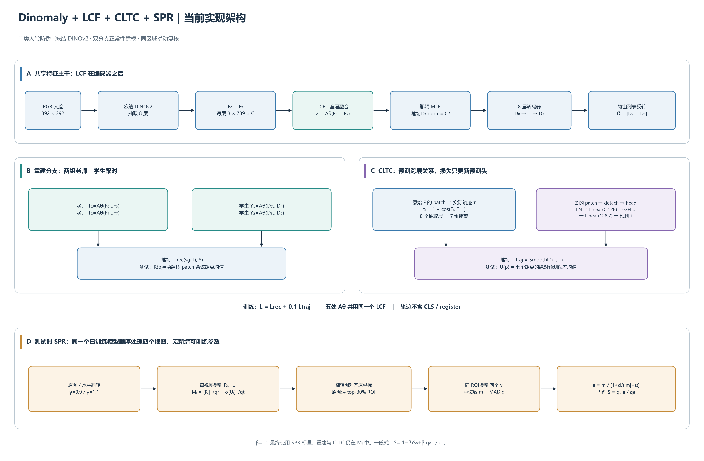
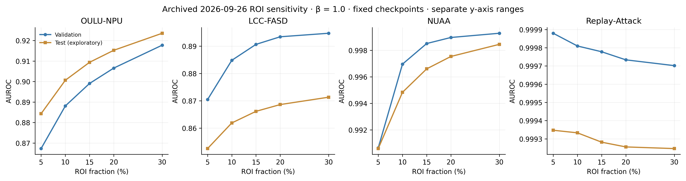

# 从层条件表示到同区域证据复核：LCF＋CLTC＋SPR 单类人脸防伪研究稿

版本：2026-09-28。本文按论文逻辑组织当前已经实现的方法、实验和解释，作为论文写作底稿与复现实验说明。最新主结果采用用户从日志摘录的四库、四阶段、六项指标；用户确认不清楚统计方式，所有原值保留，聚合口径待核对。模块工作名称不等于已有发表论文的名称；新颖性需要在投稿前完成相关文献比对。

**建议论文题目**：面向单类人脸防伪的层条件正常性建模与同区域扰动复核。

**英文题目**：*Layer-Conditional Normality Modeling and Same-Region Perturbation Rechecking for One-Class Face Anti-Spoofing*。

当前完整系统是 **Dinomaly＋LCF＋CLTC＋SPR**。C 模块即 SPR，当前方法设置为 **ROI=30%、β=1.0**。用户最新记录中的 laf/ctlc 按上下文暂对应既有代码的 LCF/CLTC。方法部分描述现有实现；第 10.1–10.3 节采用 2026-09-28 日志摘录；其余标注为历史的实验来自原始归档。最新 16 行结果尚未逐行关联 checkpoint、manifest、阈值及运行配置，不能直接继承旧结果的同协议证明。SLR、RCNC、MSC、LGC、CMV、语言 CoT 不属于这套系统。

**证据边界**：最新日志摘录支持四个阶段的数值比较，但并非本次独立复跑。历史同 checkpoint 缓存中的“仅原图 top-30% 区域均值”在四库 AUROC 均略高于完整 SPR，HTER 也更低（第 10.5.1 节）。这项历史发现不能被新主表覆盖，也不能与新基线混算差值。现阶段不能把完整方法的改善全部独立归因于多视图复核；统计口径、配对实验条件与机制贡献仍需核验。

配套文件：

- [逐项实验数据附录](dinomaly_lcf_cltc_spr_paper_data.md)：最新四库四阶段指标与核对项，以及明确分开的历史消融、五档 ROI、CLTC 分支、配置和运行代价。
- [最新日志摘录 CSV](assets/lcf_cltc_spr_paper/reported_metrics_20260928.csv) / [来源说明](assets/lcf_cltc_spr_paper/reported_metrics_20260928_provenance.json)：主结果唯一转录源，保留原精度。
- [中文架构图 PDF](assets/lcf_cltc_spr_paper/architecture_current_zh.pdf) / [SVG](assets/lcf_cltc_spr_paper/architecture_current_zh.svg) / [PNG](assets/lcf_cltc_spr_paper/architecture_current_zh.png)。
- [英文论文流程图 PDF](assets/lcf_cltc_spr_paper/method_overview_en.pdf) / [SVG](assets/lcf_cltc_spr_paper/method_overview_en.svg) / [PNG](assets/lcf_cltc_spr_paper/method_overview_en.png)。
- [ROI 敏感性图 PDF](assets/lcf_cltc_spr_paper/roi_sensitivity.pdf) / [PNG](assets/lcf_cltc_spr_paper/roi_sensitivity.png)。
- [绘图及数据汇编源码](scripts/build_lcf_cltc_spr_paper_assets.py)、[来源文件 SHA256](assets/lcf_cltc_spr_paper/evidence_sources.json)。

## 摘要草稿

在仅使用真人样本进行梯度训练的人脸防伪场景中，固定跨层融合可能限制局部表示，单一重建误差也未显式利用跨层关系。本文在 Dinomaly 基础上研究层条件融合 LCF、跨层轨迹一致性头 CLTC 和同区域扰动复核 SPR。LCF 根据 token 内容组织层信息，并共享用于解码器输入与老师/学生分组融合；CLTC 从停止梯度的融合表示预测冻结编码器相邻抽取层的余弦距离，以残差补充重建异常证据；SPR 在原图选定区域后，对齐四视图并通过中位数及相对 MAD 聚合，不引入额外可训练参数。最新日志摘录中，完整方法在 OULU-NPU、LCC-FASD、NUAA、Replay-Attack 的测试 AUROC 分别为 0.9235、0.8713、0.9984 和 0.9992，四库等权宏平均为 0.9481，相对 Dinomaly 基线增加 7.24 个百分点；HTER 宏平均由 0.222575 降至 0.0990。分阶段比较显示 LCF 的 AUROC 四库均提高，而 CLTC 的增益随数据集及指标而变；SPR 阶段四库 AUROC 与 HTER 均改善，但 LCC-FASD 的部分阈值指标下降。这些数值尚待原日志统计口径与逐行协议核验，不能视为本次独立复现。历史同 checkpoint 对照进一步显示单视图同区域聚合略优于完整 SPR，提示评分与池化方式是重要混杂因素。正式论文需补齐来源核验、配对消融及未参与调参的独立评估。

关键词：人脸防伪；单类学习；特征重建；层条件融合；跨层关系预测；同区域扰动复核。

## 1. 引言：为什么要做这项工作

### 1.1 任务背景

人脸防伪需要区分真人采集与照片、屏幕回放等呈现攻击。常规二分类方法直接学习训练集中的攻击模式，但实际部署中的攻击材质、显示设备和采集条件可能不同。只用真人样本训练提供另一种研究路径：学习真人的正常特征结构，再检测偏离该结构的输入。

这种思路的困难在于，偏离正常结构不一定来自攻击。真人的反光、模糊、曝光和背景也可能产生较大的异常响应；反过来，一些攻击的外观仍然非常接近真人。因而，研究重点不应只是“把异常分数变大”，而应是：如何形成信息更充分、对局部扰动更稳健的正常性证据。

本文以已有的 Dinomaly 特征重建范式为基础。DINOv2 提供冻结的多层视觉特征，瓶颈和解码器在真人上学习重建。本文围绕三个相互衔接的问题组织方法。

### 1.2 三个问题如何形成一条主线

| 问题 | 当前设计 | 输出 | 希望检验的效果 |
|---|---|---|---|
| 同一位置应如何利用不同深度的信息？ | LCF：输入条件的跨层注意力 | 融合表示 Z、老师 T、学生 Y | 相比固定 mean 改善正常性表示与重建 |
| 除了重建结果，跨层关系是否还能提供异常证据？ | CLTC：七维层间距离预测 | 跨层预测残差图 U | 对重建异常图 R 提供互补信息 |
| 原图的可疑区域经轻微扰动后是否仍然高响应？ | SPR：对齐后复核原图选定区域 | 稳健区域证据 e | 改善单视图及普通 TTA 的异常排序 |

可以用三句话向读者解释：**LCF 学会组织层信息；CLTC 检查层间关系的可预测性；SPR 检查同一局部证据在多视图下的表现。**

这是一条计算证据链。当前系统没有语言模型、思维链文本监督、多轮语言推理，也没有跨视频时间的轨迹建模。适合使用“区域证据复核”“多视图证据一致性”这样的表述。

### 1.3 论文贡献的建议写法

1. 研究冻结预训练编码器下的层条件正常性建模，以 patch/token 级跨层注意力替换固定平均，并明确共享融合器在输入与重建比较空间中的作用。
2. 构建停止梯度的跨层关系预测旁路，通过预测真人多层特征的相邻抽取层余弦距离，形成补充性的轨迹残差证据。
3. 设计免新增训练的同区域扰动复核，将原图高响应区域、几何对齐、多视图稳健聚合与正常样本尺度校准结合起来，并以同视图预算 TTA 和聚合消融检验其作用。

以上是可用于论文组织的贡献描述，不表示三项贡献都已被现有实验独立证明。最新日志已有完整四阶段数值：LCF 四库 AUROC 均上升，CLTC 并非逐库逐指标一致改善。其独立贡献仍需核对配对条件；历史同区域对照中 SPR 尚未超过更便宜的单视图方案。若后续仍无独立收益，应将 SPR 定位为受检验的扩展或负结果分析。注意力、余弦距离、MLP、median、MAD 都是已有工具；贡献应落在具体问题、约束和可验证的机制上。

## 2. 相关工作与方法定位

### 2.1 预训练特征与重建式异常检测

DINOv2 提供视觉特征，Dinomaly 提供冻结编码器、带噪瓶颈、Transformer 解码器、松散分组重建及余弦硬样本训练的基础。本文保留这些构件。论文应明确基础方法来源，并把新增内容与继承内容分开。

LCF 不是新的基础视觉编码器，也没有重新训练 DINOv2。它改变的是抽取层之间的融合方式，而且当前实现还共享到老师与学生特征的分组融合。

### 2.2 单类人脸防伪

单类 FAS 关注如何在缺少训练攻击样本时学习正常分布。本文的梯度训练仅使用真人，但当前完整实验流程仍使用带攻击标签的验证集选择分类阈值，历史调参也观察过测试成绩。因此应写成“真人梯度训练＋所述开发/评估协议”，不能省略验证与选择条件后笼统宣称整个流程从未使用攻击标签。

### 2.3 跨层关系与自监督预测

CLTC 用特征关系而非类别标签作为预测目标。它与特征蒸馏、辅助自监督预测具有联系，但这里的目标是同一 patch 在八个抽取层之间的七个距离。其输入 Z 已融合这八层，所以这是压缩表示上的关系预测，不是从浅层预测从未见过的未来层，也不是自回归推理。

### 2.4 测试时增强与区域复核

普通 TTA 将不同视图的整图分数平均。SPR 固定原图的高响应位置，比较对齐视图中相同位置的分数，并引入稳健聚合。区别同时涉及“在哪里聚合”“怎样聚合”，因此只有与普通 TTA 比较仍不能单独证明固定 ROI、median 或 MAD 各自的贡献，需要逐步消融。

本文尚未做穷尽式最新文献检索。正式稿应补充与相邻层关系预测、区域一致性异常检测、置信度加权 TTA 及单类 FAS 的直接比较；文末列出已知基础文献入口，不据此声称“首次”。

## 3. 总体架构与记号

第 3–8 节的结构、公式与超参数对应现有代码及已归档实现设置；最新日志只补充指标，没有提供新架构。不能据此断言最新 16 个运行的全部配置已逐一验证。



图 1：当前代码对应的详细架构。A 展示编码与解码主干；B、C 通过重复使用同名张量 F、Z、D 展示两分支；D 展示推理时的 SPR 包装。图中的五处 Aθ 是同一 LCF 实例的五次调用。sg 表示停止梯度。所有 R、U 是模型计算的异常证据，不代表有像素标注监督。


图 2：训练阶段只用真人更新 LCF、瓶颈、解码器与 CLTC head；推理阶段使用四视图、固定区域对齐和稳健复核。虚线为目标构造路径，实线为前向数据路径。CLTC 输入的 sg 切断该损失对 LCF 的回传。英文投稿图注见第 13 节。

| 符号 | 含义与形状 |
|---|---|
| x | RGB 输入；当前为 B×3×392×392 |
| F_i | 第 i 个抽取层 token；当前 B×789×C，i=0,…,7 |
| F_i(p) | 去掉 prefix 后的原始 patch 特征；B×784×C |
| C | 特征通道数，LCC 为 1024，另外三库为 1536 |
| Aθ | 五处共享的 LCF 函数 |
| Z | 八层全融合后、瓶颈前的特征 |
| D_i | 解码器按执行顺序产生的第 i 层输出 |
| T_g、Y_g | 第 g 组老师/学生特征，g=1,2 |
| τ、τ̂ | 实际与预测的七维跨层距离；B×784×7 |
| R、U | 原生重建图和轨迹图；B×1×28×28 |
| P | 原有图像级打分算子：上采样、resize、平滑、top-1% 均值 |
| q_r、q_t | 真人验证分数的两支路 q95 尺度 |
| S0 | 单视图 LCF＋CLTC 基础标量分数 |
| ρ | SPR 原图选区比例，当前 0.30 |
| Ω / w(p) | 原图选定的区域 / 含并列边界分摊的非负权重 |
| v_j、m、d、e | 四视图区域分数、中位数、MAD、复核证据 |
| λ、α、β | 轨迹训练损失权重、轨迹证据权重、最终 SPR 混合权重 |

392/14=28，所以共有 784 个 patch。reg4 模型还有 1 个 CLS 和 4 个 register，token 总数为 **789**。当前保留 prefix 通过 LCF 与解码器；重建输出空间化与 CLTC 轨迹都仅使用 patch。旧文档某些示例把这一数量写成 785，应以此处和实际代码为准。

## 4. 方法一：LCF 层条件融合

### 4.1 固定平均与输入条件融合

设本次融合的层集合为 I。对位置 p，先计算层均值作为 query 的摘要，再映射每层的 key 和 value：

\[
\bar F(p)=\frac{1}{|I|}\sum_{i\in I}F_i(p),\quad
q(p)=W_q\bar F(p)+b_q,
\]
\[
k_i(p)=W_kF_i(p)+b_k,\quad v_i(p)=W_vF_i(p)+b_v,
\]
\[
a_i(p)=\operatorname{softmax}_{i\in I}\left(\frac{q(p)^\top k_i(p)}{\sqrt C}\right),
\quad A_\theta(\{F_i\})(p)=W_o\sum_{i\in I}a_i(p)v_i(p)+b_o.
\]

softmax 在层维上进行，每个位置有自己的层权重。当前 dropout=0，因此没有随机丢弃注意力权重。该模块在 prefix 上也运行；对防伪局部解释主要关注 patch。

LCF 不只是对原始特征作非负加权平均，因为还有 value 投影与输出投影。因此论文不能将输出直接解释成原始层特征的凸组合，也不能未经可视化就断言某个权重一定对应纸张纹理或屏幕像素。

### 4.2 一个 LCF，五个调用位置

\[
Z=A_\theta(F_0,\ldots,F_7),
\]
\[
T_1=A_\theta(F_0,\ldots,F_3),\qquad T_2=A_\theta(F_4,\ldots,F_7),
\]
\[
Y_1=A_\theta(D_7,D_6,D_5,D_4),\qquad
Y_2=A_\theta(D_3,D_2,D_1,D_0).
\]

Z 决定瓶颈/解码器输入；T 是重建时的老师答案；Y 是学生答案的分组表达。图中的三个用途都在编码器之后，与“LCF 位于编码器之后”完全一致。

编码器被冻结，但老师 T 并非整个训练期间数值固定：共享 LCF 会被其他路径更新，下次前向生成的 T 也可能变化。重建损失对 T 做 detach，意味着当步损失不沿老师路径更新参数；并不意味着 T 的生成函数永久固定。

### 4.3 为什么反转解码器输出

解码器先顺序执行 D0→D1→…→D7，然后执行 `decoder_features[::-1]`。这是对已得到的输出列表排序，以构造分组配对：编码器较浅的四个抽取层对应解码器较后的四层，编码器较深的四个抽取层对应解码器较前的四层。没有反向执行网络，也没有翻转图像或 token 的空间位置。

当前 LCF 没有显式层位置编码，在同一组内置换输入次序不会在数学上改变集合注意力结果。因此这里反转的重要效果是**改变半组成员的对应关系**，而不是让 LCF 在四层内部按时间顺序读特征。这种对应来自原重建设计，不能写成逐层语义等价已经被证明。

### 4.4 重建损失与重建异常图

训练损失不是逐 patch 距离的简单平均。实际 `CosineHardMiningLoss` 对每组空间特征展平，计算样本级全局余弦距离，然后对两组平均：

\[
\mathcal L_{rec}=\frac{1}{2B}\sum_{g=1}^{2}\sum_b
\left[1-\cos\big(\operatorname{vec}(\operatorname{sg}(T_g^b)),
\operatorname{vec}(Y_g^b)\big)\right].
\]

另外，代码依据逐位置重建难度给学生梯度注册 hook，降低简单位置的梯度。默认简单位置梯度乘 0.1；比例调度从 0 逐渐增加，在 1000 steps 达到 0.9。这个 0.1 是硬挖掘梯度系数，与 CLTC 的 λ=0.1 是两个独立参数。

测试时才逐位置计算重建图：

\[
R(p)=\frac12\sum_{g=1}^2[1-\cos(T_g(p),Y_g(p))].
\]

余弦及相关精细数值在 FP32 中计算，以降低 BF16 高相似度取整造成的分数塌缩风险。

## 5. 方法二：CLTC 跨层轨迹一致性头

### 5.1 轨迹目标从哪里来

按照编码深度排列抽取层，对相同 patch 构造：

\[
\tau_i(p)=\operatorname{clip}_{[0,2]}\{1-\cos(F_i(p),F_{i+1}(p))\},\quad i=0,\ldots,6.
\]

目标来自冻结编码器的**原始 patch 特征**，在 LCF 和可选 context recentering 之前构造。不经过瓶颈和解码器，也不需要人工标注轨迹。这里“相邻”指相邻的抽取层：Giant 使用 blocks [6,10,14,18,22,26,30,34]，它们并非物理上相邻的 Transformer block。

这条七维向量描述特征方向在抽取层间的变化幅度，不包含完整方向信息。不同特征序列可能有相同的七个距离。因此建议把“轨迹”解释为跨层距离描述子，不称为对全部特征演化的完整恢复。

### 5.2 预测头训练过程

\[
\hat\tau(p)=h_\phi(\operatorname{sg}(Z_{patch}(p))),
\]
\[
h_\phi=\operatorname{Linear}_{128\to7}\circ\operatorname{GELU}
\circ\operatorname{Linear}_{C\to128}\circ\operatorname{LayerNorm}_C.
\]

每个 patch 的 C 维融合表示被映射到七个距离。预测头是可训练的，随主实验共同优化，并保存在 checkpoint 中；不需要单独运行一个“CLTC 训练命令”。当前最后一层没有 sigmoid 或 clip，所以预测值没有被强制限制在 [0,2]。

\[
\mathcal L_{traj}=\operatorname{mean}_{b,p,i}\operatorname{SmoothL1}(\hat\tau_i(p)-\tau_i(p)),
\quad \mathcal L=\mathcal L_{rec}+\lambda\mathcal L_{traj},\quad\lambda=0.1.
\]

PyTorch 默认 SmoothL1 的转折参数为 1：误差绝对值小于 1 时是二次惩罚，大于等于 1 时转为线性惩罚。它与最终的 λ 权重、SPR 的 β 不是同一个变量。

由于输入 detach 和目标 no-grad，轨迹损失只更新 head。LCF、瓶颈与解码器由重建损失更新；冻结编码器不更新。当前 Lightning 实现将 head 与主重建部分分别裁剪梯度，避免全局裁剪把两部分重新耦合。将 λ 从 0.1 改成 0.3 会改变 head 的优化，但不等于测试时轨迹分数变成三倍，也不能据此保证 AUROC 上升。

### 5.3 为什么残差可能提供防伪信息

CLTC 在真人上学习融合表示与层间关系之间的映射。如果攻击在这两者之间形成不同于训练真人的关系，预测误差可能增加：

\[
U(p)=\frac17\sum_{i=0}^6|\hat\tau_i(p)-\tau_i(p)|.
\]

它补充的是关系预测残差，不是第二次重建 RGB。该机制是一项经验假设：head 可能对攻击也泛化良好，也可能对困难真人预测失败；需要分支比较、互补性与误报分析支持。

因为 Z 已包含所有抽取层的信息，论文不能以“没有看过深层，所以必须推理深层”来解释效果。更合理的解释是：以正常样本训练的低维预测器，对多层关系进行受容量约束的建模。

## 6. 原有 LCF＋CLTC 如何打分

两张原生图 R、U 各自执行同一图像级算子 P：先双线性上采样到输入分辨率，再 resize 至 256×256、高斯平滑，取最高 1% 响应的均值。当前高斯核为 5、sigma=4；256² 个位置取 floor(65536×0.01)=655 个值。

\[
s_r=P(R),\quad s_t=P(U),\quad
q_r=Q_{.95}(s_r\mid\text{validation bona fide}),\quad
q_t=Q_{.95}(s_t\mid\text{validation bona fide}),
\]
\[
S_0=\frac{s_r}{q_r}+\alpha\frac{s_t}{q_t}.
\]

α 在 OULU、NUAA、Replay 为 1.0，在 LCC 为 0.5。两尺度被保存于 CLTC head buffer。它们把两个分支调整到参考尺度，不是把分数转成概率。

**先分别池化再融合标量**是旧基线的准确计算。由于 top-k 具有非线性，一般有：

\[
P(R/q_r+\alpha U/q_t)\ne P(R)/q_r+\alpha P(U)/q_t.
\]

因此不能把融合热图重新取 top-1% 后称作原 S0。SPR 使用另一种明确声明的局部聚合，正是在打分规则上引入变化。

| 分数名称 | 模型条件 | 输出 |
|---|---|---|
| 纯 LCF reconstruction | 单独训练、关闭 CLTC 的 LCF 模型 | P(R) |
| CLTC reconstruction | 已训练 LCF＋CLTC，读取重建分支 | P(R) |
| CLTC trajectory | 同一个模型，读取轨迹分支 | P(U) |
| CLTC fused | 同一个模型，两支路尺度对齐后相加 | S0 |
| 当前 SPR，β=1 | 同一 checkpoint，四视图同区域复核 | q0 e/qe |

trajectory-only 仍依赖 LCF 提供 Z，并依赖真人重建训练得到的 LCF 参数。只读取轨迹分数不等于 LCF 没起作用。

## 7. 方法三：SPR 同区域扰动复核

### 7.1 四个视图与共享模型

将已经按原数据流程缩放、尚未标准化的 RGB 图像 x 构造成：

\[
\mathcal V=\{x,\operatorname{HFlip}(x),x^{0.9},x^{1.1}\}.
\]

gamma 在 [0,1] RGB 上逐值幂运算，之后才进入原 preprocessor。四个视图顺序通过同一个已训练、eval 模式的 LCF＋CLTC 模型。包含原图共四次前向，比单视图多三次。所有样本都执行，没有先按 S0 筛选一部分样本才复核。

每个视图产生原生 28×28 的 R_j、U_j，再得到：

\[
M_j(p)=\frac{[R_j(p)]_+}{q_r}+\alpha\frac{[U_j(p)]_+}{q_t}.
\]

水平翻转视图的 M_j 沿宽度翻回原始坐标，记为 \(\widetilde M_j\)。gamma 视图没有几何变化。该过程没有裁剪出一张 ROI 人脸小图再跑网络。

### 7.2 从原图选一次 ROI

由原图 M0 选择最高响应的 k 个 patch，k=max(1,floor(ρN))。当前 N=784、ρ=0.30，所以 k=235。

这个 ROI 是由响应排序得到的 patch 集合，可能散布在不同位置，不保证连通，也不是固定的人脸中心矩形。ρ=30% 指约 30% 的原生 patch 响应质量，不是放大 30%、图像边长 30%，也不是丢弃其余区域后重新编码。

为避免边界同分值被任意索引打破，实现对并列边界分配相同的分数权重：高于截断值的 patch 权重为 1，低于截断值为 0，等于边界的 patch 共享剩余权重，总权重为 k。常数图得到均匀权重，因而非零位置数可能大于 k。

### 7.3 在相同坐标读取四个区域分数

\[
v_j=\frac{\sum_p w(p)\widetilde M_j(p)}{\sum_p w(p)},\qquad j=0,1,2,3.
\]

w 只来自原图，四个视图复用。普通 TTA 每个视图在自身分数算子下选高值位置，各视图的主要响应可能在不同地点；SPR 则明确围绕原图选定位置复核。这是其机制上的可检验差异。

### 7.4 中位数与相对 MAD

\[
m=\operatorname{median}(v_0,v_1,v_2,v_3),\quad
d=\operatorname{median}_j|v_j-m|,
\]
\[
e=\frac{m}{1+d/(|m|+\epsilon)},\qquad\epsilon=10^{-8}.
\]

四个数的中位数取中间两项均值。MAD 描述视图分数围绕 m 的波动；实现未乘常见正态一致性系数 1.4826。分数非负时，0≤e≤m，波动相对更大时抑制更强。它是启发式稳定性折减，不是统计置信概率或因果验证。

例如区域分数 [1.9,2.0,2.1,2.0] 给出 m=2.0、d=0.05、e≈1.951；[0.2,0.3,3.7,3.8] 同样 m=2.0，但 d=1.75，e≈1.067。例子仅说明公式，不是模型实测分数。四视图的鲁棒性有限，稳定的错误高响应也会保留下来。

### 7.5 最终校准与 β 的含义

在验证真人上估计 q0=Q.95(S0) 与 qe=Q.95(e)，再计算：

\[
S=(1-\beta)S_0+\beta q_0\frac{e}{q_e}.
\]

| β | 最终标量组成 |
|---:|---|
| 0 | 100% 原 S0 |
| 0.25 | 75% 原 S0＋25% 校准后的 SPR |
| 0.5 | 各 50% |
| 1.0 | 100% 校准后的 SPR |

当前 β=1.0 时，S0 在最终线性混合中的直接系数是 0。但是 R、U 已经进入每个 M_j，LCF、重建和 CLTC 都仍然参与最终分数的计算。不能把这一设置写成“只剩 C，移除了原模型”。

因为 q0/qe 是数据集内对所有样本相同的正数，**β=1 时 S 与 e 的 AUROC 相同**。这一外层尺度只调整数值单位；两支路 q_r、q_t 以及 α 会改变 M_j 的组成和 ROI，仍可能影响排序。

## 8. 训练、校准与测试的完整流程

### 8.1 算法 1：真人梯度训练

```text
输入：真人训练清单；冻结 DINOv2；LCF θ；瓶颈/解码器 ψ；CLTC φ
每个训练 step：
  1. 编码 x 得到原始 F0…F7；从原始 patch 计算 τ。
  2. Z = Aθ(F0…F7)。
  3. 经瓶颈、8 层 decoder 得到 D0…D7，将输出列表反转。
  4. 通过共享 Aθ 得到 T1,T2 与 Y1,Y2；去 prefix，重排为空间特征。
  5. τ_hat = hφ(stop_gradient(Z_patch))。
  6. L = CosineHardMiningLoss(T,Y) + 0.1 SmoothL1(τ_hat,τ)。
  7. 反向传播；主重建参数与 CLTC head 分别裁剪；优化器更新。
按配置的固定步数保存 checkpoint。
```

使用 StableAdamW：lr=0.002，betas=(0.9,0.999)，weight_decay=0.0001，amsgrad=True，eps=1e-8；WarmCosineScheduler 的最终值 0.0002，warmup 100。实际调度总长依训练 max_steps 设置。输入 392×392，瓶颈 dropout=0.2，LCF dropout=0，hidden_dim=128。当前 head 的随机初始化有单独 RNG 保护，不能据此推导不同运行一定逐位相同。

### 8.2 算法 2：验证校准与推理

```text
固定 checkpoint、预处理、manifest、α、ρ、β。
读取或在真人验证样本上估计 q_rec、q_traj。
对验证集每张图：
  顺序计算四视图的 Rj、Uj、原图 S0；对齐翻转图；
  原图 M0 选一次 ROI；计算四个 vj、m、MAD、e。
只用验证真人估计 q0、qe；计算完整验证集的 S。
按该数据集预先声明的规则，在有标签验证集上确定阈值 t。
测试时固定所有统计量，对每张图复用上述四视图评分；以 S>t 判攻击。
保存逐样本分数、清单哈希、配置、阈值及指标。
```

训练损失系数 λ、分支融合系数 α、后处理融合系数 β 和选区面积 ρ 必须分别报告。推理时没有 `Lrec + 0.1 Ltraj` 这个训练损失相加过程；测试使用实际异常图及分数。

## 9. 实验设置与指标

### 9.1 历史归档四库配置

第 9.1–9.3 节元数据来自 2026-09-26 归档链，用于说明现有实现和历史对照；不是最新四阶段 16 行的配置证明。最新结果需要逐行补齐原日志、骨干、训练设置、checkpoint/manifest 哈希和阈值选择规则。

| 数据集 | 编码器 | 训练 steps | 训练 batch | 主干精度 | λ | α | 本轮评估 batch |
|---|---|---:|---:|---|---:|---:|---:|
| OULU-NPU | DINOv2 Giant/14 reg4 | 5000 | 1 | BF16，配置名 float16 | 0.1 | 1.0 | 4 |
| LCC | DINOv2 Large/14 reg4 | 5000 | 2 | FP32 | 0.1 | 0.5 | 4 |
| NUAA | DINOv2 Giant/14 reg4 | 20000 | 1 | FP32 | 0.1 | 1.0 | 4 |
| Replay-Attack | DINOv2 Giant/14 reg4 | 20000 | 1 | FP32 | 0.1 | 1.0 | 4 |

四个 checkpoint 的 seed 均为 42；本轮 SPR 的 β=1、ρ=.3。head 保持 FP32。Large 的八个抽取 block 为 [4,6,8,10,12,14,16,18]；Giant 为 [6,10,14,18,22,26,30,34]。当前未启用 context recentering，也未在主干前移除 prefix。

### 9.2 历史清单的样本数量

下表“真人/攻击”均为历史 manifest 中的帧/图像计数，不是受试者或视频数，不自动代表新主表每行的样本数。

| 数据集 | 训练真人 | 验证真人/攻击 | 测试真人/攻击 |
|---|---:|---:|---:|
| OULU-NPU | 1800 | 360 / 1440 | 1440 / 5760 |
| LCC | 924 | 46 / 1352 | 185 / 5409 |
| NUAA | 3135 | 156 / 1349 | 625 / 5399 |
| Replay-Attack | 2272 | 113 / 1395 | 454 / 5582 |

历史 LCC 清单的验证真人只有 46 张，q95 和阈值可能对少量样本敏感。测试中攻击占绝大多数，Accuracy、F1、Precision 不能单独代表两类的平衡表现。最新数据按用户提供的全名写作 LCC-FASD；目录别名仍为 lcc。原始数据集引用、版本与划分需补齐，不能把它当作 CASIA-FASD 或标准 O/C/I/M 协议中的 C。

### 9.3 历史归档协议的准确名称

| 数据集 | 已保存协议 | 分类阈值选择 |
|---|---|---|
| OULU-NPU | `legacy_lcf_from_test_20pct_frame_level_folder` | 验证集最大 F1，沿用旧边界规则 |
| LCC | `legacy_normal_holdout_from_test_val` | 验证集最小 HTER，并列取较大阈值 |
| NUAA | `legacy_dedicated_normal_test_from_test_val` | 同上 |
| Replay-Attack | `legacy_normal_holdout_from_test_val` | 同上 |

OULU 使用旧测试目录划出 20% 验证帧；其他三库按各自旧 Folder 划分逻辑生成清单。路径不重叠并不足以证明视频、身份或近重复帧之间独立。当前结果属于 **自定义帧级/图像级实验**，不是官方 OULU Protocol 1–4 或官方视频级成绩，也不是跨库迁移成绩。

四库分别训练/加载各自 checkpoint，验证尺度也在各自验证集上估计。不能把四个库都测得高分称为“一个模型跨四库泛化”。

### 9.4 指标定义与正负类

归档实现中真人 y=0，攻击 y=1，分数越大越可疑。判定使用严格 `score > threshold`。TP 是攻击判攻击，FN 是攻击判真人，FP 是真人判攻击，TN 是真人判真人。下列是整体二分类公式，不是对最新摘录统计方式的确认：用户从日志抄数，暂不清楚其 binary/macro/weighted、分折/视频聚合、正类和阈值是否完全一致。

\[
\mathrm{Accuracy}=\frac{TP+TN}{TP+TN+FP+FN},\quad
\mathrm{Precision}=\frac{TP}{TP+FP},\quad
\mathrm{Recall}=\frac{TP}{TP+FN},
\]
\[
F1=\frac{2TP}{2TP+FP+FN},\quad
\mathrm{HTER}=\frac12\left(\frac{FN}{TP+FN}+\frac{FP}{TN+FP}\right).
\]

AUROC 衡量随机一个攻击样本的分数高于一个真人样本的概率（并列算半），不依赖固定分类阈值。分类指标依赖验证阈值，因此 AUROC 改善不保证 Accuracy 或 HTER 同时改善。当前 pooled HTER 与早期 pooled ACER 都对两类错误率平均，但不能将其直接冒充官方按攻击类别汇总的 ACER。

最新日志中有六行的 F1 与所给 P、R 的整体二分类公式值存在超出显示精度的差异（详见第 10.1 节）。这不等于断言原结果错误：分折后分别平均或类别平均可能不满足上述关系。也不能擅自认定已经采用该平均方式。本文保留日志值，待原始评估脚本与同次运行输出核对；不使用公式值替换成绩。

OULU 的 F1 阈值选择调用 precision-recall curve，最终判定仍沿用严格大于，历史代码在边界相等处存在阈值口径差异；此稿复述已测实现。正式统一协议若修订该行为，需要全方法重算阈值指标，不应只改某个方法。

### 9.5 已经看过测试集时如何陈述

目前开发过程中已查看 β 与 ROI 的测试表现；ρ=30% 同时也是已测五档的验证宏平均最好值，但这一事实不能倒推整个选择过程从未使用测试反馈。因此本文把这些结果作为开发阶段的已测证据。正式无偏终评需要在方法冻结后使用未参与选择的数据或预先定义的新协议。

重新运行相同 checkpoint 和同一测试清单验证了复现性，并不会重新获得一个未参与开发的测试集。此前提关系到论文实验可信度，应在设置中交代，而不是隐藏在结果数字后面。

## 10. 实验结果：每个模块实际有多少证据

### 10.1 最新四库四阶段结果：日志摘录原值

<!-- REPORTED_METRICS_START -->

来源：2026-09-28 用户从日志抄录的结果；本次未重新训练或模型推理。用户确认不清楚评估脚本的统计方式，故保留全部原值，聚合口径待核对。下表按用户上下文作为测试结果整理，未提供新的验证指标、逐行 checkpoint、manifest 或阈值。原记录 laf/ctlc 暂对应既有实现 LCF/CLTC，未改名模型。所有数值为 0–1；AUROC、Accuracy、F1、Precision、Recall 越高越好，HTER 越低越好。

**LCC-FASD**

| 方法 | AUROC ↑ | Accuracy ↑ | F1 ↑ | Precision ↑ | Recall ↑ | HTER ↓ |
|---|---|---|---|---|---|---|
| Dinomaly | 0.8243 | 0.8562 | 0.9205 | 0.9777 | 0.8721 | 0.2914 |
| Dinomaly＋LCF | 0.8503 | 0.8701 | 0.9291 | 0.9824 | 0.8814 | 0.2894 |
| Dinomaly＋LCF＋CLTC | 0.8377 | 0.8299 | 0.9048 | 0.9858 | 0.8361 | 0.2575 |
| Dinomaly＋LCF＋CLTC＋SPR | 0.8713 | 0.7926 | 0.8807 | 0.9916 | 0.7922 | 0.2012 |

**OULU-NPU**

| 方法 | AUROC ↑ | Accuracy ↑ | F1 ↑ | Precision ↑ | Recall ↑ | HTER ↓ |
|---|---|---|---|---|---|---|
| Dinomaly | 0.809 | 0.7362 | 0.8075 | 0.9163 | 0.7148 | 0.2607 |
| Dinomaly＋LCF | 0.8726 | 0.8257 | 0.7871 | 0.8395 | 0.7608 | 0.1884 |
| Dinomaly＋LCF＋CLTC | 0.8747 | 0.8902 | 0.9346 | 0.8923 | 0.9812 | 0.2461 |
| Dinomaly＋LCF＋CLTC＋SPR | 0.9235 | 0.9208 | 0.9517 | 0.9282 | 0.9765 | 0.1627 |

**NUAA**

| 方法 | AUROC ↑ | Accuracy ↑ | F1 ↑ | Precision ↑ | Recall ↑ | HTER ↓ |
|---|---|---|---|---|---|---|
| Dinomaly | 0.9328 | 0.7036 | 0.8084 | 0.9893 | 0.6835 | 0.1981 |
| Dinomaly＋LCF | 0.9675 | 0.9354 | 0.9462 | 0.9471 | 0.9553 | 0.0925 |
| Dinomaly＋LCF＋CLTC | 0.9804 | 0.9397 | 0.9638 | 0.9884 | 0.9403 | 0.0585 |
| Dinomaly＋LCF＋CLTC＋SPR | 0.9984 | 0.9923 | 0.9957 | 0.9964 | 0.9950 | 0.0177 |

**Replay-Attack**

| 方法 | AUROC ↑ | Accuracy ↑ | F1 ↑ | Precision ↑ | Recall ↑ | HTER ↓ |
|---|---|---|---|---|---|---|
| Dinomaly | 0.9367 | 0.8352 | 0.8884 | 0.9612 | 0.8328 | 0.1401 |
| Dinomaly＋LCF | 0.9542 | 0.7220 | 0.8182 | 0.9777 | 0.7126 | 0.1385 |
| Dinomaly＋LCF＋CLTC | 0.9888 | 0.9845 | 0.9870 | 0.9876 | 0.9864 | 0.0171 |
| Dinomaly＋LCF＋CLTC＋SPR | 0.9992 | 0.9956 | 0.9976 | 0.9978 | 0.9974 | 0.0144 |

**四数据集等权宏平均（由上述汇总数计算）**

| 方法 | AUROC | Accuracy | F1Score | Precision | Recall | HTER |
|---|---|---|---|---|---|---|
| Dinomaly | 0.8757 | 0.7828 | 0.8562 | 0.961125 | 0.7758 | 0.222575 |
| Dinomaly＋LCF | 0.91115 | 0.8383 | 0.87015 | 0.936675 | 0.827525 | 0.1772 |
| Dinomaly＋LCF＋CLTC | 0.9204 | 0.911075 | 0.94755 | 0.963525 | 0.9360 | 0.1448 |
| Dinomaly＋LCF＋CLTC＋SPR | 0.9481 | 0.925325 | 0.956425 | 0.9785 | 0.940275 | 0.0990 |

这里的宏平均仅指四个数据集等权，不表示原始日志内部采用 macro 指标；不是合并全部测试样本的 pooled 指标，也不是多训练 seed 均值。

**逐阶段差值（百分点，相对紧邻前一配置）**

| 数据集 | +LCF ΔAUROC | +LCF ΔHTER | +CLTC ΔAUROC | +CLTC ΔHTER | +SPR ΔAUROC | +SPR ΔHTER |
|---|---|---|---|---|---|---|
| OULU-NPU | +6.36 | -7.23 | +0.21 | +5.77 | +4.88 | -8.34 |
| LCC-FASD | +2.60 | -0.20 | -1.26 | -3.19 | +3.36 | -5.63 |
| NUAA | +3.47 | -10.56 | +1.29 | -3.40 | +1.80 | -4.08 |
| Replay-Attack | +1.75 | -0.16 | +3.46 | -12.14 | +1.04 | -0.27 |

差值是日志汇总值的算术比较，不自动证明仅改变一个模块；同拆分、骨干、训练预算和阈值策略仍须核对。

**统计口径核对（不是替换后的成绩）**

只有在同一批预测、同一正类、同一阈值的整体二分类计算下，才应满足 F1=2PR/(P+R)。下列行的差异超过 0.0003，不能简单归于所示精度的取整；分折后平均、类别宏平均或不同运行来源均需检查，当前不能确定原因。

| 数据集 | 方法 | 日志 F1（保留） | 整体二分类公式参考值 |
|---|---|---|---|
| LCC-FASD | Dinomaly | 0.9205 | 0.921886 |
| OULU-NPU | Dinomaly | 0.8075 | 0.803104 |
| OULU-NPU | Dinomaly＋LCF | 0.7871 | 0.798215 |
| NUAA | Dinomaly＋LCF | 0.9462 | 0.951182 |
| Replay-Attack | Dinomaly | 0.8884 | 0.892405 |
| Replay-Attack | Dinomaly＋LCF | 0.8182 | 0.824361 |

上表参考值仅用于发现口径差异，不是重新评估所得的 F1。投稿前应逐行关联原日志、评估代码、正类、阈值、样本单位和 average 参数。完整方法与旧 SPR 结果数值接近，也不意味着其他阶段继承旧实验的元数据。

<!-- REPORTED_METRICS_END -->

### 10.2 按模块解释：表示、关系与复核

**LCF：四库排序改善，但阈值指标并非全面上升。** 相对 Dinomaly，OULU-NPU、LCC-FASD、NUAA、Replay-Attack 的 AUROC 分别增加 6.36、2.60、3.47、1.75 个百分点，四库 HTER 也都下降。四库 AUROC 宏平均从 0.8757 增至 0.91115，提示输入相关跨层融合具有研究价值。但 Replay 的 Accuracy 从 0.8352 降至 0.7220，OULU 的日志 F1 从 0.8075 降至 0.7871，不能用 AUROC 代替全部评价。LCF 同时改变解码器输入、老师及学生比较空间，需要输入端/全共享消融才能定位收益来源。

**CLTC：关系证据的作用具有数据集差异。** 相对纯 LCF，OULU、NUAA、Replay 的 AUROC 分别增加 0.21、1.29、3.46 个百分点，而 LCC-FASD 从 0.8503 降至 0.8377，下降 1.26 个百分点。OULU 的 HTER 从 0.1884 升至 0.2461，虽然 AUROC 略升，所报告阈值下的平衡误差却变差；LCC-FASD 则出现 AUROC 下降、HTER 改善的相反组合。这支持“排序与阈值决策必须分开分析”，不支持“加入轨迹必然提高所有数据集性能”。应从同 checkpoint 导出 reconstruction、trajectory、fused 三支路，再分析残差互补性与阈值迁移。

**SPR：四库 AUROC、HTER 方向一致，但评分规则和视图复核尚未分离。** 相对最新 LCF＋CLTC 摘录，OULU、LCC-FASD、NUAA、Replay 的 AUROC 分别增加 4.88、3.36、1.80、1.04 个百分点；HTER 分别下降 8.34、5.63、4.08、0.27 个百分点。LCC-FASD 的 Accuracy 从 0.8299 降至 0.7926、F1 从 0.9048 降至 0.8807、Recall 从 0.8361 降至 0.7922，同时 Precision 从 0.9858 升至 0.9916，呈现明显的阈值表现取舍。尚未核对阈值及聚合口径前，不应进一步反推混淆矩阵或断言具体错误类型已被修复。

**整体表现。** 四库 AUROC 宏平均为 0.8757 → 0.91115 → 0.9204 → 0.9481；HTER 宏平均为 0.222575 → 0.1772 → 0.1448 → 0.0990。完整方法相对 Dinomaly 的 AUROC 提高 7.24 个百分点，HTER 降低 12.3575 个百分点。宏平均是对用户报告值的等权算术汇总，不表示统计显著，也不代表每库各项指标都单调改善。

### 10.3 新结果、历史证据与因果归因的边界

最新四阶段表已经提供 Dinomaly、纯 LCF、LCF＋CLTC、完整 SPR 的结果，不再以“没有 LCF 数值”为缺口。真正尚缺的是逐行可核验的日志来源、评分字段、同协议元数据与固定划分配对复现。旧对话中的纯 LCF=0.8685 不再充当本版最新主表基线。

特别注意：最新 NUAA 的 LCF＋CLTC AUROC 为 **0.9804**，历史同 checkpoint 对照为 **0.984028**；最新 Replay 为 **0.9888**，历史为 **0.998826**。这不是四位小数取整造成的差异。因此最新 SPR 阶段差值应为 NUAA +1.80、Replay +1.04 个百分点；历史缓存差值仍为约 +1.442371、+0.042104 个百分点。两者必须分开，不应把历史 checkpoint 的配对关系移植到新数字。

最新摘录没有验证 AUROC，主表不拼接历史验证成绩。历史验证曲线、TTA、ROI 消融、单视图区域对照和耗时仍完整保留在后续章节与附录，作为独立标注来源的证据。投稿前需将四阶段日志关联到每库相同 manifest、骨干、预算、训练种子、阈值规则及逐样本预测；若条件不同，应重跑或明确写成非配对比较，而非强行解释为单模块因果提升。

### 10.4 历史 CLTC 三分支结果（与最新主表分开）

早期 `oulu_cltc_s42_gpu` 是**独立正常 dev** 协议，已核验结果为：

| 同一 CLTC 模型的分数 | AUROC | 近似 EER | pooled ACER |
|---|---:|---:|---:|
| reconstruction | 0.864614 | 0.213264 | 0.369306 |
| trajectory | 0.816326 | 0.261250 | 0.407986 |
| fused | 0.871118 | 0.217083 | 0.383681 |

融合相对重建 AUROC 增加约 0.650355 个百分点，支持该次运行中的排序互补性；但 EER 与 ACER 没有同步改善。轨迹单支路 AUROC 低于重建，不妨碍其在融合时提供补充信息。

该早期实验的测试 manifest 哈希为 `734b8ce8…`，历史 OULU legacy 为 `a4df2815…`，测试数量与校准协议也不同。不能把 0.871118 与 SPR 的结果直接相减，声称那就是加入 SPR 的公平增益。历史同 checkpoint 基线为 0.874795，见附录 B；最新主表另按用户摘录 0.8747 保留，并待核验来源。

CLTC 的严格消融还需要“关闭 CLTC 的独立 LCF 训练”与“开启 CLTC 的同设置训练”，以及重建/轨迹/fused 全分支导出。detach 设计避免直接更新 LCF，但不替代真实配对复现实验。

### 10.5 历史同视图预算 TTA 与聚合消融

下表来自已完成的**历史 ROI=10%、β=0.25**，与当前主表配置不同。所有 TTA 和 SPR 都使用原图、flip、gamma0.9、gamma1.1 四视图。

| 数据集 | 原 S0 | 普通 TTA | 同比例融合 TTA | 同 ROI 均值 | 同 ROI 中位数 | 完整 SPR |
|---|---:|---:|---:|---:|---:|---:|
| OULU-NPU | 0.874795 | 0.877415 | 0.875670 | 0.883317 | 0.883866 | 0.883645 |
| LCC | 0.837748 | 0.834283 | 0.837181 | 0.844862 | 0.846002 | 0.845643 |
| NUAA | 0.984028 | 0.969576 | 0.981589 | 0.985612 | 0.988429 | 0.988455 |
| Replay-Attack | 0.998826 | 0.995880 | 0.998566 | 0.998835 | 0.999062 | 0.999064 |

表中均为测试 AUROC。“同 ROI 均值/中位数”两列均无 MAD 惩罚，仍按 β=0.25 与 S0 融合。普通 TTA 为四个整图 S0 分数的均值；同融合 TTA 则也进行真人 q95 尺度对齐，并采用同一 β。

这些数据说明：在历史配置下，SPR 的收益不只是“四次推理代替一次推理”，也不只是保留 75% 原 S0。中位数在四库均优于均值；完整 SPR 相对无惩罚中位数，OULU/LCC AUROC 略降，NUAA/Replay 略升，HTER 的额外改善很小。**MAD 应被定位为轻量稳健化细节，不能作为已被证明的大幅收益来源。**

四库六项完整指标、MAD 增量的源值见数据附录 C 及历史实验记录。不能把上表与最新主表混算增益或省略配置差异。历史 ROI=30% 配置的缓存计算结果如下。

### 10.5.1 历史 ROI=30% 的同视图预算对照与单视图区域对照

以下由文档生成脚本读取 2026-09-26 归档 validation/test scores 后计算，**新增网络前向次数为 0**。这不是最新 16 行摘录的重新评估。采用原阈值规则，各替代分数独立拟合验证真人尺度和验证分类阈值，随后固定到测试集。脚本复算的原 S0 与完整 SPR 六项指标均与该历史 summary 一致，绝对核对容差为 1e-12。

| 数据集 | 原 S0 AUROC | 仅原图 ROI 均值 | 普通四视图 TTA | 同 ROI 四视图均值 | 同 ROI 四视图中位数 | 完整 SPR |
|---|---:|---:|---:|---:|---:|---:|
| OULU-NPU | 0.874795 | 0.924518 | 0.877415 | 0.921628 | 0.924091 | 0.923543 |
| LCC | 0.837748 | 0.872103 | 0.834283 | 0.867893 | 0.871675 | 0.871306 |
| NUAA | 0.984028 | 0.998546 | 0.969576 | 0.995230 | 0.998443 | 0.998451 |
| Replay-Attack | 0.998826 | 0.999270 | 0.995880 | 0.996910 | 0.999205 | 0.999247 |

| 数据集 | 单视图 ROI HTER | 完整 SPR HTER | SPR 相对单视图 ROI 的 AUROC 差值/百分点 |
|---|---:|---:|---:|
| OULU-NPU | 0.161892 | 0.162760 | −0.097536 |
| LCC | 0.195353 | 0.201198 | −0.079747 |
| NUAA | 0.017237 | 0.017700 | −0.009454 |
| Replay-Attack | 0.013369 | 0.014470 | −0.002289 |

单视图对照保留相同 R/U、q_r/q_t、α 和原图 ROI，直接将原图区域分数 v0 校准为 q0·v0/Q.95(v0|验证真人)。它每张图只需一次网络前向。因此，上述点估计显示：当前四次复核没有超过一个更低成本的区域评分方案。没有显著性检验，不能说两者差异在统计上确定，但已经不能声称多视图复核产生额外收益。

该单视图对照相对原 S0 仍改变了两个重要细节：先融合 patch 图再区域池化，以及从原 top-1% 图像级流程改为原生 top-30% 区域。需要继续拆开这两种变化。当前数据提示“打分与池化方式”是收益来源的强候选，尚不能把所有提升严格归因于 ROI 面积本身。

β=1 下经过正数尺度对齐的 TTA 与普通 TTA 的排序等价，所以无需再列一列相同 AUROC 作为独立方法。完整 SPR 相对无惩罚中位数的 MAD 作用仍很小，且 LCC 在当前设置下的 HTER 也变差；历史配置中“MAD 四库 HTER 均略改善”的结论不能泛化到当前配置。

完整六指标和尺度/阈值分别保存于 [历史缓存对照 CSV](assets/lcf_cltc_spr_paper/current_cached_comparisons.csv) 与 [校准 JSON](assets/lcf_cltc_spr_paper/current_cached_calibration.json)，并收入数据附录 H。文件名保留 current 以兼容已有引用，来源仍是 2026-09-26 归档预测，不冒充新主表的独立神经网络实验。

### 10.6 历史 ROI 敏感性与统一配置



图 3：2026-09-26 历史 sweep，固定 β=1、固定各库 checkpoint，改变原图 ROI 比例。各子图纵轴范围不同，便于查看接近饱和的 NUAA/Replay，不能仅比较曲线视觉高度。测试曲线属于开发探索结果，不为最新主表补填验证成绩。

| ROI | 验证 AUROC 宏平均 | 测试 AUROC 宏平均 |
|---:|---:|---:|
| 5% | 0.932063 | 0.931690 |
| 10% | 0.942410 | 0.939165 |
| 15% | 0.946992 | 0.942845 |
| 20% | 0.949666 | 0.945159 |
| 30% | 0.952855 | 0.948137 |

扩大 ROI 在 OULU、LCC、NUAA 上改善了所测 AUROC，但 Replay 的趋势不同：5% 的测试 AUROC 为 0.999347，高于 30% 的 0.999247。因而 30% 是已测范围内统一四库宏平均较好的设置，并非每个数据集分别最优，更不是“ROI 越大越好”的一般规律。

机制上可能是：较小 ROI 过度依赖少量峰值，较大 ROI 纳入更广的证据；继续增大也可能把正常背景平均进去。这是对现象的解释假设，应通过 ROI 可视化、真人/攻击分布及单视图区域池化对照验证。

### 10.7 历史训练参数探索与 seed 的真实含义

数据附录 F 整理了 19 个有完整顶层指标文件的 LCF＋CLTC 训练记录，并附全部配置。重要观察包括：

- LCC，λ=.1、α=.5、5000 steps：batch=1 的 AUROC 为 0.810133，batch=2 为 0.837748，batch=3 为 0.751020。相同步数下不同 batch 的样本更新量也不同，不能归因成“batch 越大越好”。
- LCC，batch=1、5000 steps、α=.5：λ=.1 与 .5 的 AUROC 分别为 0.810133 和 0.810105，差异极小，没有证据支持增大 λ 必然改善。
- 文件夹 `lcc_lcf_cltc_legacy_fp32_20k_lambda03_s42` 实际 config 的 max_steps 是 **5000**。表格采用配置文件，不能依据目录名写成 20000。
- LCC seed 42/43/44/45/46 的对应 AUROC 为 0.837748/0.774020/0.675276/0.772293/0.732218；五次 test manifest 哈希不同。它们反映初始化和划分等因素的联合变化，不能写成固定数据划分下的多训练种子均值±标准差。
- `lcc_lcf_cltc_final_lambda01_alpha05_5k_b2_s42` 与 `lcc_lcf_cltc_final_5k_b2_s42` 配置和指标重复，不按两个独立种子计数。
- Replay 5000→20000 steps 的保存结果 AUROC 从 0.940862 到 0.998826，但调度总长也变化；OULU 两次运行还同时改变精度与时长，不是纯步数消融。

这些结果应作为开发实验记录与后续控制变量设计依据，论文主文不宜只挑高分而忽略变化条件。

## 11. 开销、可解释性与失败模式

### 11.1 参数量和推理成本

LCF 四个 C→C 带偏置线性层参数量为 4C²+4C，Large 为 4,198,400，Giant 为 9,443,328。共享调用只计算一次参数量，不能乘五。CLTC head 的参数量为 130C+1031，Large 为 134,151，Giant 为 200,711。SPR 可训练参数为 0。

“轻量”适合修饰 CLTC head 或 SPR 的参数增量，不适合在没有总模型统计时称整个 Giant 系统轻量。SPR 需要四视图网络前向，实际墙钟开销还受 I/O、batch、GPU 负载影响。本轮含 I/O 的 test 秒/图约为 OULU 0.216、LCC 0.275、NUAA 0.793、Replay 0.783，完整统计见附录 G；它们不是统一硬件基准下的纯网络延迟。

### 11.2 论文应展示什么定性结果

正式定性图建议每个案例同时给出：原图、R、U、原图 ROI、flip 对齐图、两张 gamma 图、四个 v_j、m、MAD、e 和最终判断。挑选真人反光误报、普通攻击、接近决策边界的攻击、SPR 修正成功及修正失败各类案例，采用同一色条规则。

目前交付的架构图和流程图没有冒用人脸/热图作为真实实验案例。没有像素标注时，热图可以支持诊断解释，但不能据此声称精准定位物理攻击区域。后续需从实际 `predict_evidence` 输出导出案例，再加入论文。

### 11.3 可能的失败模式

1. **稳定误报**：真人反光对四个弱扰动都稳定，MAD 小，SPR 仍可能保留错误证据。
2. **攻击响应不稳定**：某些真实攻击对 gamma 敏感，折减反而压低攻击分数。
3. **ROI 选错**：原图高响应在背景，四视图持续复核错误区域。
4. **关系预测过度泛化**：CLTC 对攻击也能准确预测，轨迹残差没有区分力。
5. **融合参照漂移**：共享 LCF 同时改变重建输入及比较空间，解释层权重时需要检查其动态。
6. **校准迁移**：正常验证样本数量少、身份/设备分布不同，q95 和分类阈值在测试或部署中偏移。

因此不能把“多视图稳定”当成“物理上确实是攻击”的充分条件，也不能把一次近满分解释成跨设备稳定性已经解决。

## 12. 补齐正式论文证据的实验设计

最新四阶段日志值已收录。下一步首先核对统计口径和配对条件，而非默认这些值已经有完整元数据。以下区分来源核验和后续机制实验，不把计划写成已完成结果。

| 实验 | 固定条件 | 改变因素 | 回答的问题 |
|---|---|---|---|
| 最新 16 行来源核验 | 原日志、评估脚本与同次运行预测 | 不改模型；核对正类/阈值/聚合方式 | 六行 F1 差异原因及数据可比性是什么？ |
| mean vs 输入 LCF vs 共享 LCF | 同拆分、骨干、训练预算、共同初始化 | 融合位置/方式 | LCF 收益来自哪里？ |
| LCF vs LCF＋CLTC | 同数据与训练设置；导出各分支 | CLTC 开关 | 辅助关系预测是否有独立收益？ |
| CLTC fused vs 单支路 | 同 checkpoint 与阈值策略 | 评分支路 | 排序和阈值表现是否互补？ |
| 分支分别池化 vs 先融合图再池化 | 同原图 R/U、同面积 | 融合与池化次序 | 单视图区域收益来自哪里？ |
| 原图 ROI vs 四视图普通 TTA vs SPR 的跨种子验证 | 固定拆分，配对 checkpoint | 区域与聚合策略 | 当前缓存结论能否跨训练复现？ |
| 固定原图 ROI vs 各视图独立选 ROI | 相同对齐、ρ、median、MAD | 区域定义 | “同区域”本身是否必要？ |
| mean vs median vs median/MAD 的跨种子验证 | 同当前 ρ=.3、β=1 | 稳健聚合 | 当前缓存消融是否稳定？ |
| 重建图 SPR / 轨迹图 SPR / 两图 SPR | 同 checkpoint、ROI/校准规则 | SPR 内部证据来源 | β=1 时两分支是否都必要？ |
| 3–5 个训练 seed | 完全固定 manifest 与 split_seed | 只改 train_seed | 模块收益是否跨初始化稳定？ |
| 官方/视频分组/跨库评估 | 先冻结方法和调参规则 | 协议或目标域 | 当前现象能否推广？ |

当前配置的标量对照已由缓存补齐。建议下一步先核验单视图区域结论及融合/池化次序，再补需要空间图的独立选区实验；在额外复核收益成立之前，不应优先扩展更复杂的复核模块。已有缓存能重算的项目无需重新做四视图前向，但新比较必须有单独文件、参数和来源记录。

置信区间应尽量以视频或受试者为独立单位做配对 bootstrap，而不是把同视频帧当成大量独立样本。无法恢复可靠分组时，需要限制统计结论。不同方法使用同一个 bootstrap 抽样，以比较 AUROC/HTER 差值的分布。

正式主实验建议统一 backbone，或至少在每个数据集内所有方法使用同一 backbone。阈值规则、seed 选择与评估预算也应统一或完整披露；不能直接把当前自定义帧级数字与文献官方视频级 SOTA 排名。

## 13. 论文组织、图注与可直接使用的表述

### 13.1 建议的篇章结构

1. Introduction：真人建模动机；层信息、层关系与证据稳定性三个缺口；贡献。
2. Related Work：单类 FAS、预训练特征重建、层关系预测、TTA/区域一致性。
3. Method：问题设置与符号；LCF；CLTC；SPR；训练与校准算法。
4. Experiments：数据协议、实现参数、指标、完整方法、配对消融、参数敏感性、成本。
5. Discussion：误报/漏报实例、共享目标与关系信息限制、协议及模型选择的局限。
6. Conclusion：仅总结证据支持的贡献，列明后续需要的独立验证。
7. Supplementary：完整逐库指标、阈值/尺度、哈希、探索记录、所有复现命令。

主文建议保留方法图、完整结果表、主要消融表、敏感性图和真实定性图；所有历史训练探索放补充材料，不能伪装成严格控制变量的消融。

### 13.2 英文图注草稿

**Figure 1 / implementation architecture.** *Architecture of the implemented LCF–CLTC–SPR system. A frozen DINOv2 encoder provides eight feature levels. One shared layer-conditional fusion module produces the decoder input and the two encoder/decoder comparison groups. Decoder outputs are reversed before grouping. A detached CLTC predictor estimates seven adjacent selected-layer cosine distances from fused patch tokens. Reconstruction and trajectory residual maps are subsequently used by a parameter-free same-region perturbation recheck. At the reported setting, ρ=0.30 and β=1.0. Repeated tensor symbols across panels denote the same intermediate quantities.*

**Figure 2 / method overview.** *Overview of normality learning and same-region evidence rechecking. (a) Only bona fide images are used for gradient training. Reconstruction updates the LCF, bottleneck and decoder, whereas the trajectory objective updates only the detached prediction head. Dashed paths construct supervision targets; solid paths denote forward computation. (b) During inference, four deterministic views share the trained network. The original-view evidence selects one patch region, which is reused after geometric alignment. Median aggregation and relative median absolute deviation produce a calibrated recheck score without additional training.*

**Figure 3 / sensitivity.** *Sensitivity to the ROI fraction with β=1.0 and fixed dataset-specific checkpoints. Validation and exploratory test AUROC are shown for five evaluated fractions. Each panel uses its own y-axis range. The largest tested fraction yields the highest macro-average AUROC, whereas Replay-Attack favors a smaller region. These development results do not constitute an untouched final-test estimate.*

### 13.3 创新点与证据如何对应

| 可写入论文的陈述 | 当前支持程度 | 还缺什么 |
|---|---|---|
| 实现了输入条件、逐位置跨层融合 | 代码＋最新摘录四库 AUROC 上升 | 核对来源与同协议条件，补融合位置消融 |
| CLTC 提供跨层关系预测异常证据 | 代码＋最新阶段比较＋历史三分支 | 收益非全面一致，需配对条件与互补性分析 |
| SPR 阶段四库 AUROC/HTER 改善 | 最新日志摘要数值支持；历史另有配对证据 | 不混用两套来源，核对日志、独立终评与 seed 稳定性 |
| SPR 优于普通 TTA | 历史与当前缓存对照支持 | 仍未优于单视图区域对照 |
| 多视图复核比原图区域评分更有效 | 当前四库点估计不支持 | 独立协议与跨种子验证，或修改/删减机制主张 |
| 同 ROI 四视图中位数的 AUROC 高于均值 | 历史与当前四库缓存消融支持 | 固定划分的更多训练 seed |
| MAD 是主要收益来源 | 当前数据不支持 | 现有增量很小且 AUROC 不一致 |
| 四库已证明跨库泛化/官方 SOTA | 当前数据不支持 | 官方与跨库协议、可比基线 |
| 整个模型无需训练 | 与代码不符 | 只能说 SPR 无新增梯度训练 |

适合当前结果的结论段：本研究构建并分析了一个结合层条件特征重建、跨层关系预测及同区域扰动复核的人脸防伪框架。最新四阶段日志汇总中，完整方法 AUROC 四库宏平均为 0.9481，HTER 宏平均为 0.0990，相对 Dinomaly 分别改善 7.24 和 12.3575 个百分点。LCF 的 AUROC 四库均改善；CLTC 的收益依数据集和指标而变；SPR 阶段四库 AUROC 与 HTER 均改善，但 LCC-FASD 的部分阈值指标下降。新结果的统计口径与配对条件仍需核对。历史同 checkpoint 的单视图区域对照略优于完整 SPR，说明打分和池化方式不能忽略，现有证据不支持将所有收益独立归因于额外多视图。后续通过日志来源核验、固定划分配对消融、融合/池化次序控制及独立终评检验真正贡献。

## 14. 复现入口、文件对照和交付说明

### 14.1 最新日志摘录与历史评估入口

最新主结果来源为 `assets/lcf_cltc_spr_paper/reported_metrics_20260928.csv`，对应用户从日志摘录的 16 行、96 项指标；`reported_metrics_20260928_provenance.json` 记录来源、别名和未知统计口径。尚未提供逐行原始日志路径，本次不声称独立复跑或复算了这些成绩。

历史归档评估目录：`results/spr_roi_sweep_20260926_140600_193717`；五档 sweep 目录：`results/spr_roi_sweep_20260926_012138_088241`。每库保存 config、calibration、runtime、validation/test scores 和 roi_metrics；顶层 summary/macro_summary 汇总。下列命令复现的是该归档 SPR 设置，不能单靠它重建最新四阶段全部结果。

在既有 WSL CUDA 环境中可按同配置运行以下命令。需要确保 uv 选择原 torch_env 的 Python，不自动切换到 Windows 绘图环境；不需要为了本文重新执行数小时模型评估。

```bash
cd /mnt/c/Users/heqi/Desktop/wj/anomalib
uv run --no-project --python "$(command -v python)" \
  LCF-CLTC-SPR/sweep_roi_fractions.py \
  --datasets oulu lcc nuaa replay --roi-fractions 0.30 \
  --spr-beta 1.0 --eval-batch-size 4 --num-workers 4 --device cuda:0
```

输出使用新时间戳目录。四个输入 checkpoint 分别来自 `oulu_lcf_cltc_legacy_s42`、`lcc_lcf_cltc_final_5k_b2_s42`、`nuaa_lcf_cltc_legacy_fp32_20k_s42`、`replay_lcf_cltc_legacy_fp32_20k_s42`，以各 config 中保存的权重与 manifest 哈希为准。

### 14.2 关键代码对应关系

| 文件 | 本文对应内容 |
|---|---|
| `src/anomalib/models/image/dinomaly/torch_model.py` | 编码层、五处融合调用、反转、两种异常图、标量池化与融合 |
| `components/lcf.py` | Q/K/V、层 softmax、输出投影 |
| `components/trajectory_head.py` | 原始层轨迹目标、detach、LN/MLP、q95 buffer |
| `components/loss.py` | 全局余弦损失与简单 patch 梯度衰减 |
| `lightning_model.py` | 参数解冻、初始化、精度、优化器和独立梯度裁剪 |
| `components/perturbation_recheck.py` | fractional top-k、同区域评分、median/MAD |
| `LCF-CLTC-SPR/_runner.py` | 四视图、对齐、原 S0 复核、尺度拟合、阈值规则 |
| `LCF-CLTC-SPR/sweep_roi_fractions.py` | 单次四视图前向复用到多个 ROI 比例 |
| `LCF-CLTC-SPR-TTA/_runner.py` | 普通 TTA 与同 β 校准融合 TTA |
| `LCF-CLTC-SPR-ABLATION/_runner.py` | 无惩罚 median/mean 聚合对照 |

除表中第一行和最后四行外，相对路径均位于同一个 Dinomaly 模型目录中。

### 14.3 图表如何重新生成

Windows 当前工作区：

```powershell
uv run --no-project --python .venv-win/Scripts/python.exe docs/research/scripts/build_lcf_cltc_spr_paper_assets.py
```

脚本以 inline dependencies 固定 Matplotlib/Numpy，读取最新摘录 CSV 自动同步主表和附录，另从历史归档生成缓存对照、来源哈希和 SVG/PDF/300-dpi PNG。新旧结果各有明确栏目，不会用旧 summary 覆盖新主表。中文图使用 Microsoft YaHei，SVG 保留可编辑文字；PDF 嵌入字体，适合论文排版。迁移机器时需要提供中文字体路径。图形全部为代码构建的矢量对象，没有虚构实验热图。

LaTeX 双栏论文可用：

```latex
\begin{figure*}[t]
  \centering
  \includegraphics[width=\textwidth]{method_overview_en.pdf}
  \caption{Overview of normality learning and same-region evidence rechecking.}
  \label{fig:method}
\end{figure*}
```

本次文档工作不更新 checkpoint、不重新训练或网络推理，历史 results 保留原样；更新的是用户日志摘录、派生算术统计、分析、架构说明与论文交付件。归档缓存对照仅离线重算，不与新主表混用。正式投稿时应补齐原日志、代码 commit、依赖版本和独立分组信息，核验统计口径后完善 Data Availability / Code Availability。

另提供主文与完整数据附录合并的 [Word 研究稿](dinomaly_lcf_cltc_spr_manuscript.docx)，含可编辑表格、公式和插图。使用 `scripts/export_lcf_cltc_spr_manuscript.py` 通过 uv 重新导出；最终投稿版需按目标期刊/会议模板重新排版。

## 15. 参考文献与后续检索入口

以下列出支撑方法定位的基础入口；本轮没有逐篇重新核验全文或开展截至当前日期的系统检索，投稿前应补全作者、卷页、BibTeX 及直接相关的近期工作。

1. **Dinomaly: The Less Is More Philosophy in Multi-Class Unsupervised Anomaly Detection**, CVPR 2025。[CVF 入口](https://openaccess.thecvf.com/content/CVPR2025/html/Guo_Dinomaly_The_Less_Is_More_Philosophy_in_Multi-Class_Unsupervised_Anomaly_CVPR_2025_paper.html)。本文基础重建范式来源。
2. **DINOv2: Learning Robust Visual Features without Supervision**。[arXiv:2304.07193](https://arxiv.org/abs/2304.07193)。冻结视觉表示来源；register 变体配置另需对应实现/权重引用。
3. **Vision Transformers Need Registers**。[arXiv:2309.16588](https://arxiv.org/abs/2309.16588)。解释 reg4 prefix，不应把 register 当空间 patch。
4. **One-Class Face Anti-spoofing via Spoof Cue Map-Guided Feature Learning**, CVPR 2024。[CVF 入口](https://openaccess.thecvf.com/content/CVPR2024/html/Huang_One-Class_Face_Anti-spoofing_via_Spoof_Cue_Map-Guided_Feature_Learning_CVPR_2024_paper.html)。单类 FAS 的相关方法，说明“仅真人训练”不是本文首次提出。
5. **Self-Supervised Predictive Convolutional Attentive Block for Anomaly Detection**, CVPR 2022。[CVF 入口](https://openaccess.thecvf.com/content/CVPR2022/html/Ristea_Self-Supervised_Predictive_Convolutional_Attentive_Block_for_Anomaly_Detection_CVPR_2022_paper.html)。辅助预测异常建模的相关方向，不能仅因引入预测头就宣称独创。

还需补齐各数据集的原始论文、普通 TTA 与稳健聚合文献、跨层关系建模的最近邻方法，以及与本文监督条件相同的 FAS 基线。LCF、CLTC、SPR 在本项目中是工作命名；不能把 CLTC 虚构成某一年已发表并被引用的独立论文。
