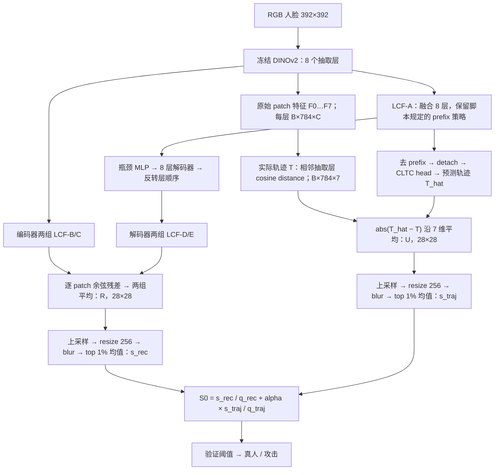
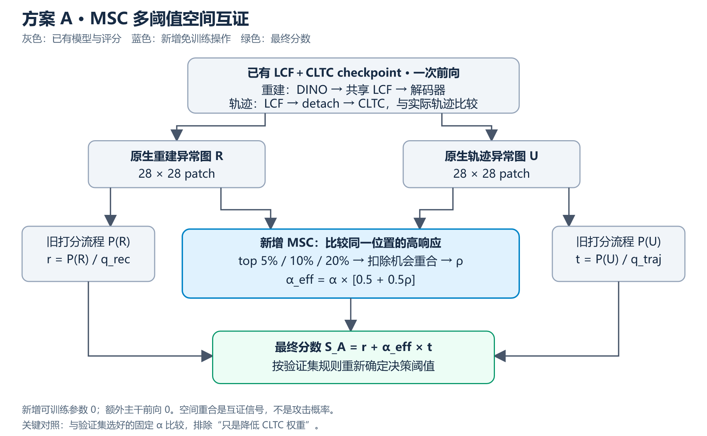
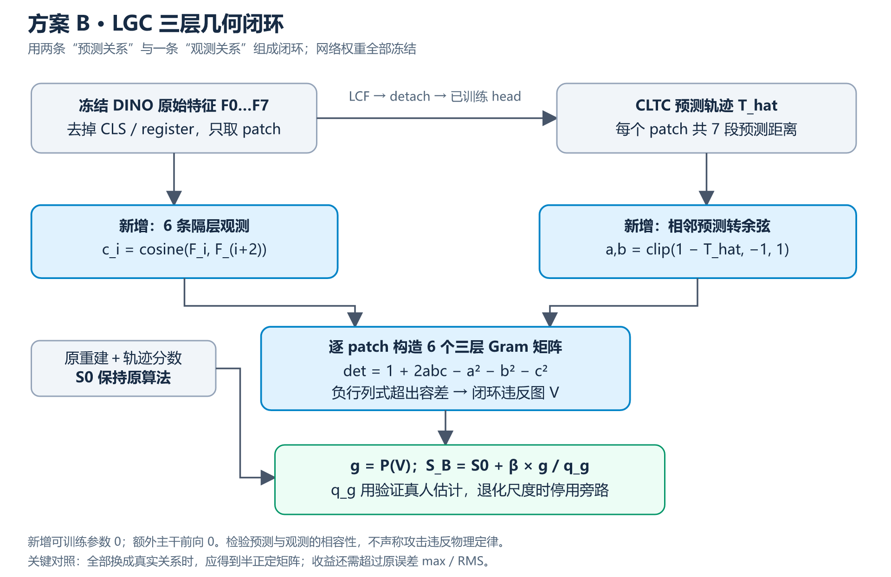
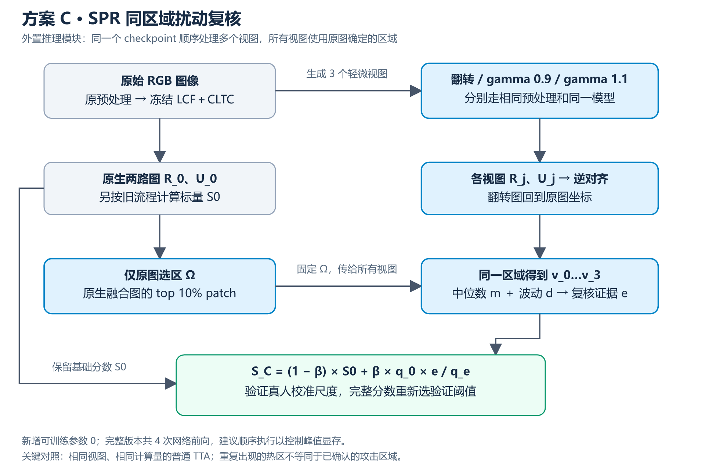
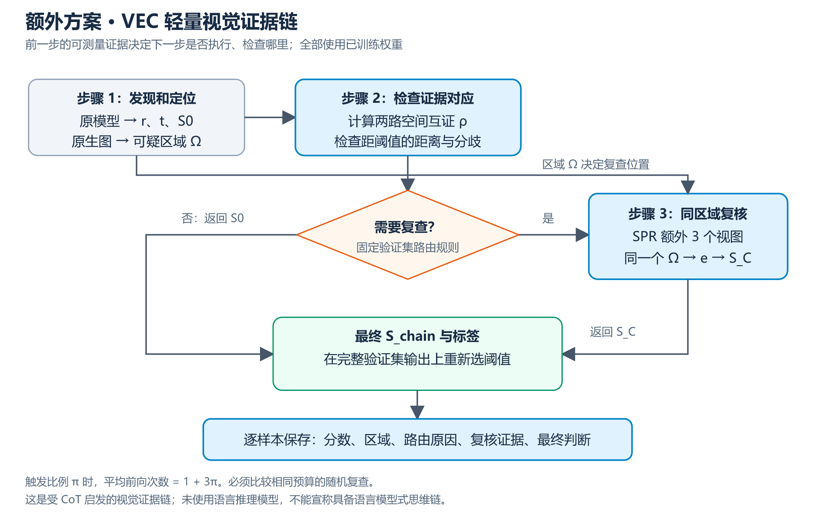

# LCF＋CLTC 的三个免训练扩展模块与轻量视觉证据链

日期：2026-09-24。本文基于当前仓库代码和已有实验配置编写。

交付范围：研究方案、接入位置、架构图、数学定义、消融设计和实现清单。三个候选模块尚未实现，也没有测得性能提升。模块名称是本文的工作命名，不代表已经发表的方法。

**我的建议：先试 A；想把老师说的“思维链”作为论文主线，选 C＋第 6 节的证据链；愿意承担更高研究风险、希望更紧密围绕 CLTC 展开，选 B。** 三个方案是供你选择的替代方向，第一轮每次只接一个。

## 1. 三个方案到底有什么不同

|方案|工作名称|新增的检查|接入位置|新增可训练参数|额外网络前向|需要重新训练吗|
|---|---|---|---|---:|---:|---|
|A|MSC：Multi-threshold Spatial Corroboration，多阈值空间互证|重建与轨迹是否在同一位置发现异常？|两张原生 patch 图形成后，最终分数融合处|0|0|不需要|
|B|LGC：Layer-triplet Geometric Closure，三层几何闭环|预测的相邻层关系与实际隔层关系是否能同时成立？|原始 DINO 特征与 CLTC 预测之间，旁路输出闭环分数|0|0|不需要|
|C|SPR：Same-region Perturbation Recheck，同区域扰动复核|轻微改变图像后，同一可疑区域是否仍提供异常证据？|整个 LCF＋CLTC 外部的推理封装器|0|固定版本多 3 次|不需要|

这里“免训练”指：加载已有 LCF＋CLTC checkpoint，全部设为 `eval()`，不创建优化器、不反向传播、不更新网络参数。LCF 和 CLTC 原本是训练出来的，不能把整个系统写成“无需训练”。

A 可以直接使用已有分数尺度；B、C 需要在验证真人上估计新增分数尺度。所有方案改变最终分数后，都要按旧协议重新选择验证集阈值。这是统计校准，没有梯度训练。**如果你连验证集校准也不想重新做，就只能比较未校准分数的 AUROC，不能直接沿用旧阈值比较 Accuracy、F1 和 HTER。**

不建议把一个没有训练过的 CBAM、MLP 或新 Transformer 放入 LCF 到解码器之间。随机参数无法提供可靠功能。即使 SimAM 等模块没有可训练参数，插入已有 checkpoint 的特征路径也会改变解码器见到的分布，需要实验验证。本文三个方案都围绕现成模型已经产生的证据工作。

## 2. 当前 LCF＋CLTC 的准确结构

### 2.1 一张图看清现有模型



LCF-A/B/C/D/E 是五个调用位置，**共享一个 LCF 实例和参数**。CLTC 接在 LCF-A 后、瓶颈之前。当前代码的 `detach()` 固定存在于 `CrossLayerTrajectoryHead.forward()` 中。

LCF 按每个 patch 学习跨层融合；CLTC 预测七段跨层距离。这里的“轨迹”是网络深度方向的变化，**不是视频时间轨迹，也不是未来帧预测**。CLTC 输入的 LCF 表示已经融合了全部抽取层，不能声称它在预测完全未见过的深层特征。

训练损失是 `L_rec + lambda × SmoothL1(T_hat, T)`。CLTC 的损失只更新 head。推理时，即使 detach，CLTC 仍通过轨迹异常分数影响最终结果。

### 2.2 本文统一符号

|符号|定义|
|---|---|
|`F_i(p)`|第 i 个抽取层在 patch p 的原始冻结 DINO 特征|
|`T_i(p)`|`1 − cosine(F_i(p), F_(i+1)(p))`，实际轨迹，共 7 段|
|`T_hat_i(p)`|CLTC head 输出，现有 head 没有强制限制输出范围|
|`R(p)`|两组编码器/解码器 cosine distance 的平均，原生 28×28 重建图|
|`U(p)`|`mean_i abs(T_hat_i(p) − T_i(p))`，原生轨迹误差图|
|`P(M)`|当前脚本的图像打分流程：上采样到输入大小，再 resize、blur、top-1% 均值|
|`q_rec, q_traj`|验证真人的图像级分数 q95，已经保存在 CLTC head buffer|
|`r, t`|`P(R)/q_rec`、`P(U)/q_traj`|
|`S0`|当前基础分数 `r + alpha × t`，越高越倾向攻击|

**当前实现先分别池化，再融合标量。** `P(R/q_rec + alpha×U/q_traj)` 通常不等于 `S0`，因为 top-k 不是线性运算。下面的方案只在明确指定的位置改分数，不把融合热图重新池化后冒充旧基线。

### 2.3 四个可用于接入实验的 checkpoint

以下是已有历史最高 AUROC 的运行，适合作为工程接入起点；正式论文还需补充固定划分、多模型种子的配对验证。

|数据集|结果目录，均在 `results/` 下|骨干|步数 / batch|alpha|AUROC|HTER|
|---|---|---|---|---:|---:|---:|
|OULU-NPU|`oulu_lcf_cltc_legacy_s42`|Giant|5000 / 1|1.0|0.87479528|0.24618056|
|LCC|`lcc_lcf_cltc_final_5k_b2_s42`|Large|5000 / 2|0.5|0.83774790|0.25757621|
|NUAA|`nuaa_lcf_cltc_legacy_fp32_20k_s42`|Giant|20000 / 1|1.0|0.98402756|0.05898292|
|Replay|`replay_lcf_cltc_legacy_fp32_20k_s42`|Giant|20000 / 1|1.0|0.99882568|0.01610865|

四个目录都存在 `calibrated_last.ckpt`、配置、数据清单和分数文件。其他设置以该次 `config.json` 为准，不能用今天的训练脚本默认值覆盖。尤其当前 LCC wrapper 默认是 `lambda=0.5, alpha=0.25`，而表中最好运行实际是 `lambda=0.1, alpha=0.5`。

精度更正：OULU 配置写着 `model_precision="float16"`，但当前 Lightning 实现将主干转为 **BF16**，CLTC head 保持 FP32。其余三次表中运行使用 FP32。论文应记录实际 dtype，而非只写参数名字。

这些结果不能证明 CLTC 或新模块必然有效，也不能把 Replay 单次 99.88% 称为“稳定”。当前要比较的是同一个 checkpoint 上 `S0` 与新增模块分数的差异。

## 3. 方案 A：MSC 多阈值空间互证

### 3.1 完整的研究故事

LCF 解决“从哪些层提取有用表示”，CLTC 增加“跨层变化是否符合已学到的正常规律”。但当前融合存在一个信息缺口：重建分支可能在左上角得分高，轨迹分支可能在右下角得分高，两个最高分仍直接相加。系统没有区分“两个分支在同一个位置共同报警”和“两个分支各有一个互不相干的高分点”。

例如真人眼镜反光让重建误差升高，另一处背景又让轨迹预测困难。固定相加可能把两种正常困难一起放大。我们的研究假设是：**对于一部分攻击，重建异常与跨层异常更容易在相同图像位置出现；这种空间对应关系可以帮助决定 CLTC 的融合权重。**

MSC 在推理时比较两张已有异常图的高响应位置，得到每张图像自己的互证系数，再调整 CLTC 的话语权。它把“固定相加”扩展为“有位置依据的融合”。多阈值用于降低单一 top-k 面积选择的偶然性。

候选论文主线可以写成：**从跨层表征、跨层轨迹到空间互证的单类人脸防伪。** 真正需要证明的是“位置对应关系有用”，而不仅仅是再次把 alpha 调小。若反光本身同时影响两条分支，MSC 也可能放大错误，因此不能把空间重合直接解释成攻击真实性。

### 3.2 接在哪儿



[可缩放 SVG 原图](assets/cltc_training_free_msc.svg)

输入直接取未插值、未 blur 的 `R,U ∈ R^(28×28)`。正常的 `r,t` 仍由旧打分流程计算。新增操作只负责算融合系数。

推荐接入 `_combine_predictions()` 前后，增加一个推理旁路；原生 `R` 从 `en/de` 的 FP32 cosine 残差获得，`U` 从现成 `prediction/target` 获得。不要通过把 392×392 的融合显示图缩小来近似原生两路图。

### 3.3 可以直接编码的首版

固定三个高响应面积比例：`f ∈ {0.05, 0.10, 0.20}`。令 `N=784`、`k=max(1,floor(fN))`，分别选取 R、U 的 top-k 位置。

```text
c_f = 两个 top-k 集合的交集大小 / k
rho_f = clip((c_f − k/N) / (1 − k/N), 0, 1)
rho = mean_f rho_f
alpha_eff(x) = alpha × [eta + (1 − eta) × rho(x)]
S_A(x) = r(x) + alpha_eff(x) × t(x)
```

`k/N` 是独立、等大小位置集合下的期望重合比例，只是机会重合的参照，**不是显著性检验，也不是攻击概率**。首版固定 `eta=0.5`，所以 CLTC 权重始终处于 `[0.5 alpha, alpha]`。A 不会增加额外深度网络前向。

生动例子：LCC 原来的 alpha=0.5。如果两路几乎没有超出机会水平的重合，CLTC 权重降到约 0.25；如果两路高分位置完全重合，权重仍是 0.5。模型现在会看“你们是不是在说同一块地方”。

边界处理：top-k 截断处如果存在相同数值，采用分数权重集合：大于截断值的位置权重为 1，等于截断值的位置均分剩余名额，保证总权重为 k；交集大小改成两路权重乘积之和。这样全常数图会得到机会水平重合，而不会因为排序恰好选了相同索引而产生假互证。非有限值应报错，不能默默转换为高互证。

第一版不用膨胀、连通域、脸部分割或关键点。后续若增加一格邻域容错，要重新计算机会参照，不能继续照搬 `k/N`。

### 3.4 论文中必须做的对照

|对照|要排除的问题|
|---|---|
|旧 `S0`|新模块相对当前系统有无收益|
|固定 alpha/2、固定 alpha、验证集选好的固定 alpha|是否只是降低轨迹分数权重|
|固定 alpha = 验证样本上 `alpha_eff` 的平均值|是否真正需要逐样本调整|
|单阈值 f=0.10 对比三阈值|多阈值是否有贡献|
|把 U 平移后重新算互证，保留 r/t 不变|改进是否依赖正确空间对应|
|eta=1|关闭 MSC 应精确恢复原分数|

空间平移对照首版用固定半幅环形平移，只改变互证掩码，不改变原始分数。它是机制诊断，不是声称平移后的图像仍符合真实成像。

记录真人/攻击各自的 rho 分布、被修正的错误与新产生的错误，以及重建、轨迹、共同高响应三张图。没有攻击区域标注时，只能称“可疑位置可视化”，不能报告定位准确率。

### 3.5 风险、成本与保留标准

A 的额外成本主要是两张 784 元素图上的 top-k 和集合计算；预计远低于一次 DINO 前向，但必须实测延迟。没有新增大特征缓存。

如果两条分支提供的有效攻击线索本来就在不同位置，A 会抑制互补证据；纹理均匀的全脸攻击也可能缺乏鲜明的高响应区域。因此保留 CLTC 权重下限。若它不优于充分验证的固定 alpha，论文只能说实现了一个简单加权规则，不能宣称空间机制成立。

## 4. 方案 B：LGC 三层几何闭环

### 4.1 完整的研究故事

现有 CLTC 逐段预测相邻抽取层之间的距离，然后把七段误差取绝对值平均。这个平均值能表达“整体预测得准不准”，但没有检查多段预测之间的几何关系。

把三个抽取层看作三个人的朝向。你预测甲与乙很相近、乙与丙也很相近，而实际观测到甲与丙相差很大，这三条关系可能无法同时成立。LGC 把两条 CLTC 预测关系与一条原始 DINO 的隔层观测关系拼成一个三角闭环，检查它是否对应一个合法的余弦关系矩阵。

研究假设是：**一些攻击会使正常数据训练的轨迹预测器产生结构化误差，这些误差与实际隔层关系组合后更容易出现闭环不相容。** 这是一种“模型预测与观测的一致性”证据。

候选论文主线：**从逐段轨迹预测走向跨层关系闭环验证。** 这个方案和 CLTC 的联系最紧，机制也最容易被明确推翻。注意：真人和攻击图像的实际特征都遵守线性代数规律；我们检验的是混合了预测值的矩阵，不能写成“伪造人脸违反几何定律”。

### 4.2 接在哪儿



[可缩放 SVG 原图](assets/cltc_training_free_lgc.svg)

在 `_get_outputs()` 内，原始 `encoder_features` 刚提取出来、任何 context recentering 或 LCF 之前，额外计算六个隔层余弦：

```text
c_i(p) = cosine(F_i(p), F_(i+2)(p)), i=0,…,5
```

前缀 CLS/register 不参与。CLTC 输出后，将这六个观测与原有七段预测组合。只需返回小张量 `skip_cosine: [B,784,6]`，不必在模型外保留全部高维 DINO 特征。

### 4.3 首版精确定义

对每个位置 p 和相邻三个抽取层 i、i+1、i+2：

```text
a = clip(1 − T_hat_i(p), −1, 1)
b = clip(1 − T_hat_(i+1)(p), −1, 1)
c = clip(c_i(p), −1, 1)

G_i(p) = [ 1  a  c ]
         [ a  1  b ]
         [ c  b  1 ]

det(G_i) = 1 + 2abc − a² − b² − c²
v_i(p) = max(0, −det(G_i(p)) − tolerance)
V(p) = mean_i v_i(p)
g = P(V)
q_g = Q95(g on validation real images)
S_B = S0 + beta × g / q_g
```

首版固定 `tolerance=1e-6`、`beta=0.25`。所有关系计算用 FP32。因为对角线为 1、a/b/c 已限制在 [-1,1]，一阶和二阶主子式非负，三阶行列式非负就对应这个三阶对称矩阵的半正定条件。负行列式表示这组三条余弦关系不可能同时来自三个单位向量。

只有新旁路把预测转换为 [-1,1] 内的余弦；**原 CLTC 的 U 仍使用未裁剪预测**。同时记录预测越界比例，避免 clamp 掩盖 head 输出异常。

如果验证真人 `q_g <= 1e-8` 或没有足够非零分数，标记该旁路无法可靠校准，首版停用 B 并报告原因；不要除以一个极小 epsilon 强行放大。最终阈值仍需在完整 `S_B` 上按旧规则重新确定。

### 4.4 一个数学例子

假设三个实际单位特征的夹角依次为 0°、30°、60°。实际相邻余弦为 cos30°，隔层余弦为 cos60°=0.5，真实 Gram 矩阵行列式为 0。

如果 head 错把两个相邻余弦都预测为 0.99，那么混合矩阵的行列式为：

```text
1 + 2×0.99×0.99×0.5 − 0.99² − 0.99² − 0.5² = −0.2301
```

这产生闭环违反分数。但这只是构造的数学示例，并非某个数据集实测现象。反过来，一些很大的预测误差仍可能组成合法矩阵，所以 B 不能替代原 CLTC 误差。

### 4.5 论文中必须做的对照

|对照|要验证的事情|
|---|---|
|七段误差 mean、max、RMS，以及验证集选好的 alpha|几何收益是否只是另一种放大误差|
|用真实相邻余弦替代预测余弦|真实 Gram 应无超过容差的违反，否则实现或数值有问题|
|给预测加等幅随机噪声|闭环是否只检测通用 head 噪声|
|打乱隔层观测对应的层索引或图像，匹配比较边际分布|是否确实需要预测与观测配对|
|3 层滑动窗口与可选更长闭环|额外关系是否有必要；第一轮不必实现更长版本|
|beta=0|关闭新增分数时应恢复 S0|

按数据集画 `g` 与原轨迹分数的相关性，并在相近原轨迹分数区间比较真人和攻击的 g 分布。若它完全由原误差解释，不能主张获得独立的新证据。

### 4.6 风险、成本与保留标准

这不是成熟现成论文模块的直接复现，而是由现有算子组成的**零参数研究原型**。它不需要重训，但效果风险高于 A。

若三层特征原本接近共线，真实 Gram 就接近奇异，极小预测噪声也可能导致负行列式。还有些攻击的 CLTC 预测虽然错误，却保持几何可行，B 完全不会报警。跨层余弦只是表征关系，也不能等同于人脸三维物理几何。

额外计算为六组原始特征余弦和逐 patch 标量运算。应在现有特征还在内存时即时计算，避免复制八层特征。若原始真人闭环数值测试不通过，或者收益无法超过 max/RMS 误差对照，应停止这条方向。

## 5. 方案 C：SPR 同区域扰动复核

### 5.1 完整的研究故事

现在的系统只看一遍图像就判定。某个局部高分可能来自攻击，也可能来自输入亮度、纹理采样或模型对这个视角的不稳定响应。只有单次分数时，这些情况难以区分。

SPR 先根据原图指出可疑位置，然后对图像做很轻的、预先固定的变换，用同一个已训练模型复查。它特别要求回到原来的可疑位置，避免每一遍都在不同地方找一个最大值，再把这些最大值平均。

研究假设是：**同一个可疑区域在多个轻微视图下重复提供证据，比单次偶发高分更值得用于最终判断。** 这建立的是算法响应的稳健性证据，不是已识别的物理因果关系。某些真实攻击纹理恰好非常易受变换影响，因此“越稳定越像攻击”必须由开发集验证。

候选论文主线：**从一次判别到疑点驱动的同区域复核。** 它最容易和第 6 节的“发现疑点—定位—复查—决策”串成一个完整故事；关键贡献需放在区域对应与复核策略上，而非普通 TTA 本身。

### 5.2 接在哪儿



[可缩放 SVG 原图](assets/cltc_training_free_spr.svg)

把完整 LCF＋CLTC 当成一个冻结函数 `f(x)`，新模块放在外面。首版不修改任何中间特征，不遮挡 token，也不把人工遮挡图像送给从未见过遮挡的解码器。

固定四个视图：原图、水平翻转、gamma=0.9、gamma=1.1。gamma 作用于 `[0,1]` RGB 后，再走原来的 resize 和 ImageNet normalize。不能对已经标准化后的带负数张量直接做 gamma。

每次返回 R、U；翻转视图的两路 patch 图要翻回原坐标，gamma 视图无需坐标逆变换。三张附加视图顺序推理，显存中只保留各视图小型异常图，不同时放四份 Giant 激活。

### 5.3 首版精确定义

```text
M_j(p) = R_j_aligned(p)/q_rec + alpha × U_j_aligned(p)/q_traj
Omega = 原图 M_0 的 top 10% patch 位置
v_j = mean_(p in Omega) M_j(p), j=0,1,2,3
m = median_j(v_j)
d = median_j(abs(v_j − m))
e = m / (1 + d/(abs(m)+epsilon))

q_e = Q95(e on validation real images)
q_0 = Q95(S0 on validation real images)
S_C = (1 − beta) × S0 + beta × q_0 × e/q_e
```

首版 `beta=0.25`、`epsilon=1e-8`。`e` 会兼顾同一区域的响应强度和视图间波动；乘 `q_0/q_e` 是让复核证据与原分数处于可比较的量级。Omega 只由原图确定，各视图都使用同一组位置，不能各取各的 top-10%。截断并列时采用 A 的分数权重办法；四个值的 median 明确定义为排序后中间两个值的平均，避免库函数偶数样本约定不同。

这里 M_j 用于定位和复查，**S0 仍按原流程先分别池化再融合**。首版全部视图共享旧 `q_rec,q_traj`，整体 e 再单独校准；如发现 gamma 引起系统偏移，再把“逐视图独立尺度”作为独立消融，而非悄悄加进去。

正常校准集也必须执行相同四视图、同样选区和同一套聚合。`q_e<=1e-8` 时停用旁路并记录。不能只对攻击图像执行更多视图，测试时不知道标签。

### 5.4 论文中必须做的对照

|对照|要排除的问题|
|---|---|
|原单次前向 S0|总收益|
|相同四视图的分数平均 / 中位数 TTA|是否只是多算几次|
|随机等面积区域复查|原图定位有没有贡献|
|每个视图重新选 top-k|是否需要同区域对应|
|四视图 m，对比带 d 的 e|稳健性惩罚有没有贡献|
|不做翻转逆对齐|位置对齐是否真实参与结果；仅作错误机制对照|
|只翻转、只 gamma、完整视图组|收益来源及额外代价|

同时统计“旧模型错误被修正多少”和“旧模型正确变错误多少”。报告每张图的平均前向次数、延迟、显存峰值。四视图版本约为四次完整网络计算，**免训练不等于推理免费**。

### 5.5 风险与保留标准

翻转可能移动设备标志和背景，gamma 可能改变攻击纹理可见性。真人误报也可能在所有视图下都稳定存在。变化后证据一致，只说明模型响应一致，不能作为真假标签的逻辑证明。

若同区域复核不优于同算力普通 TTA，不应把它单独写成强创新；若只在某个任意 gamma 上有效，应先怀疑变换偏置。建议先验证只加一个翻转的简化版本，再扩到四视图。

## 6. 老师提出的简单“思维链”：做成视觉证据链 VEC

### 6.1 这和语言模型思维链有什么关系

标准语言 CoT 包含模型生成的中间推理步骤。当前 Dinomaly 是特征重建模型，没有语言推理接口。加三层网络、写三句解释、给静态规则起一个 CoT 名字，都不足以证明获得了这种能力。

与你的“简单、免训练”要求相匹配的是 **Visual Evidence Chain（VEC，视觉证据链）**：前一步计算得到的疑点真实决定下一步检查哪里、是否复查，最后结果又真实参与最终分数。建议论文称“CoT-inspired sequential evidence verification”，并明确它是可检查的视觉决策流程，未训练语言推理器。

如果老师明确要求语言大模型产生推理文本，第 6.6 节给出冻结 VLM 版本；那会增加一个模型和推理成本，不能把目前的 VEC 直接当成同一种方法。

### 6.2 推荐的三步流程



[可缩放 SVG 原图](assets/cltc_training_free_vec.svg)

**第一步：发现和定位。** 用原模型计算 r、t、S0，并从原生融合图产生 Omega。形成可验证记录：“原始分数是多少、哪些位置高响应”。

**第二步：检查证据是否对应。** 计算 MSC 的 rho，判断两条分支是否指向同一位置；结合 S0 与旧验证阈值的距离，决定是否进行额外视图复查。为了明确归因，VEC 首版只把 rho 用于路由，第一步分数仍用原 S0，不同时修改 alpha。

**第三步：复查并更新。** 对被触发的样本运行 SPR 的三个附加视图，使用上一步确定的 Omega 计算 e 和 S_C。未触发的样本返回 S0，触发的返回 S_C。对整个混合输出重新按验证协议选最终阈值。

这条链并没有“思考出了攻击类型”。它做的是有依据的后续测量：前面的结果决定后面的输入和计算，后面的测量会改变最终判断。

### 6.3 可以编码的路由规则

令 `tau0` 为旧基础分数在验证集选择的阈值，`delta=0.15×max(abs(tau0),1e-8)`，先固定如下首版规则：

```text
uncertain = abs(S0 − tau0) <= delta
disagreement = (max(r,t) >= 1.0) and (rho < 0.2)
need_recheck = uncertain or disagreement

S_chain = S_C if need_recheck else S0
```

`r,t>=1` 在这里表示超过对应真人 q95 尺度，不是攻击后验概率。delta 和 rho 阈值只是首版固定设计值，不是经过实验确认的最佳值。若校准集很小，这些规则可能不稳定。

在验证集上先按固定策略执行完整链条，再选择 `tau_chain`。不能在测试时临时修改触发条件，也不能直接沿用 tau0 判断新的混合分数。硬路由可能在边界产生不连续排序，因此既看 HTER，也看 AUROC，并与全部复查版本比较。

这里 `q_e,q_0` 先按第 5 节在全部验证真人上完成一次离线校准，然后才运行路由流程。不要只在碰巧被触发的少量真人上临时估计尺度。校准所需前向另列总耗时，部署单图延迟按真实触发的计算统计。

若被触发的比例为 pi，四视图设计的平均前向次数为 `1+3pi`。这是可核算的计算次数，不等于实测速度倍数。未触发样本仍可能是自信错误，所以要统计最终所有样本的结果，并在开发集抽查未触发样本复核后的变化，不能只报告链条处理过的子集。

### 6.4 结构化证据记录和汇报例子

拟输出 `evidence.jsonl`，每一行包含：

```json
{
  "image_path": "example.png",
  "r": 1.2,
  "t": 1.6,
  "alpha": 0.5,
  "base_score": 2.0,
  "spatial_agreement": 0.15,
  "roi_patch_indices": [81, 82, 109],
  "roi_indices_are_truncated_in_this_example": true,
  "recheck": true,
  "trigger": "branch_disagreement",
  "view_region_scores": [2.0, 1.9, 2.1, 1.8],
  "final_score": null,
  "final_threshold": null,
  "final_label": null
}
```

这是说明字段含义的虚构示例，完整实现要保存全部 ROI 索引及算出的最终字段。示例没有完整校准统计，所以不编造最终标签。

汇报时可以这样说：

> 我们让模型先从外观重建和跨层轨迹两方面发现疑点，再检查这两种证据是否指向同一位置。如果结果接近决策边界或两路明显分歧，就对这个位置做轻微视图变换复核，最后把复核结果纳入判断。每一步都有分数、区域和后续动作，能够追溯某个判断为什么发生变化。

不要把“热图右下角很亮”自动翻译成“发现屏幕边框”或“检测到摩尔纹”；系统目前没有训练或验证这些攻击语义识别器。解释模板只引用实际计算到的量和位置。

### 6.5 怎样证明“链”有用

|实验|目的|
|---|---|
|只输出三句话，分数仍为 S0|确认文字包装本身不会改善分类|
|所有样本都复查|测完整 SPR 的准确率和成本|
|相同平均预算的随机复查|是否值得按疑点分配计算|
|只用距离阈值路由|空间分歧是否带来额外价值|
|随机 ROI 与疑点 ROI|前一步的位置是否帮助后一步|
|完整 VEC|在准确率和平均计算预算之间做配对比较|

若路由只省算力而不提高准确率，可以如实写成效率贡献；若它不优于同预算随机复查，则证据驱动路由的主张不成立。A/B/C 三种模块与 VEC 不能重复计算贡献，VEC 的新增点是顺序控制和可检查证据记录。

### 6.6 如果必须加一个真正的语言推理环节

最小扩展是调用一个现成的冻结 VLM，输入原图、带标识的异常图和结构化数值，要求它按固定格式报告观察、核验条件和不确定性。首版只生成解释，分类仍使用可复现的视觉分数。

```text
任务：根据提供的图像和数值生成简短的证据报告。
1. 引用已给出的分数、可疑区域和两路重合情况。
2. 引用复核结果，说明同一区域的响应是否稳定。
3. 按给定 final_score 与 final_threshold 报告系统标签及局限。
没有直接证据时，不推断纸张、屏幕或具体攻击类型。
输出 JSON：observations、verification、decision、limitations。
```

这只是一个报告接口示例，不是当前实现。冻结 VLM 可能读错热图或编造解释，需逐项核对输出是否忠实于提供的数据。若希望 VLM 的推理再反过来影响分类，必须另设验证协议、处理不确定回答，并与不使用 VLM 的版本做消融；不建议作为本轮最小方案。

FaceCoT/CEPL 已研究 FAS 的图文 CoT，并涉及训练数据与训练策略。因此“防伪＋思维链”本身不是空白，本文更明确的探索点是：**复用单类检测器、无需新增网络训练、由可测量证据控制复核预算。**

## 7. 三条可以用于开题或论文的完整主线

下面是研究假设的写法，不能在尚未实验时写成已得到的结论。

|选择|候选题目|问题 → 方法 → 需要看到的证据|
|---|---|---|
|A|Spatially Corroborated Cross-Layer Trajectories for One-Class Face Anti-Spoofing|独立池化丢失位置对应 → 多阈值互证控制轨迹权重 → 优于固定 alpha，错位后收益消失|
|B|Closing the Loop: Geometric Verification of Cross-Layer Predictions for Face Anti-Spoofing|逐段预测未检查关系自洽 → 相邻预测与隔层观测构成闭环 → 同等原误差下增加区分能力，真实 Gram 对照通过|
|C＋VEC|From Suspicion to Verification: A Training-Free Visual Evidence Chain for Face Anti-Spoofing|单次高分缺少后续复核 → 疑点定位、同区域多视图复查与动态路由 → 优于同预算 TTA/随机复查，解释记录与执行一致|

主干叙述都可以保持三段：LCF 让表示更合适，CLTC 提供跨层变化证据，新模块解决“证据如何被验证和使用”。但论文要给出每一段相对于前一段的配对实验，不能用不同骨干或不同训练预算的最高分拼出递增故事。

如果只准备先写一个模块，我更推荐 A 做低成本筛选；如果重点是老师要求的分步推理，推荐 C＋VEC。B 的方向更聚焦几何一致性，但需要接受它可能在第一轮就被实验否定。

## 8. 实验怎么安排，才能直接复用现有模型

### 8.1 第一轮只做推理

1. 读取已有运行的 `config.json`、`calibrated_last.ckpt` 和三份 manifest，按该次配置还原模型、预处理、alpha 和 dtype。
2. 在原验证集和测试清单上恢复 S0，核对是否接近原存档分数。先消除预处理、权重加载和图像清单的差异。
3. 冻结同一模型，缓存验证集的原生 R、U；若做 B，另存七段预测及六段隔层余弦；若做 C，再缓存视图输出。
4. 按候选固定公式计算新增分数，只用验证数据确定新增尺度、阈值及有限超参数选择。
5. 锁定配置后，在原测试清单上计算新结果，同时保存旧 S0 作为配对基线。

旧 `test_scores.csv` 通常只有 `image_path,label,fused`，**无法从这个标量恢复两路图、轨迹向量或新视图分数**。因此需要重新推理，但不需要重新训练。

### 8.2 最小实验矩阵

|编号|模型权重|推理策略|主要回答|
|---|---|---|---|
|E0|同一个 LCF＋CLTC checkpoint|旧 S0|完全一致的参考|
|E1|同 E0|A 固定首版|空间互证有没有价值|
|E2|同 E0|B 固定首版|闭环关系有没有价值|
|E3|同 E0|C 固定首版|同区域复核有没有价值|
|E4|同 E0|与 C 同视图的普通 TTA|是否只是多次计算|
|E5|同 E0|C＋VEC 动态路由|能否减少复核成本|

用户可只选一条执行，相应删除其他候选行。建议 LCC 和 OULU 做开发分析，因为它们有较大改进空间；NUAA 和 Replay 做保真与泛化检查。Replay 接近 AUROC 上限，很小的数值变化不应被过度解释。

### 8.3 超参数与数据协议

首版固定 A 的 eta=0.5、B 的 beta=0.25、C 的 beta=0.25，避免同时搜索所有部件。如果做后续开发集筛选，每个新增 beta 限定为 `{0,0.1,0.25,0.5}`；A 可比较 `eta∈{0.25,0.5,1.0}`。beta=0 和 eta=1 提供原模型退化对照。

alpha 先固定为该 checkpoint 运行的值。若同时重选 alpha，要给无新增模块的基线相同验证集搜索机会。用同一个验证集反复筛选很多候选会增加选择偏差；正式定稿时应固定机制并用新的协议或独立测试验证。

保持当前各库的旧指标规则：OULU 用验证集最大 F1 选择阈值；LCC、NUAA、Replay 用验证集最小 HTER 选择阈值。新增分数必须重新按各自规则选阈值。正类是攻击（label=1），HTER 是两类错误率的平均，AUROC 不依赖某一个阈值。

这些旧划分包含从既有 test 文件夹抽出的验证子集；实验中不得再用最终 test 剩余部分的标签调参数。OULU 当前为帧级文件夹协议，不能称官方视频协议。对正式论文应补充主体/视频隔离的协议，尤其避免同视频近邻帧分散到不同集合。

当前网络训练用真人，但验证阈值及可选超参数筛选使用真人和攻击标签，因此应写明“真人训练＋有标签开发集选择”，不能把整个流程称为完全未使用攻击数据。

### 8.4 随机性、稳定性和报告字段

这些新模块可以是确定性的；随机种子实验主要检验已有模型 checkpoint 的变化。当前 runner 把同一个 seed 同时用于模型与 Folder 划分，已有五个 seed 的差异混合了权重差异和测试集难度。未来稳定性实验固定 manifest，再改变模型 seed；不需要为了新模块重新训练，只要已有符合固定划分的多份权重即可。

建议结果表保留：AUROC、Accuracy、F1、Precision、Recall、HTER、最终阈值、新增尺度、checkpoint SHA256、manifest SHA256、参数、实际 dtype、平均前向次数、单图延迟和峰值显存。报告全部模型种子的均值和标准差，避免只挑一个最高种子。

同一测试清单上的提升最好做配对区间估计；有视频/受试者标识时按视频或受试者进行 bootstrap，不能把强相关近邻帧当作大量独立样本来夸大显著性。没有元数据时，明确区间估计的这一限制。

所有数值提升和延迟均待测。验证用模拟张量只能证明公式与工程实现，不证明在四个人脸库上有效。

## 9. 后续实际编码的文件落点

以下文件名和接口是拟议设计，**目前不能把它们当作已有脚本执行**。本次只交付方案文档与图。

|位置|建议新增职责|
|---|---|
|`torch_model.py`|新增仅推理的 evidence 输出接口；保留旧 `forward()` 返回结构；同一次前向暴露原生 R/U、T/T_hat，按需计算隔层余弦|
|`components/spatial_corroboration.py`，拟新增|A 的分数 top-k、机会参照、rho 和动态 alpha|
|`components/layer_geometric_closure.py`，拟新增|B 的三层 Gram 行列式、数值容差和闭环图|
|`components/perturbation_recheck.py`，拟新增|C 的 RGB 变换、逆对齐、固定 ROI 和稳健聚合|
|`LCF-CLTC/evaluate_training_free.py`，拟新增|按已存 config/checkpoint/manifest 评估；保存新输出到新目录|
|`LCF-CLTC/evidence_chain.py`，拟新增|VEC 顺序控制、复核路由、结构化证据记录|

首版可以先在离线 evaluator 中调用 `_get_outputs()` 做小规模验证，正式集成再提供稳定的公开推理接口。不得在同一张图上为了拿分数和拿热图重复跑两次前向，并把第二次漏出成本统计。

加载旧 checkpoint 时要确认 Lightning 的初始化流程没有再次随机初始化已训练 head；按旧配置建立模型后正确加载全部权重，检查缺失/多余 key。新增统计量建议单独存 `posthoc_calibration.json`，绑定 checkpoint 和 manifest 哈希，避免同一组尺度跨模型复用。

预计保存的实验输出：`config.json`、`posthoc_calibration.json`、`validation_scores.csv`、`test_scores.csv`、`metrics.json`、`evidence.jsonl`、代表性证据图。测试分数表应同时包含 S0 与新分数，便于配对分析；总体报告仍以最终融合分数为主。

最小验收项目：A 的 eta=1 恢复 S0、全常数图无假互证；B 的真实 Gram 不违反容差、构造非法关系能触发、无尺度时安全退出；C 的水平翻转能逆对齐、恒等视图一致、固定 ROI 被所有视图共用；VEC 实际前向次数与日志一致。只做推理，不调用 `engine.fit()`。

## 10. 相关工作与新颖性的边界

本次检查了以下页面的标题和摘要/概要，不是完整系统综述，也没有完成三种新机制的穷尽查重。尤其 B 的精确构造是否存在高度相近方法，正式投稿前还需补充检索。

|参考|这次确认的内容|对本文方案的约束|
|---|---|---|
|[SimAM，ICML 2021](https://proceedings.mlr.press/v139/yang21o.html)|已有无需可训练参数的注意力模块|“零参数模块”本身不能作为新颖性|
|[Better Aggregation in Test-Time Augmentation](https://arxiv.org/abs/2011.11156)|研究 TTA 聚合，也指出 TTA 可以把正确预测改错；其提出的方法包含学习式聚合|C 需要与同计算量 TTA 比较；本文固定公式免训练，不能照搬其学习式聚合后仍称零训练|
|[Chain-of-Thought Prompting Elicits Reasoning in Large Language Models](https://arxiv.org/abs/2201.11903)|语言模型通过中间步骤提升部分推理任务表现|视觉规则链要标明是受启发的分步证据处理|
|[Harnessing Chain-of-Thought Reasoning in Multimodal Large Language Models for Face Anti-Spoofing](https://arxiv.org/abs/2506.01783)|FaceCoT 是 FAS 图文数据集，CEPL 是相关渐进学习策略|“首次在 FAS 使用 CoT”不成立；也不能说本方案直接复现 FaceCoT|

基础重建架构沿用 [Dinomaly，CVPR 2025](https://openaccess.thecvf.com/content/CVPR2025/html/Guo_Dinomaly_The_Less_Is_More_Philosophy_in_Multi-Class_Unsupervised_Anomaly_CVPR_2025_paper.html)。关于其在本仓库的接入，以本地源码为准；本次未逐页重读该论文。

空间一致性、Gram 半正定约束、TTA、median/MAD 聚合和动态早退都是已有工具。可以争取的贡献是：在明确的 LCF＋CLTC 单类防伪问题中，提出有针对性的验证机制，并用公平对照证明其必要性。**“有论文故事”不能替代实验，也不能保证录用。**

建议定稿检索词：`face anti-spoofing spatial evidence consistency`、`anomaly detection cross-layer Gram consistency`、`trajectory prediction geometric closure`、`region aligned test-time augmentation`、`training-free sequential verification face anti-spoofing`。如发现相近方法，应把论文问题和对照更新到具体差异上。

## 11. 本文依据与交付检查

代码依据：

- [`torch_model.py`](../../src/anomalib/models/image/dinomaly/torch_model.py)：特征提取、共享 LCF 调用、重建图、分别池化及分数融合。
- [`trajectory_head.py`](../../src/anomalib/models/image/dinomaly/components/trajectory_head.py)：真实轨迹、detach、FP32 预测和 q95 buffers。
- [`lcf.py`](../../src/anomalib/models/image/dinomaly/components/lcf.py)：逐 patch 的跨层 Q/K/V/O 融合。
- [`lightning_model.py`](../../src/anomalib/models/image/dinomaly/lightning_model.py)：参数初始化、训练模块、精度映射。
- [`_runner.py`](../../LCF-CLTC/_runner.py) 与 [`train_dinomaly_lcf_cltc_oulu.py`](../../train_dinomaly_lcf_cltc_oulu.py)：旧数据协议、尺度校准和验证阈值。

已有研究文档中的 SLR、RCNC、遮挡重训练方向不作为这次三个候选。此次重新从实际已完成的 LCF＋CLTC 架构出发，保持“加载现有模型后即可评估”的限制。

交付检查包括：本地链接与 SVG 结构检查、三层闭环数学示例核算、图文接入位置与当前源码对照；四张 SVG 已导出 PNG 并逐张查看文字和连线。没有执行 GPU 实验、没有修改现有训练脚本，也没有对任何方案的 AUROC 做效果承诺。
