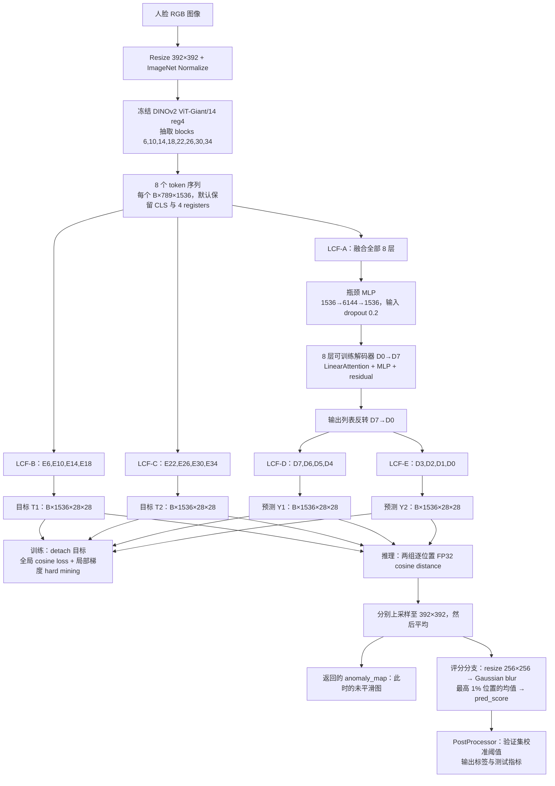
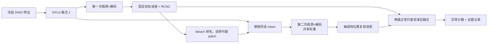
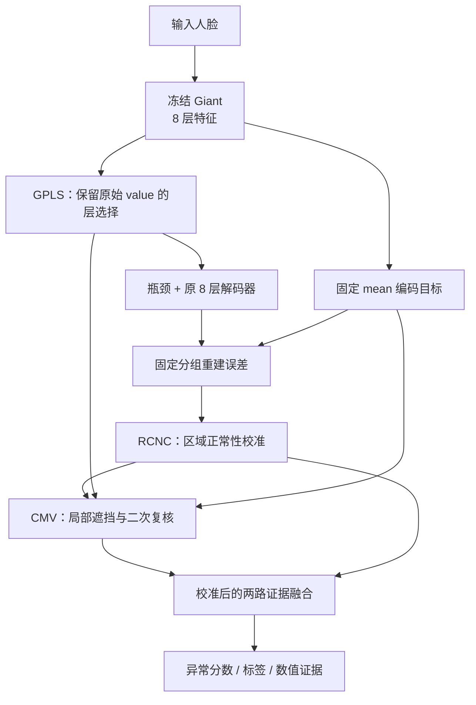

# Dinomaly + LCF 人脸异常检测：当前架构与模块扩展技术方案

核查日期：2026-09-18。对象：本仓库 `DinomalyModel`，以及 `train_dinomaly_lcf_nuaa_giant_dim1536.py` 的 Giant + LCF 配置。本文是设计文档，新增模块均未实现、未测出性能；现有代码事实、文献事实和研究假设分别标明。

## 1. 建议先做什么

推荐主线：**稳定的层选择 → 面部区域正常性校准 → 遮挡后的上下文复核**。频域分支作为独立备选，语言模型作为后期扩展。不要一次把所有模块放进去。

这条主线回答三个相连的问题：哪个深度的特征值得使用？哪些区域的误差真的异常？被标记的区域是否经得起第二次验证？论文贡献应落在这些问题的机制和证据上，而不是模块数量上。

|顺序|实验内容|插入位置|实现成本|主要目的|
|---|---|---|---|---|
|0|固定数据清单、复现均值与现有 LCF|训练脚本与评估|低|建立可信基线|
|1|分离融合职责、固定编码目标|`get_encoder_decoder_outputs`|低至中|验证共享 LCF 是否造成目标漂移|
|2|保留原始特征的轻量层选择器|编码输入融合处|中|保留 DINO 特征几何，学习局部层权重|
|3|区域条件正常性校准|两组误差图之后、图像评分之前|低至中|降低真实面部困难区域误报|
|4|遮挡上下文复核|融合 token 与瓶颈之间，增加第二次解码|中至高|验证异常是否被直接复制重建|
|备选 A|固定频率目标的辅助重建|输入旁路与解码特征输出|中|补充浅层成像线索|
|备选 B|视频证据一致性|逐帧分数之后|高，需视频元数据|利用真实时序而非随机图片|
|最后|证据约束的语言报告|检测器之后|高|可读解释；不默认提高检测准确率|

如果只能选两项：先做第 2 项和第 3 项。如果准备形成较完整论文：在它们确实有效后加入第 4 项。第 1 项是必要消融，不必包装成独立重大创新。

## 2. 任务边界与当前数据

你当前 NUAA / Replay 路线更准确地属于**单类人脸呈现攻击检测（one-class FAS/PAD）**：优化模型时只用真实人脸，测试时把攻击样本当异常。这不等同于通用人脸识别异常、身份识别，也不能仅凭 NUAA 实验宣称支持 deepfake 或三维面具。

本次实际读取 `C:/Users/heqi/Desktop/wj/data/NUAA_mtcnn_colors/rgb`：

|目录|递归文件数|当前脚本用途|
|---|---:|---|
|`normal`|3135|正常训练样本|
|`test`|781|作为正常测试来源|
|`abnormal`|6748|作为异常测试来源|
|`visualize_test`|4145|当前训练脚本不使用|

计数是文件数，并非本次逐个解码验证后的有效图像数。`test` 被当作正常目录是脚本约定，论文前必须以原始数据协议/清单确认其标签。

当前脚本把 `test + abnormal` 组成的集合分出 20% 作为验证集，剩余部分测试。需要明确：训练损失只用真实样本，但验证选阈值和早停使用了攻击标签。因此不能声称“整个开发流程从未接触攻击标签”。当前脚本协议也不自动等于 NUAA 官方协议。

论文级实验应优先恢复官方划分；若做自定义划分，保存固定 manifest，按 subject / session / video 分组，防止相邻帧和同源样本跨 train/val/test。若元数据无法恢复，应披露限制，不要把按图片随机切分的结果称为跨身份泛化。当前目录计数本身不能证明不存在重复和身份泄漏。

## 3. 当前真实架构

### 3.1 总图：Giant + LCF，默认分组

图中 E6 表示 `blocks.6`，为代码的零基索引；D0–D7 是解码器执行顺序。LCF-A/B/C/D/E 是调用位置，**目前共享同一个 LCF 实例及参数**。



默认 392/14=28，patch 数为 784。789=784+1 CLS+4 registers。启用 `remove_class_token` 或 `use_context_recentering` 时，中间序列通常是 784；两选项互斥。应在首次实际 forward 记录 shape，以核实特征提取器对 token 的返回行为。

### 3.2 不能从日志误读的地方

1. `--use-lcf` 替换的是特征融合，不是所有 `mean`。两组异常图仍平均，最高 1% 的评分也仍取平均。
2. 脚本的 `describe_group()` 仍打印 `mean(...)`，即使实际启用了 LCF；它还把解码层标成 E。这是展示问题，应在未来实现时改为 `LCF(...)` 和 D。
3. LCF 是同一位置跨层注意力，不是在所有空间位置之间做注意力；空间上下文主要由 DINO 和解码器提供。
4. 冻结编码器不意味着整个模型无梯度。瓶颈、解码器、LCF 都在训练。
5. 返回的可视化异常图与最终分数采用的平滑图不同；分析模块定位效果时必须明确使用哪张图。

### 3.3 当前 LCF 的公式与真实含义

同一位置 n 上，输入 L 个 C 维向量 `f[l,n]`：

```text
f_mean[n] = mean_l f[l,n]
q[n] = Wq f_mean[n] + bq
k[l,n] = Wk f[l,n] + bk
v[l,n] = Wv f[l,n] + bv
a[l,n] = softmax_l(q[n]·k[l,n] / sqrt(C))
LCF(f)[n] = Wo sum_l(a[l,n] v[l,n]) + bo
```

所以当前 LCF 不仅学习层权重，还改变通道表示空间。C=1536 时四个带 bias 的 Linear 共 `4×(1536²+1536)=9,443,328` 个参数。5 次调用不使参数变成 5 倍，但产生额外计算和中间张量。

`lcf.py` 中 Xavier 初始化会被 Lightning 的 `_initialize_trainable_modules()` 再次初始化为截断正态。未来新增零初始化权重、恒等初始化投影时，必须避免被这一过程覆盖。

编码目标虽然在损失中 `detach()`，但生成目标用的 LCF 权重仍会通过其他路径更新。因此目标不回传梯度，并不代表跨优化步骤保持固定。这是目标漂移的风险，**不是已证实的 NUAA 性能问题根因**。

LCF 文件注释中“某几层对应某类攻击”的说法不能直接当论文事实；Giant 的层号与 Base 也不同。需要逐层探针实验或响应分析支持。

### 3.4 当前损失、优化与精度

训练损失先把目标 detach，再用 FP32 对整张特征图展开计算 cosine loss，对两组平均。局部 cosine distance 用来寻找困难位置，并通过梯度 hook 将容易位置的梯度乘 0.1。p 在 1000 步内升至 0.9。它**不是简单的局部逐 patch cosine loss 平均**，增加辅助损失时不要无意替换原目标。

当前 StableAdamW 配置 lr=2e-3、weight_decay=1e-4；调度器设置 warmup=100、终值 2e-4。代码返回裸 scheduler 列表：正式实验前应读取 Trainer 的实际 scheduler interval 并记录逐 optimizer-step 学习率，确认所谓“步数调度”是否按预期执行，不能仅靠注释认定。后续加梯度累积时也要按 optimizer step 计算调度总长。

`--model-precision float16` 实际把模型参数转成 **bfloat16**，不是标准 FP16 AMP。当前 cosine 与损失显式转 FP32，但高斯卷积输入仍跟随 kernel dtype；微小误差图可能再次量化。建议单独做 FP32 blur 对照后固定设置，不把数值修正与新模块混在一个实验里。

## 4. 实验 0：先建立可信基线

你报告过 AUROC=0.90265274、HTER=0.18559912。这是会话中的结果，不是本次复测，缺少完整配置、checkpoint 与固定 split 时应视为待归档的历史记录。不要把它直接当作下述新模块的基准。

固定相同预处理、Giant 权重、层号、输入大小、split、batch、精度、训练预算和 seed。保存每样本原始分数、标签、subject/video ID、阈值和 checkpoint 路径。

先跑：B0 原始 mean；B1 现有共享 LCF。5000 步比较通过后再扩至 20000。5000 和 20000 的 cosine schedule 不同，不是仅多跑一些相同学习率的步骤；应分别报告训练预算。20000 步可能过拟合，不保证 AUROC 提升。

推荐每 500 或 1000 optimizer steps 验证一次，明确监控 `image_AUROC` 的最佳 checkpoint，并对该 checkpoint 校准验证阈值后测试。当前脚本 `engine.test(model=model, ...)` 没显式加载最佳权重；有 EarlyStopping 不等于已经恢复最佳权重。最后一个训练阶段不触发验证时，阈值也可能来自更早权重。

论文比较至少 3 个训练种子，例如 42/43/44，但固定同一数据清单；不要让训练 seed 同时改变数据 split。报告均值±标准差，以及按独立视频/主体重采样的置信区间。图片来自同一视频时，不能把它们当独立统计样本。

## 5. 模块一：保留特征几何的层选择器

工作名：Geometry-Preserving Layer Selection，简称 GPLS。这是本文提议的名称，不代表已确认原创或已有实测。

### 5.1 故事与假设

人脸真假共享相似语义，区别可能分布在局部纹理、结构及成像属性中。固定平均忽略位置差异；完整 Q/K/V/O 投影又可能改变预训练表示。我们的假设是：**让融合器决定“使用哪些层”，同时保留输入特征值与固定重建参照，比同时重写目标空间更稳定**。

可检验预测：相对 mean，GPLS 改善攻击/真实分数间隔；相对现有 LCF，目标漂移更小、跨 seed 波动更小。只有发现这些证据后，才能在论文中描述为优势。

### 5.2 首版具体结构

只替换瓶颈前的 8 层融合。两组编码目标使用固定 mean，解码组先使用固定 mean。这使研究问题最清晰。

```text
F: [B,N,8,1536]
u = GELU(Linear(1536,64)(LayerNorm(F)))
logits = Linear(64,1)(u).squeeze(-1) + layer_bias
w = softmax(logits.float()/temperature, dim=layers)
w_safe = (1-rho)/8 + rho*w
z = sum_layers(w_safe * F)        # 原始 F 作为 value，不加 Wv/Wo
```

初始化：最后的 `Linear(64,1)` 权重和 bias=0，layer_bias=0，temperature=1，rho=0.5。如此初始输出等于 mean，且最终线性层仍可获得梯度。不要同时把所有门控和所有可学习输出初始化为零，导致整条分支梯度长期关闭。所有“等于 mean”的单测在浮点容差内比较。

LayerNorm 仅给权重预测分支使用，不能偷偷将被加权的原始 F 也归一化。小网络共享各层参数，可选 8 个 layer bias；首版约 0.1M 参数，远低于当前 LCF 的 9.44M，精确值以实例化统计为准。

prefix token 可以用同一个权重分支，但要分别记录 CLS/register 与 patch 的权重统计。首版不要同时改变 token 保留策略。

### 5.3 训练与防坍缩

基础损失不变。可选的均匀先验正则 `KL(w || Uniform)` 从 1e-3 试起，同时保留不加正则对照。均匀正则过强会退回 mean，因此不要默认加大。先使用与基线相同 lr；若抖动再试 GPLS lr=1e-4，且保持解码器 lr 不变。实现分组 lr 时检查 WarmCosineScheduler 是否会把各组 lr 覆盖成同一个值。

若扩展至重建组融合：不要让编码与解码独立学习两个可同时塌缩的坐标系。可先由仅正常训练得到的冻结/EMA 选择器提供编码侧层权重，然后将同一组权重应用于对应反向解码层；这仍需独立消融，不是首版默认。

### 5.4 必做消融与失败标准

|编号|输入融合|编码目标|解码融合|回答的问题|
|---|---|---|---|---|
|B0|mean|mean|mean|原始基线|
|B1|原 LCF|共享原 LCF|共享原 LCF|当前改动整体是否有效|
|G0|原 LCF|mean|mean|仅分离融合职责的效果|
|G1|GPLS|mean|mean|保留 value 几何的效果|
|G2|输入无关可学习层权重|mean|mean|是否确实需要按图/位置自适应|
|G3|GPLS + 均匀正则|mean|mean|防止过度集中是否有效|

画层权重热图、权重熵、梯度范数、正常/攻击分数分布。注意力权重不是因果解释；需要层删除、权重置乱等干预。如果 G1 不优于 G0 或静态权重，就不能声称自适应局部层选择是关键贡献。

## 6. 模块二：区域条件正常性校准

工作名：Region-Conditioned Normality Calibration，RCNC。

### 6.1 故事

眼部、口部、轮廓、背景的正常重建难度并不相同。全图 top-1% 容易被高方差区域支配。研究假设是：**异常应是相对于该区域正常波动的偏离，而不仅是绝对误差大**。这一模块能与 LCF 形成“选特征—解释误差”的关联。

首版不训练复杂 GNN。先做最便宜、可解释的正常统计校准，再决定是否需要学习区域关系。

### 6.2 具体实现

保留 `calculate_anomaly_maps()` 的第二个返回值（两组图），最好先在原生 28×28 patch 网格上处理，避免插值制造额外统计相关。

使用对齐后的坐标划分若干软区域：双眼附近、鼻部、口部、双颊、额头/轮廓。首版采用固定软网格并命名为“空间区域”，不能无 landmarks 却声称精确解剖分区。后续使用 landmarks 时，要冻结检测器并明确外部预训练依赖及失败回退。

模型选定后，在与优化集分离的正常校准集上收集每组 g、区域 r 的误差分布：

```text
mu[g,r] = median(normal_errors[g,r])
sigma[g,r] = max(1.4826*MAD(normal_errors[g,r]), sigma_floor)
z[g,p] = (a[g,p] - mu[g,region(p)]) / sigma[g,region(p)]
z_clip = clamp(z, -5, 10)
```

`sigma_floor` 由正常校准数据的尺度确定，如全局 MAD 的 0.1 倍再设数值 epsilon；不要照抄固定大常数盖过所有误差。统计量用 buffer 保存到 checkpoint，测试时不更新。小样本区域用全局统计收缩，避免极小方差放大噪声。

先平均两组标准化图再按相同 top-1% 评分，单独评价“区域标准化”；之后才试每区 top-k 再平均。后者建议每区 k=max(1,ceil(0.05*N_r))，另设最大区评分对照。不同聚合方式属于独立超参数，不应与校准捆绑。

### 6.3 边界与消融

比较：原评分、全局标准化、位置/区域标准化、区域标准化+新聚合、打乱区域分配。若只靠全局尺度修正就提升，不能归功于面部区域知识。

评价真实眼镜、表情变化、姿态及边界背景的误报；缺少这些标注时可以对固定样本人工分组，但不能从测试错误里不断改方法再宣称无偏测试。

风险：对齐不稳定；正常校准集覆盖不足；某些攻击本就依赖面部边界，完全抛弃轮廓可能降性能。因此保留全图分数作对照，前景 mask 不应默认把外围全部删除。

## 7. 模块三：遮挡上下文复核，形成可检验的证据链

工作名：Contextual Masked Verification，CMV。

### 7.1 论文故事

正常样本训练的解码器仍可能从输入特征复制攻击信息。一遍重建低误差，不必然意味着真实。第一遍发现可疑区域，第二遍遮挡直接输入后由上下文预测，再比较两次证据。

这是**顺序视觉证据处理**，不是语言模型内部思维链，也不是已识别的物理因果机制。建议论文称“evidence chain”或“progressive verification”，避免仅加几层网络就声称具备 CoT。

### 7.2 插入图



### 7.3 如何在只有正常训练样本时训练

在正常训练时，每张图片随机选 5%–15% patch（连续块与随机散点分别做对照），在 GPLS 输出后、瓶颈前替换为可学习 mask token + 位置编码。保留固定、未遮挡编码特征作为目标。

```text
L_total = L_original + lambda_mask * L_masked
L_masked = mean_{g,p in M} (1-cos(stopgrad(T[g,p]), Y_mask[g,p]))
lambda_mask 初始候选 = 0.1
```

第二项先不用 hard-mining hook，以便定位效果。第一遍和第二遍都训练，避免测试第二遍成为分布外用法。最初只随机 mask；稳定后再混入由第一遍 detach 残差选出的困难 mask。0.1、mask 比例均为起点，不是最优值结论。

推理首版对所有图片使用相同复核预算：选原生 28×28 网格最高 10% patch；在同样位置评估 `a1` 和 `a2`；分别使用正常校准分布标准化，再以固定 0.5/0.5 融合。稀疏复核图应在 patch 网格上打分，不能把未复核位置随便补零再当完整图统计。

可额外记录 `delta=a2-a1`，但不默认“差值越大一定越假”：真脸难点同样会被遮挡影响。选择 top 区域自身有偏，正常校准也必须执行相同 top 选择流程。

### 7.4 关键漏洞：深层 token 已包含上下文信息

在 DINO 编码后 mask token，只移除了该 token 的直接访问；其他 patch、CLS、register 已经可能携带该区域的信息。因此不能叫“完全去除异常证据”或严格反事实。

必须比较：只 mask patch、同时移除/替换 prefix、输入图像级 mask 后重新编码。最后一种更强，但多一次 Giant 编码，费用明显更高且会引入遮挡分布变化。若需要严格“未观察区域”的实验，应按输入级遮挡重新编码并相应训练；feature mask 首版定位为低成本近似复核。

### 7.5 证明链条有效，而非多算一次

对照至少包括：单遍、两遍相同输入、随机位置复核、top 残差复核、打乱首遍定位、只增加训练次数不改变推理。保持计算预算接近，并报告实际 latency/峰值显存。

有效证据：top 复核优于随机/重复推理；困难攻击的漏检减少；真实困难样本误报不显著恶化；跨库仍保持收益。若只提升域内指标，则限制结论。

第一版只做两步；不默认 3–5 步迭代。反复重建可能越来越会复制攻击，也可能使初始误报不断自我强化。按不确定性触发的早停留到后期，并用验证集固定触发规则，报告准确率—成本曲线。

## 8. 备选 A：正常成像残差的频率辅助重建

### 8.1 故事与新颖性边界

打印/屏幕重采集可能改变局部频谱与色彩关系，而语义特征未必充分保留。频域和中央差分早已有大量防伪研究；“加 FFT/小波/CDC”本身不构成创新。已有研究还明确提醒频率捷径会损害泛化，见第 14 节文献。

可探索的具体问题是：**在仅真实样本训练下，固定的局部成像统计能否为语义重建提供互补、经正常尺度校准的异常证据？**

### 8.2 可落地首版

从归一化前、范围 [0,1] 的 RGB 输入提取固定高通/小波响应，在每个 14×14 patch 汇总 log-energy、方向能量、简单色度残差。形成固定目标 `R ∈ [B,784,K]`，K 先取 8–16。不要直接对标准化后的图像随意混用 RGB/YUV 数值范围。

对最终解码 patch 特征加小头 `1536→64→K`，用正常训练统计标准化 R 后，以 SmoothL1 重建。`L=L_base+0.05*L_freq`。目标提取器固定、无梯度，防止两条可训练分支共同输出常数而“完美一致”。

推理频率残差按正常校准集标准化，再与原分数做固定加权融合；先分别报告语义分支、频率分支、简单分数融合，然后才考虑学习门控。否则无法判断复杂模块是否必要。

需要对照固定高通、普通小 CNN、等参数 MLP，以及 JPEG/分辨率/光照变化下的真实误报。不要同时把高频定义为判别信号、又用过强模糊增强强制其不变。明显抹除攻击线索的增强可能制造错误学习目标。

若频率分支只学到数据集设备差异，跨 NUAA/Replay 会失败；这应作为否定假设的依据，而不是只挑提升的数据集报告。

## 9. 备选 B：有视频元数据后再做时间一致性

如果保存原始 video ID、时间戳和连续帧，可以在逐帧证据后建轻量时间聚合，比较均值/中位数、1D temporal convolution 与 attention。目标是压制偶发误报并分析局部异常的持续性。

单帧 NUAA 图片不能直接提供心率/真实运动证据。Replay 视频也可能具有自然眨眼与运动，所以“有运动即真实”不成立。不要把随机抽样图片拼成序列做所谓时序推理。rPPG 需要采样率、时长与成像质量支持，应另开研究分支。

## 10. 思维链如何合理加入

优先使用第 7 节可测量的视觉证据链，再考虑 VLM。推荐输出结构化证据记录：

```json
{
  "sample_id": "example",
  "layer_weights_summary": "measured array",
  "region_scores": "measured array",
  "masked_verification_score": "measured value",
  "threshold_source": "held-out validation",
  "prediction": "normal or anomalous"
}
```

之后模板或冻结 VLM 可以将实际字段转成“某区域重建偏离正常范围，复核后仍偏离”的报告。没有攻击类型监督时，不应自动把异常解释成“纸张”“屏幕”或“面具”，更不能仅凭热图确诊具体攻击机制。

这类说明是决策证据摘要，不是忠实复原神经网络内部推理。若要让语言分支参与判别，应单独声明视觉语言监督、外部攻击描述/图文数据来源，并设置同等资源的视觉基线。

相关工作已经包括 FaceCoT、PA-FAS 和 SLIP。因此不能声称首次将 CoT 或语言引入 FAS。可争取的区别在“正常样本训练、可定位的数值证据、对证据干预后输出响应可验证”。仍需更系统检索来确认近似方法。

解释评估不要只给几张漂亮例子：删除高证据区域与随机区域作对照；替换报告证据字段看结论是否响应；区分检测 AUROC 和解释正确率。对标签捷径、伪因果措辞和证据不存在时的幻觉分别统计。

## 11. 推荐的最终候选结构



这不是要求三个模块都保留。若 GPLS 与 RCNC 已提供稳定收益、CMV 没有额外价值，应舍弃 CMV。Dinomaly 本身强调简洁，新增复杂度必须有匹配证据。

## 12. 代码实施清单

以下为计划接口，不是当前已经支持的命令行参数。

|文件|未来改动|关键约束|
|---|---|---|
|`components/lcf.py`|保留旧 LCF；新建独立 GPLS 类或新文件|旧实验/旧 checkpoint 可复现|
|`torch_model.py::__init__`|加入 fusion scope / type 等显式参数|关闭新开关走旧路径|
|`get_encoder_decoder_outputs`|分开 input、target、decoder 三种融合；可返回诊断信息|默认返回契约不能静默改变|
|`calculate_anomaly_maps`|提供原生分组误差给校准器|FP32 cosine；明确原生图与显示图|
|`forward`|加入校准与可选复核|仍返回 `InferenceBatch`；分数方向高=异常|
|`lightning_model.py`|透传参数、解冻新模块、配置优化器|全模型先 freeze 的逻辑会使忘记解冻的新模块不训练|
|`_initialize_trainable_modules`|增加模块专用初始化时序|完成通用初始化后再执行 GPLS 的零末层初始化|
|`components/loss.py`|原损失保留；辅助损失显式相加|FP32、detach 教师、检查梯度 hook 作用范围|
|训练入口|记录 split/config/git hash、best checkpoint、正常校准|验证及测试不参与训练统计更新|
|测试|mean 初始化等价、梯度、dtype、checkpoint round-trip|无需先跑完整 Giant 才验证逻辑|

推荐参数设计：`fusion_type={mean,lcf,gpls}`、`fusion_scope={legacy_shared,input_only}`、`use_region_calibration`、`use_masked_verification`。保留旧 `use_lcf` 的兼容映射并拒绝相互冲突的参数组合。还没实现前不要直接把这些开关加到训练命令里。

原有 forward 把输入转为编码器 dtype，新增模块必须跟随设备与精度；统计 buffer、softmax、cosine、校准分母应优先 FP32。小 batch 用 LayerNorm/GroupNorm，避免在 batch=1 下依赖 BatchNorm 统计。

CMV 重构应把“编码一次”“融合与解码”“计算误差”拆为内部方法，复用冻结编码输出。在 feature-mask 版本不重复跑 Giant；在 input-mask 对照中必须重新编码。仅做模块设计时无需新注册一个模型类，也无需改变公共数据 batch 类型。

### 最小验证顺序

1. 小张量：GPLS 初始化近似 mean，输出/梯度 finite；随机权重后输入变化能改变层权重。
2. 小张量：目标固定且无梯度，新增模块参数确实在 optimizer 中。
3. 小张量：区域统计只在 fit/calibrate 更新，保存加载后分数一致。
4. 小张量：mask index 排除 prefix，反向解码分组不变。
5. 单 GPU 2 个训练 batch + 2 个验证 batch，覆盖 FP32 和当前 BF16 模式。
6. 5000 步单 seed 初筛，再对有意义的候选做 3 seeds 和 20000 步。

## 13. 资源预算、结果表与推进规则

你日志中的 Giant 模型约 1.4B 总参数、254M 可训练参数，不应只拿“模型权重 5.6GB”估计显存；梯度、优化器状态、激活与临时张量也占显存。实际峰值以测量为准。

GPLS 增量很小；RCNC 主要增加 buffer；CMV 在缓存编码特征时额外增加解码计算，训练时两条图的激活可能明显增加。使用顺序前向/反向或 checkpointing 需另行实现和验证，不能假定两次解码零成本。Giant 输入保持 392，batch=1 首筛；不为新模块同时改分辨率。

|实验|模块|正常校准|5000 steps|20000 steps|3 seeds|跨库|状态|
|---|---|---|---|---|---|---|---|
|B0|mean|无/统一阈值流程|待测|待测|待测|待测|计划|
|B1|当前 LCF|同上|待复现|待测|待测|待测|已有用户历史结果待归档|
|G0|原 LCF input-only|同上|待测|候选|候选|候选|计划|
|G1|GPLS input-only|同上|待测|候选|候选|候选|计划|
|R0|最佳冻结模型+全局校准|有|无需重训模型|同 checkpoint|对应种子|待测|计划|
|R1|同模型+区域校准|有|无需重训模型|同 checkpoint|对应种子|待测|计划|
|V1|最佳融合+CMV|有|待测|候选|候选|候选|计划|
|V2|最佳融合+RCNC+CMV|有|待测|候选|候选|候选|计划|
|F1|最佳融合+频率辅助|有|备选|候选|候选|候选|计划|

不能只有累计叠加：还应有 B0+RCNC、B0+CMV、GPLS+CMV，用于判断独立收益与互补性。先用验证集筛选，再对冻结配置评估测试集；不要每次看测试分数决定下一个超参数。

每行至少记录：AUROC、HTER、攻击接受/真实拒绝错误、参数量、峰值显存、每图耗时、训练时长、seed、split hash、模型精度、最佳步数。这里代码标签为 normal=0、attack=1：FNR 表示攻击被判正常，FPR 表示真实被拒绝；HTER=(FPR+FNR)/2。若报告 APCER/BPCER、视频级指标或 TPR@FPR，应明确攻击种类、聚合单位、正类定义和阈值确定方式。

跨库实验应在源库训练与校准，不使用目标库攻击标签挑阈值；若允许目标库正常校准，要单独命名为带目标域正常校准的设定。若数据集只有少数独立主体/视频，不宜只追求极低 FPR 点的漂亮数值。

推进原则：首筛无收益先分析分数/数值/梯度；机制证据不成立则降级为普通工程组件；多 seed 收益不稳定则不继续堆模块；域内升、跨库降则明确讨论域依赖。不要预先承诺“提升几个点”。

## 14. 相关工作与创新定位

以下为截至核查日的定向检索，不是穷尽检索，不能据此保证首创或可发表。各条仅简述与本方案相关的内容。

1. [Dinomaly，CVPR 2025](https://openaccess.thecvf.com/content/CVPR2025/html/Guo_Dinomaly_The_Less_Is_More_Philosophy_in_Multi-Class_Unsupervised_Anomaly_CVPR_2025_paper.html)：原框架强调简洁的 Transformer 重建。新增模块要证明必要性。
2. [Dinomaly2](https://arxiv.org/abs/2510.17611)：已有后续统一框架。本仓库 context recentering 已存在，不应作为新贡献重复提出。
3. [OC-SCMNet，CVPR 2024](https://openaccess.thecvf.com/content/CVPR2024/html/Huang_One-Class_Face_Anti-spoofing_via_Spoof_Cue_Map-Guided_Feature_Learning_CVPR_2024_paper.html)：已有单类人脸防伪及 spoof cue map 路线。正常样本训练本身不是创新。
4. [CDCN，CVPR 2020](https://openaccess.thecvf.com/content_CVPR_2020/html/Yu_Searching_Central_Difference_Convolutional_Networks_for_Face_Anti-Spoofing_CVPR_2020_paper.html)：中央差分用于防伪已有先例，不能直接把加 CDC 当原创机制。
5. [Frequency Shortcut View，WACV 2025](https://openaccess.thecvf.com/content/WACV2025/papers/Cao_Towards_Generalized_Face_Anti-Spoofing_from_a_Frequency_Shortcut_View_WACV_2025_paper.pdf)：频率捷径是泛化风险，支持把跨设备/跨域实验列为频率分支的必要验证。
6. [SSPCAB，CVPR 2022](https://openaccess.thecvf.com/content/CVPR2022/html/Ristea_Self-Supervised_Predictive_Convolutional_Attentive_Block_for_Anomaly_Detection_CVPR_2022_paper.html)：用遮挡预测做异常检测已存在。
7. [One-for-All: Proposal Masked Cross-Class Anomaly Detection，AAAI 2023](https://ojs.aaai.org/index.php/AAAI/article/view/25604)：已有 proposal masking 与异常检测；CMV 的 top 残差选区域尤其需要与这一方向细致比较，不能声称首次异常引导遮挡。
8. [FaceCoT / Harnessing Chain-of-Thought Reasoning in MLLMs for FAS](https://arxiv.org/abs/2506.01783)：已有 FAS 图文思维链研究；论文标题随版本更新，引用时固定版本。
9. [PA-FAS](https://arxiv.org/abs/2511.17927)：已有路径增强的多模态防伪推理工作。
10. [SLIP](https://arxiv.org/abs/2503.19982)：已有视觉语言预训练结合单类 FAS 的方向。

|提议|不能声称的新颖性|有机会验证的具体贡献|
|---|---|---|
|GPLS|首次注意力/首次层融合|在固定正常参照下保留 value 几何，并证明相对共享投影融合的稳定性|
|RCNC|首次区域注意力/首次误差标准化|区域条件正常波动对 FAS 误报的解释与可量化修正|
|CMV|首次 mask 重建/首次异常引导 mask/首次 CoT|与层选择、区域校准耦合的低成本证据复核，以及严格等算力和信息泄漏对照|
|频率分支|首次频域防伪|固定物理统计目标的正常重建如何补充语义重建，且不引入频率捷径|

一套可能的论文叙事是：“现有重建检测把不同层和不同面部区域的误差混在一起，并可能通过直接输入重建异常。我们以固定正常参照进行局部层选择，将误差解释为区域正常分布偏离，再对可疑位置执行上下文复核。”这只是研究假设的表达模板；实验必须支持每一项因果解释，不能先写成已经证明的结论。

## 15. 文件依据与交付边界

当前架构核对来自：

- `src/anomalib/models/image/dinomaly/torch_model.py`：编码、融合、解码反转、分组、评分。
- `src/anomalib/models/image/dinomaly/components/lcf.py`：LCF Q/K/V/O 结构。
- `src/anomalib/models/image/dinomaly/components/loss.py`：全局损失与局部梯度修改。
- `src/anomalib/models/image/dinomaly/lightning_model.py`：冻结/解冻、初始化、精度及优化器。
- `train_dinomaly_lcf_nuaa_giant_dim1536.py`：预处理、数据划分、HTER 阈值和 fit/test 路径。

本次仅新增技术文档，没有改训练脚本或模型，也没有执行训练。架构图可在支持 Mermaid 的 Markdown 查看器中渲染。本文借助 models-data / anomalib-training 的接口约束，将新模块规划为现有 Dinomaly 的可选扩展，并保留 Engine、InferenceBatch 和明确配置参数的集成方式。
