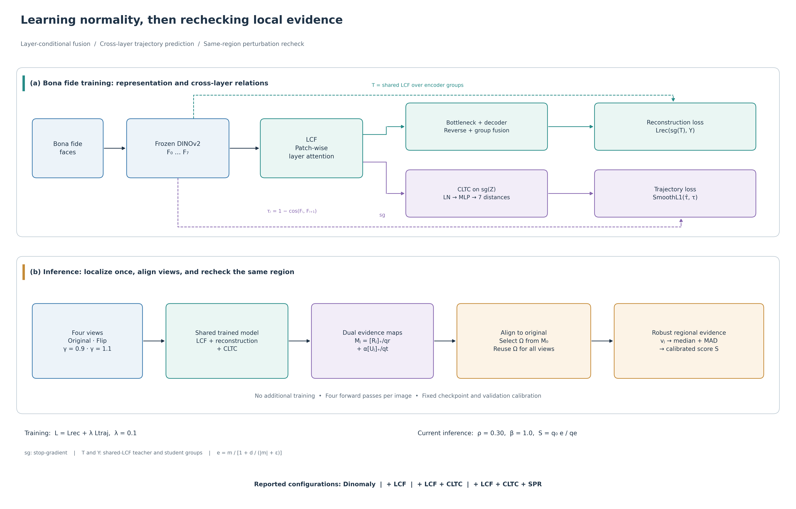

# Dinomaly

## LCF＋CLTC＋SPR 人脸防伪研究扩展

LCF、CLTC 和推理阶段的 SPR 组成当前实验性扩展；最新复核设置为 ROI=30%、β=1.0。
完整方法、训练与评分公式、四库四阶段结果及实验边界，见
[论文式研究稿](../../../../../../research/dinomaly_lcf_cltc_spr_paper.md)与
[完整数据附录](../../../../../../research/dinomaly_lcf_cltc_spr_paper_data.md)。
基础 Dinomaly 的默认配置不自动启用这套研究流程。

主表采用 2026-09-28 用户从日志摘录的数据，保留全部原值，统计口径与逐行协议待核对。
历史自定义帧级实验、ROI/TTA 对照单独保留，不与最新基线混算增益；本次文档同步未重新训练或推理。



## API

```{eval-rst}
.. automodule:: anomalib.models.image.dinomaly.lightning_model
   :members: Dinomaly
   :show-inheritance:
```

```{eval-rst}
.. automodule:: anomalib.models.image.dinomaly.torch_model
   :members: DinomalyModel
   :show-inheritance:
```
